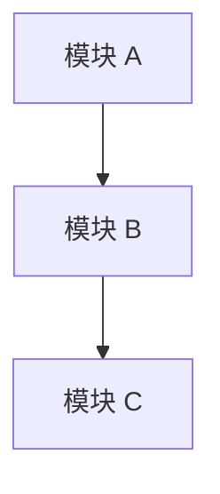

# AI Company Document Standard

Version: v1.0

Status: Draft

Owner: AI Project Manager

Last Updated: 2026-07-12

---

## 1. Document Principles

### Principle 1 — Documentation First

任何开发行为必须先产出文档。

禁止代码领先文档。

禁止无文档的开发交付。

---

### Principle 2 — Single Source of Truth

每个知识点有且仅有一份权威文档。

其他文档引用该文档时，必须使用 Cross Reference。

禁止多份文档维护同一信息。

---

### Principle 3 — Timely

文档必须在对应阶段完成时同步更新。

禁止事后补文档。

---

### Principle 4 — Traceable

所有文档必须有版本号、Owner、更新时间。

关键修改必须有 Change Log。

---

### Principle 5 — Readable

文档必须使用清晰的 Markdown 格式。

禁止大段无分段文本。

禁止口语化表达。

---

## 2. Folder Structure

### 顶层目录

```
aigateway/
├── docs/                          # 产品文档
│   ├── 01-product/                # 项目规划、PRD
│   ├── 02-architecture/           # 架构设计
│   ├── 03-api/                    # API 文档
│   ├── 04-database/               # 数据库设计
│   ├── 05-roadmap/                # Roadmap
│   ├── 06-research/               # 技术调研
│   ├── 07-meeting/                # 会议记录
│   └── 08-release/                # 发布记录
│
├── ai-company/                    # AI Company 框架
│   ├── 01-standards/              # 标准规范（00~99）
│   ├── 02-workflows/              # Workflow 实例
│   ├── 03-agents/                 # Agent 定义
│   ├── 04-skills/                 # Skill 定义
│   ├── 05-templates/              # 文档模板
│   ├── 06-knowledge/              # 知识库
│   └── 07-checklists/             # 检查清单
│
└── ADR/                           # 架构决策记录
    ├── ADR-001.md
    ├── ADR-002.md
    └── ...
```

### 目录命名规则

- 使用英文小写
- 多个单词使用连字符 `-` 连接
- 序号前缀用于排序（00~99）

### 文件命名规则

- 使用英文小写
- 多个单词使用连字符 `-` 连接
- 序号前缀（如 `01-project-standard.md`）
- 禁止使用中文文件名

---

## 3. Naming Convention

### 文件命名

格式：

```
[序号]-[英文名称].md
```

示例：

```
01-project-standard.md
02-agent-standard.md
03-workflow-standard.md
ADR-001-router-engine-selection.md
```

### 目录命名

格式：

```
[序号]-[英文名称]/
```

示例：

```
01-standards/
03-agents/
```

### 标题命名

- 一级标题：`# [英文/中文标题]`
- 二级标题：`## [标题]`
- 三级标题：`### [标题]`
- 禁止一级标题使用序号前缀

---

## 4. Version Rule

### 版本格式

```
v[主版本].[次版本]
```

| 版本位 | 说明 | 升级条件 |
|--------|------|---------|
| 主版本 | 重大变更 | 内容重构、章节增删、不兼容修改 |
| 次版本 | 增量修改 | 内容增补、修正错误、优化表达 |

### 版本号位置

每个文档的 Header 中必须包含版本号。

### 初始版本

新文档初始版本为 `v1.0`。

---

## 5. Status Rule

### 状态定义

| 状态 | 说明 | 允许操作 |
|------|------|---------|
| Draft | 草稿，尚未评审 | 编辑、评审 |
| Active | 生效，可被引用 | 引用、优化修订 |
| Deprecated | 废弃，不再使用 | 仅可引用，不可修订 |

### 状态迁移

```
Draft ──→ Active ──→ Deprecated
  ↑          │
  └── 评审不通过 ─┘
```

### 状态位置

每个文档的 Header 中必须包含状态。

---

## 6. Owner Rule

### Owner 定义

每个文档必须有明确的 Owner。

Owner 必须是 Project Standard 中定义的 Agent 角色。

| 文档类型 | Owner |
|---------|-------|
| Standards | CEO |
| PRD | Product Manager |
| Architecture | Architect |
| API | Full Stack Engineer |
| ADR | Architect |
| Workflow | AI Project Manager |
| Research Report | Architect |
| Review Report | Reviewer |
| Test Report | QA |

### Owner 职责

- 负责文档内容的准确性
- 负责文档的及时更新
- 负责文档版本的管理
- 评审对文档的修改请求

---

## 7. Last Updated Rule

### 更新规则

- 每次修改必须更新 `Last Updated` 字段
- 格式：`YYYY-MM-DD`
- 时区：UTC+8

### 更新时机

| 场景 | 必须更新 |
|------|---------|
| 内容增补 | ✅ |
| 内容修改 | ✅ |
| 内容删除 | ✅ |
| 格式优化 | ❌ |
| 拼写修正 | ❌ |

---

## 8. Change Log Rule

### Change Log 位置

每个文档必须在 Footer 之前包含 Change Log 章节。

### Change Log 格式

```markdown
## Change Log

| 日期 | 版本 | 修改内容 | 修改人 |
|------|------|---------|--------|
| 2026-07-12 | v1.0 | 初始版本 | AI Project Manager |
| 2026-07-13 | v1.1 | 新增第 5 节状态规则 | AI Project Manager |
```

### 必须记录 Change Log 的场景

- 版本升级
- 内容重大修改
- 章节新增或删除
- 与其他 Standard 的兼容性调整

---

## 9. Markdown Rule

### 标题层级

- `#` 文档标题（每文档仅一个）
- `##` 一级章节
- `###` 二级章节
- `####` 三级章节
- 禁止跳过层级（如 `#` 直接到 `####`）

### 列表

- 无序列表使用 `-`
- 有序列表使用 `1.`
- 列表层级使用 2 空格缩进
- 列表项需要空行隔开时保持格式一致

### 表格

- 必须包含表头
- 表头与内容之间必须有分隔行
- 使用 `|` 对齐

```markdown
| 列 1 | 列 2 |
|------|------|
| 内容 | 内容 |
```

### 代码块

- 必须指定语言标识（如 `markdown`、`json`、`yaml`）
- 行内代码使用反引号 `` ` ``

---

## 10. Mermaid Rule

### 允许使用的图类型

| 图类型 | Mermaid 关键字 | 适用场景 |
|--------|---------------|---------|
| 流程图 | `graph` | 流程说明、决策树 |
| 时序图 | `sequenceDiagram` | 交互流程、API 调用链 |
| 类图 | `classDiagram` | 数据模型、领域模型 |
| 状态图 | `stateDiagram-v2` | 状态机、生命周期 |
| 架构图 | `graph` | 系统架构、模块依赖 |

### 格式要求



- 必须使用 `mermaid` 代码块标识
- 节点文字使用中文或英文，保持全文统一
- 复杂图必须添加图标题注释

### 禁止使用的图类型

- 饼图
- 甘特图（除非 Release 计划场景）

---

## 11. ADR Rule

### ADR 编号

格式：

```
ADR-[三位数字]
```

示例：

```
ADR-001
ADR-002
ADR-012
```

编号规则：

- 从 001 开始递增
- 不可复用已废弃的编号
- 顺序按创建时间排列

### ADR 文档结构

```markdown
# ADR-XXX: [标题]

Status: [Proposed / Accepted / Deprecated]

Owner: Architect

Last Updated: YYYY-MM-DD

---

## Context

[决策背景]

## Decision

[决策内容]

## Consequences

[决策带来的影响]

## Alternatives Considered

[其他方案及未选原因]

---

## Change Log

| 日期 | 版本 | 修改内容 | 修改人 |
|------|------|---------|--------|
```

### ADR 生命周期

```
Proposed ──→ Accepted ──→ Deprecated
    │
    └── Rejected
```

---

## 12. PRD Rule

### PRD 文档结构

```markdown
# PRD: [功能名称]

Status: [Draft / Active]

Owner: Product Manager

Last Updated: YYYY-MM-DD

Related Workflow: [Workflow ID]

---

## 1. 背景与目标

## 2. 用户故事

## 3. 功能需求

## 4. 非功能需求

## 5. 验收标准

## 6. 影响范围

## 7. 风险

---

## Change Log
```

### PRD 前置条件

- 必须经过 Requirement Analyzer 分析
- 必须分配 Workflow ID

---

## 13. API Rule

### API 文档结构

基于 OpenAI API 兼容格式。

```markdown
# API: [接口名称]

Status: [Draft / Active]

Owner: Full Stack Engineer

Last Updated: YYYY-MM-DD

---

## Endpoint

## Method

## Authentication

## Request

### Headers

### Parameters

### Body

## Response

### Success Response

### Error Response

## Rate Limit

## Example

---

## Change Log
```

---

## 14. Architecture Rule

### Architecture 文档结构

```markdown
# Architecture: [模块名称]

Status: [Draft / Active]

Owner: Architect

Last Updated: YYYY-MM-DD

Related ADR: [ADR-XXX]

---

## 1. 概述

## 2. 架构图

## 3. 模块划分

## 4. 数据流

## 5. 技术选型

## 6. 部署方案

## 7. 性能目标

## 8. 风险与限制

---

## Change Log
```

### Architecture 前置条件

- 大型方案必须优先形成 ADR
- 架构图必须使用 Mermaid 或图表

---

## 15. Review Rule

### Review Report 结构

```markdown
# Review Report: [Workflow ID]

Status: Active

Owner: Reviewer

Last Updated: YYYY-MM-DD

---

## 1. 评审范围

## 2. 评审结论

## 3. 发现的问题

| # | 严重级别 | 描述 | 状态 |
|---|---------|------|------|
| 1 | Critical | ... | 已修复 |
| 2 | Major | ... | 待修复 |

## 4. 建议

## 5. 评审结果

□ Approved

□ Conditional（有条件通过）

□ Rejected

---

## Change Log
```

### 严重级别定义

| 级别 | 说明 | 处理时限 |
|------|------|---------|
| Critical | 阻断性缺陷 | 必须修复 |
| Major | 功能性缺陷 | 建议修复 |
| Minor | 非功能性缺陷 | 可选修复 |

---

## 16. Checklist Rule

### Checklist 格式

```markdown
□ 检查项描述

□ 检查项描述

□ 检查项描述
```

### Checklist 要求

- 使用 `□` 作为未完成标记
- 使用 `☑` 或 `✅` 作为已完成标记
- 按阶段分组
- 每组不超过 10 项

### Checklist 分组示例

```markdown
### 启动前检查

□ 检查项 1

□ 检查项 2

### 执行中检查

□ 检查项 3
```

---

## 17. Cross Reference Rule

### 引用格式

引用其他文档时，必须使用相对路径 + 显示名称。

```markdown
# 引用格式

[显示名称](相对路径)

# 示例

[Project Standard](../01-standards/01-project-standard.md)
[ADR-001](../../ADR/ADR-001.md)
[Workflow 说明](../03-workflow-standard.md#3-feature-workflow)
```

### 引用规则

- 禁止使用绝对路径
- 禁止仅写文件名不写路径
- 引用 Standards 时不需要路径，直接使用文档名
- 引用 ADR 时使用 ADR 编号

---

## 18. Documentation Lifecycle

### 完整生命周期

```
创建（Draft）
  │
  ▼
评审
  │
  ├── 通过 → Active
  │
  └── 不通过 → 返回修改
          │
          ▼
        重新评审
  │
  ▼
维护（Active 期间持续更新）
  │
  ▼
废弃（Deprecated）
  │
  ▼
归档
```

### 各阶段说明

| 阶段 | 说明 | 触发条件 |
|------|------|---------|
| 创建 | 编写初稿 | 新功能启动 |
| 评审 | 由 Owner 组织相关角色评审 | Draft 完成 |
| 发布 | 标记为 Active | 评审通过 |
| 维护 | 持续更新 | 功能变更 |
| 废弃 | 标记为 Deprecated | 功能下线或替代 |
| 归档 | 移至归档目录 | Deprecated 超过 30 天 |

---

## 19. Unified Header Template

所有 AI Company 文档必须使用以下 Header：

```markdown
# [Document Title]

Version: v1.0

Status: [Draft / Active / Deprecated]

Owner: [Role Name]

Last Updated: YYYY-MM-DD
```

特殊场景：
- Standards 文档额外包含 `Priority` 字段
- ADR 文档使用 ADR 编号替代 Title 序号

---

## 20. Unified Footer Template

所有 AI Company 文档必须使用以下 Footer：

```markdown
---

# End

[文档用途说明]

如与 Project Standard 冲突：Project Standard 优先。
如与 Agent Standard 冲突：Agent Standard 优先。
如与 Workflow Standard 冲突：Workflow Standard 优先。
```

---

## Change Log

| 日期 | 版本 | 修改内容 | 修改人 |
|------|------|---------|--------|
| 2026-07-12 | v1.0 | 初始版本 | AI Project Manager |

---

# End

本规范是 AI Company 所有文档的统一标准。

所有文档必须遵守本规范。

如与 Project Standard 冲突：Project Standard 优先。

如与 Agent Standard 冲突：Agent Standard 优先。

如与 Workflow Standard 冲突：Workflow Standard 优先。
