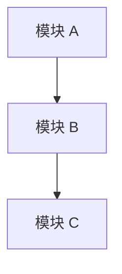

# AI Company Template Standard

Version: v1.0

Status: Draft

Owner: AI Project Manager

Last Updated: 2026-07-12

---

## 1. Template Design Principles

### Principle 1 — Consistent

所有模板必须使用统一的 Header、Footer、Metadata 和 Markdown 风格。

---

### Principle 2 — Complete

每个模板必须包含所有必要章节。

禁止使用模板时遗漏关键信息。

---

### Principle 3 — Fillable

模板中的占位符必须清晰可识别。

使用 `[占位符]` 格式标记待填写内容。

---

### Principle 4 — Reusable

模板设计为可直接复制使用。

禁止每次使用时重新设计结构。

---

---

## 2. Unified Header

所有模板必须使用以下统一的 Header 格式：

```markdown
# [文档类型]: [标题]

Version: v1.0

Status: [Draft / Active / Deprecated]

Owner: [Agent Role]

Last Updated: YYYY-MM-DD
```

特殊场景：
- ADR 文档使用 `ADR-XXX` 作为标题前缀
- Standards 文档额外包含 `Priority` 字段
- Task 文档使用 `Task:` 前缀

---

## 3. Unified Footer

所有模板必须使用以下统一的 Footer 格式：

```markdown
---

# End

[文档用途一句话说明]
```

---

## 4. Unified Metadata 格式

所有模板必须包含以下 Metadata 字段：

| 字段 | 必填 | 说明 |
|------|:----:|------|
| Version | ✅ | 语义化版本号 |
| Status | ✅ | Draft / Active / Deprecated |
| Owner | ✅ | 负责维护的角色 |
| Last Updated | ✅ | YYYY-MM-DD 格式 |
| Priority | Standards 专用 | Highest / High / Medium |
| Related Workflow | PRD 专用 | 关联 Workflow ID |
| Related ADR | Architecture 专用 | 关联 ADR 编号 |

---

## 5. PRD Template

```markdown
# PRD: [功能名称]

Version: v1.0

Status: [Draft / Active]

Owner: Product Manager

Last Updated: YYYY-MM-DD

Related Workflow: [Workflow ID]

---

## 1. 背景与目标

[为什么需要这个功能？解决了什么用户问题？]

## 2. 用户故事

- 作为 [用户角色]，我希望 [功能]，以便 [价值]。

## 3. 功能需求

| # | 需求描述 | 优先级 |
|---|---------|--------|
| 1 | [需求描述] | P0 |

## 4. 非功能需求

- 性能：[目标响应时间]
- 安全：[安全要求]
- 可用性：[可用性要求]

## 5. 验收标准

- [ ] [验收标准 1]

## 6. 影响范围

- 影响的模块：[模块列表]
- 影响的文档：[文档列表]

## 7. 风险

| 风险 | 等级 | 缓解方案 |
|------|------|---------|
| [风险] | [高/中/低] | [方案] |

---

## Change Log

| 日期 | 版本 | 修改内容 | 修改人 |
|------|------|---------|--------|
| YYYY-MM-DD | v1.0 | 初始版本 | Product Manager |

---

# End
```

---

## 6. Architecture Template

```markdown
# Architecture: [模块名称]

Version: v1.0

Status: [Draft / Active]

Owner: Architect

Last Updated: YYYY-MM-DD

Related ADR: [ADR-XXX]

---

## 1. 概述

[架构设计的总体说明]

## 2. 架构图



## 3. 模块划分

| 模块 | 职责 | 依赖 |
|------|------|------|
| [模块] | [职责] | [依赖] |

## 4. 数据流

[数据流向说明]

## 5. 技术选型

| 技术 | 选型理由 |
|------|---------|
| [技术] | [理由] |

## 6. 部署方案

[部署说明]

## 7. 性能目标

| 指标 | 目标 |
|------|------|
| 响应时间 | < [N]ms |

## 8. 风险与限制

- [风险或限制]

---

## Change Log

| 日期 | 版本 | 修改内容 | 修改人 |
|------|------|---------|--------|
| YYYY-MM-DD | v1.0 | 初始版本 | Architect |

---

# End
```

---

## 7. ADR Template

```markdown
# ADR-XXX: [决策标题]

Version: v1.0

Status: [Proposed / Accepted / Deprecated]

Owner: Architect

Last Updated: YYYY-MM-DD

---

## Context

[决策背景：当前面临什么问题？为什么需要这个决策？]

## Decision

[我们做了什么决策？]

## Consequences

[决策带来的正面和负面影响]

### Positive

- [正面影响]

### Negative

- [负面影响]

## Alternatives Considered

| 方案 | 未选原因 |
|------|---------|
| [方案 A] | [原因] |
| [方案 B] | [原因] |

---

## Change Log

| 日期 | 版本 | 修改内容 | 修改人 |
|------|------|---------|--------|
| YYYY-MM-DD | v1.0 | 初始版本 | Architect |

---

# End
```

---

## 8. Task Template

```markdown
# Task: [Task 标题]

Version: v1.0

Task ID: [Workflow ID]-[序号]

Workflow ID: [关联 Workflow 实例 ID]

Scale: [S0 / S1 / S2 / S3 / S4]

Priority: [P0 / P1 / P2 / P3]

Status: [Created / Ready / In Progress / Review / Acceptance / Done / Blocked / Cancelled]

Owner: [Agent Name]

Created: YYYY-MM-DD

Deadline: YYYY-MM-DD

---

## Description

[Task 描述]

## Inputs

- [ ] 需求说明
- [ ] PRD（如需）
- [ ] Architecture 方案（如需）

## Acceptance Criteria

- [ ] 验收标准 1
- [ ] 验收标准 2

## Deliverables

- [ ] [交付物路径]

## Dependencies

- [ ] [依赖描述]

## Risks

- [ ] [风险描述]

---

## Status History

| 日期 | 状态 | 说明 |
|------|------|------|
| YYYY-MM-DD | Created | Task 创建 |
| YYYY-MM-DD | Done | Task 完成 |

---

# End
```

---

## 9. Review Template

```markdown
# Review Report: [Review ID]

Version: v1.0

Review Type: [Code / Architecture / PRD / Document / Security / Performance / Business]

Workflow ID: [关联 Workflow 实例 ID]

Reviewer: [Reviewer Name]

Status: [In Progress / Pass / Need Fix / Reject / Closed]

Requested: YYYY-MM-DD HH:mm

Completed: YYYY-MM-DD HH:mm

---

## 1. Review Scope

[本次 Review 的范围描述]

## 2. Review Result

Result: [Pass / Need Fix / Reject]

## 3. Issues Found

| # | Severity | Description | File / Location | Status |
|---|----------|-------------|-----------------|--------|
| 1 | Critical | [描述] | [位置] | Fixed |
| 2 | Major | [描述] | [位置] | Pending |
| 3 | Minor | [描述] | [位置] | Ignored |

## 4. Suggestions

- [建议 1]
- [建议 2]

---

## Change Log

| 日期 | 版本 | 修改内容 | 修改人 |
|------|------|---------|--------|
| YYYY-MM-DD | v1.0 | 初始版本 | Reviewer |

---

# End
```

---

## 10. API Template

```markdown
# API: [接口名称]

Version: v1.0

Status: [Draft / Active]

Owner: Full Stack Engineer

Last Updated: YYYY-MM-DD

---

## Endpoint

`[METHOD] /[path]`

## Authentication

[认证方式说明]

## Request

### Headers

| 参数名 | 类型 | 必填 | 说明 |
|--------|------|:----:|------|
| Authorization | string | ✅ | Bearer token |

### Parameters

| 参数名 | 类型 | 必填 | 说明 |
|--------|------|:----:|------|
| [参数] | string | ✅ | [说明] |

### Body

```json
{
  "field": "value"
}
```

## Response

### Success Response (200)

```json
{
  "field": "value"
}
```

### Error Response (4xx / 5xx)

```json
{
  "error": "message"
}
```

## Rate Limit

[限流说明]

## Example

```bash
curl -X POST https://api.example.com/v1/endpoint \
  -H "Authorization: Bearer sk-xxx" \
  -d '{"key": "value"}'
```

---

## Change Log

| 日期 | 版本 | 修改内容 | 修改人 |
|------|------|---------|--------|
| YYYY-MM-DD | v1.0 | 初始版本 | Full Stack Engineer |

---

# End
```

---

## 11. Agent Template

```markdown
# [Agent Name]

Version: v1.0

Status: Active

Owner: [Owner Role]

---

## 3.1 Identity（身份）

- Agent Name: [Agent Name]
- Version: v1.0
- Status: Active
- Owner: [Owner Role]

## 3.2 Mission（使命）

[Agent 为什么存在？最终目标是什么？]

## 3.3 Responsibilities（职责）

- [职责 1]
- [职责 2]

## 3.4 Authority（权限）

✔ 可以：

- [权限 1]

✘ 不可以：

- [禁止事项 1]

## 3.5 Inputs（输入）

- [输入 1]
- [输入 2]

禁止自行猜测需求。

## 3.6 Outputs（输出）

- **内容**: [输出内容]
- **格式**: Markdown
- **模板**: [模板名称]

## 3.7 Workflow（参与流程）

参与规模：[S0 / S1 / S2 / S3 / S4]

## 3.8 Skills（能力）

- [Skill 名称]

## 3.9 Knowledge（知识）

- [知识目录]

## 3.10 Templates（模板）

- [模板名称]

## 3.11 Checklist（检查清单）

□ 检查项 1

## 3.12 KPIs（成功标准）

- [KPI 1]

## 3.13 Constraints（约束）

- [约束 1]

---

# End
```

---

## 12. Skill Template

```markdown
# [Skill Name]

Skill ID: [skill-name]

Version: v1.0

Status: [Draft / Active / Deprecated]

Owner: [Agent Role]

Category: [Development / Design / Management / Domain / Quality]

Last Updated: YYYY-MM-DD

---

## Input

| 名称 | 类型 | 来源 | 说明 |
|------|------|------|------|
| [输入名称] | [类型] | [来源] | [说明] |

## Output

| 名称 | 类型 | 接收方 | 说明 |
|------|------|--------|------|
| [输出名称] | [类型] | [接收方] | [说明] |

## Constraints

### 必须遵守

- [约束 1]

### 禁止行为

- [禁止事项 1]

### 前置条件

- [条件 1]

## Dependencies

| Skill ID | 依赖类型 | 说明 |
|----------|---------|------|
| [skill-id] | Required | [说明] |

## Testing

### 验证方式

- [验证方式 1]

### 成功标准

- [标准 1]

---

## Change Log

| 日期 | 版本 | 修改内容 | 修改人 |
|------|------|---------|--------|
| YYYY-MM-DD | v1.0 | 初始版本 | Architect |

---

# End
```

---

## 13. Knowledge Template

```markdown
# [知识标题]

Version: v1.0

Status: [Draft / Active / Deprecated]

Owner: [Agent Role]

Category: [Project / Architecture / Domain / External / Operations / Glossary]

Last Updated: YYYY-MM-DD

---

## 概述

[知识内容的简要说明]

## 正文

[知识内容]

---

## 相关引用

- [引用 1](路径)

---

## Version

Current: v1.0

## Change Log

| 日期 | 版本 | 修改内容 | 修改人 |
|------|------|---------|--------|
| YYYY-MM-DD | v1.0 | 初始版本 | [Owner] |

---

# End
```

---

## 14. Workflow Template

```markdown
# Workflow: [Workflow 名称]

Workflow ID: [workflow-type]-[s-level]-[description]-[YYYYMMDD]

Version: v1.0

Status: [Active / Completed]

Scale: [S0 / S1 / S2 / S3 / S4]

Owner: AI Project Manager

Created: YYYY-MM-DD

---

## Trigger

[触发条件]

## Input

[输入说明]

## Steps

### Step 1: [步骤名称]

- **Agent**: [Agent 名称]
- **Action**: [执行动作]
- **Output**: [输出物]

### Step 2: [步骤名称]

- **Agent**: [Agent 名称]
- **Action**: [执行动作]
- **Output**: [输出物]

## Output

[最终输出说明]

## Exit Condition

[退出条件]

---

## Status History

| 日期 | 状态 | 说明 |
|------|------|------|
| YYYY-MM-DD | Active | Workflow 启动 |
| YYYY-MM-DD | Completed | Workflow 完成 |

---

# End
```

---

## 15. Checklist Template

```markdown
# Checklist: [Checklist 名称]

Version: v1.0

Owner: [Agent Role]

Last Updated: YYYY-MM-DD

---

### [阶段名称]

□ [检查项 1]

□ [检查项 2]

---

### [阶段名称]

□ [检查项 3]

□ [检查项 4]

---

## Change Log

| 日期 | 版本 | 修改内容 | 修改人 |
|------|------|---------|--------|
| YYYY-MM-DD | v1.0 | 初始版本 | [Owner] |

---

# End
```

---

## 16. Decision Template

```markdown
# Decision: [决策标题]

Version: v1.0

Status: [Proposed / Accepted / Rejected]

Decision Level: [L1 Strategic / L2 Tactical / L3 Operational / L4 Technical]

Decision Maker: [Agent Role]

Date: YYYY-MM-DD

---

## Context

[决策背景和触发条件]

## Options Considered

| 选项 | 优点 | 缺点 |
|------|------|------|
| [选项 A] | [优点] | [缺点] |
| [选项 B] | [优点] | [缺点] |

## Decision

[最终决策内容]

## Rationale

[决策理由]

## Impact

[决策的影响范围]

## Related ADR

[是否需要形成 ADR：是 / 否。如需要，关联 ADR 编号]

---

## Change Log

| 日期 | 版本 | 修改内容 | 修改人 |
|------|------|---------|--------|
| YYYY-MM-DD | v1.0 | 初始版本 | [Decision Maker] |

---

# End
```

---

## 17. Template Usage Rules

### 使用规则

- 所有文档必须基于模板创建
- 禁止从空白文档开始编写
- 模板中的占位符 `[占位符]` 必须替换为实际内容
- 不需要的章节可以删除，但不可新增未定义的章节
- 所有模板文件存储于 `ai-company/05-templates/`

### 自定义规则

- 如模板不满足需求，必须先修改模板标准，再使用新模板
- 禁止单次使用中临时修改模板结构
- 模板修改必须经过 Review

---

## Change Log

| 日期 | 版本 | 修改内容 | 修改人 |
|------|------|---------|--------|
| 2026-07-12 | v1.0 | 初始版本 | AI Project Manager |

---

# End

本规范是 AI Company 所有模板的统一标准。

所有文档模板必须遵守本规范。

如与 Project Standard 冲突：Project Standard 优先。

如与 Document Standard 冲突：Document Standard 优先。
