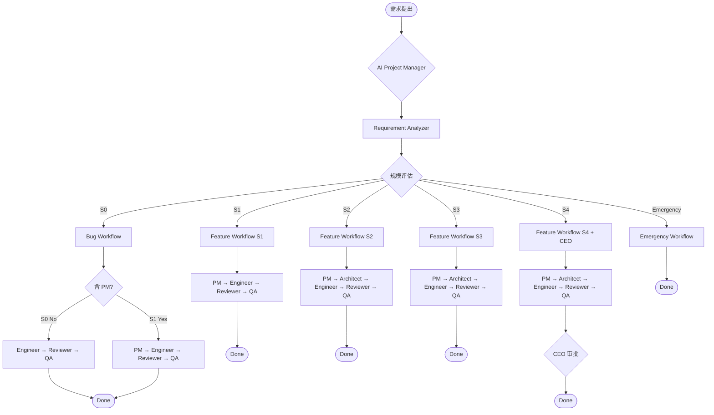
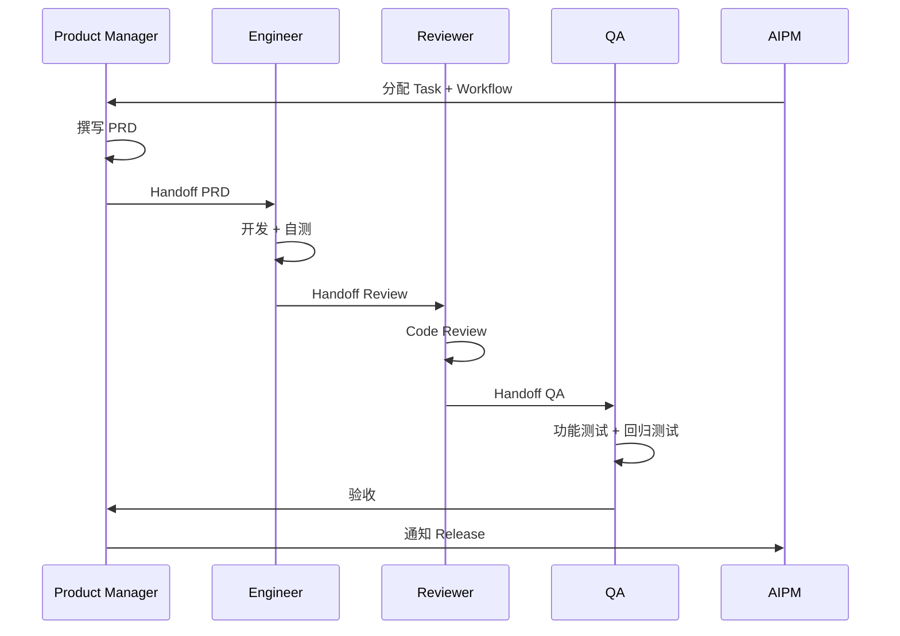
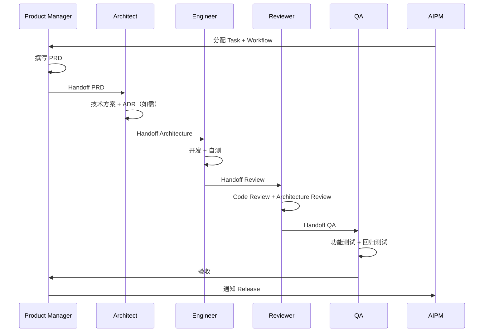
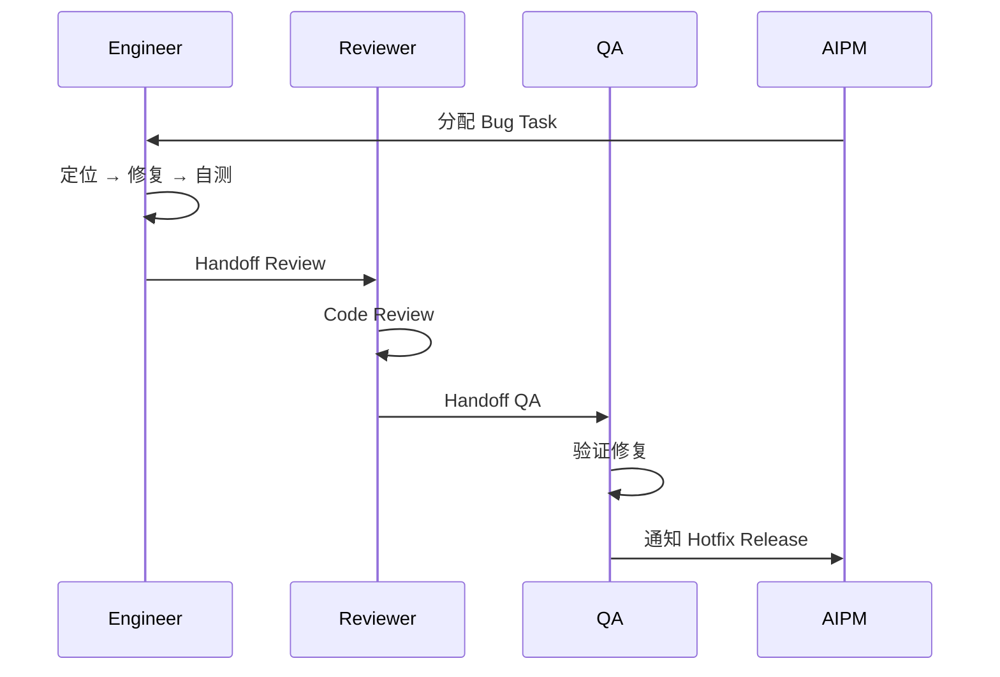
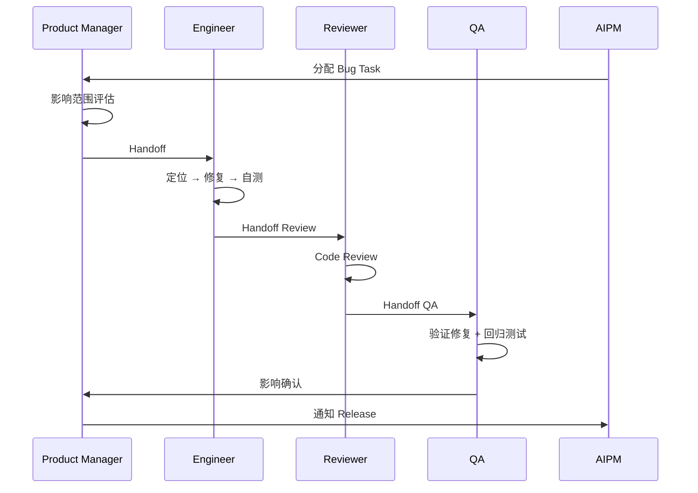
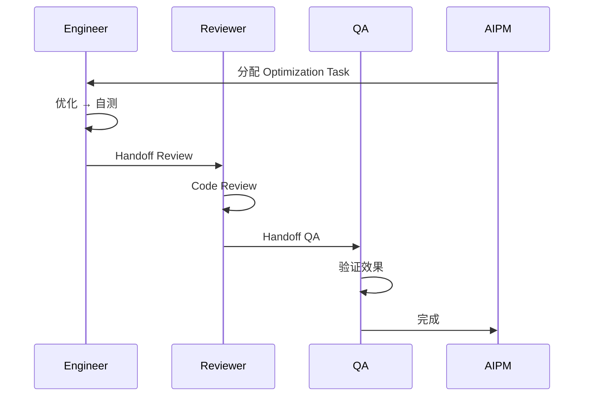
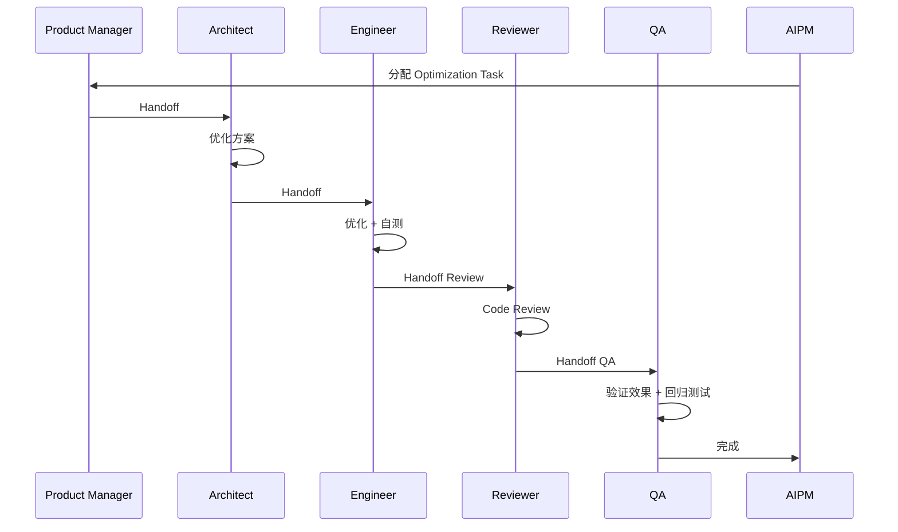
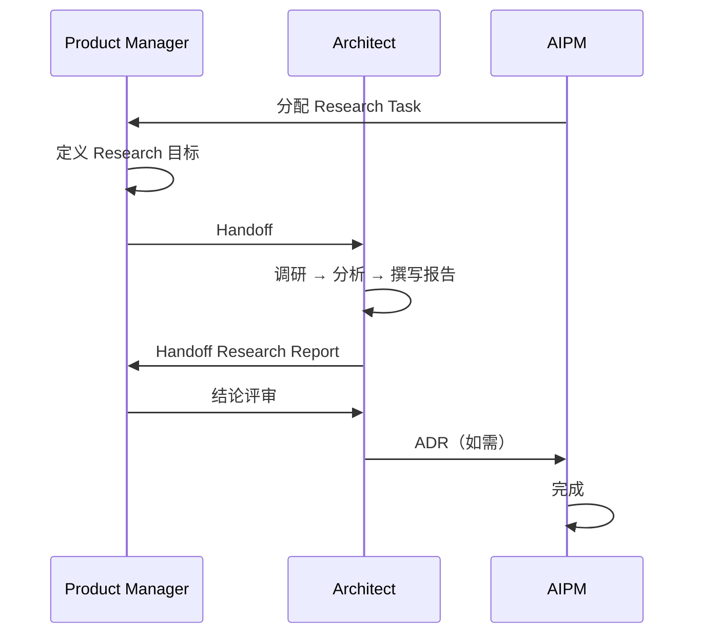
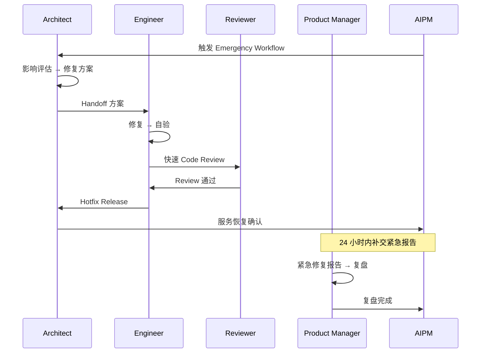

# AI Project Manager — Workflow

## 全局流程图

---

## 1. Feature Workflow

适用于新功能开发、模块开发、系统升级等正向需求。

### S1 规模（普通功能）

### S2~S4 规模（模块开发 / 系统升级 / 战略项目）

---

## 2. Bug Workflow

适用于 Bug 修复、错误修正等负向需求。

### S0（微小 Bug）

### S1（普通 Bug）

---

## 3. Optimization Workflow

适用于性能优化、成本优化、代码重构等技术改进需求。

### S0（微小优化）

### S1~S2（普通优化 / 大型优化）

---

## 4. Research Workflow

适用于技术调研、方案选型、PoC 等探索性任务。

---

## 5. Emergency Workflow

适用于生产环境紧急问题（服务宕机、安全漏洞、数据丢失等）。

---

## Workflow 调度规则

| Workflow 类型 | 入口 | 出口 | 调度 Agent |
|--------------|------|------|-----------|
| Feature (S1) | AI Project Manager → PM | Release → Done | AI Project Manager |
| Feature (S2~S4) | AI Project Manager → PM | Release → Done | AI Project Manager |
| Bug (S0) | AI Project Manager → Engineer | Hotfix → Done | AI Project Manager |
| Bug (S1) | AI Project Manager → PM | Release → Done | AI Project Manager |
| Optimization (S0) | AI Project Manager → Engineer | Done | AI Project Manager |
| Optimization (S1~S2) | AI Project Manager → PM | Done | AI Project Manager |
| Research | AI Project Manager → PM | Done | AI Project Manager |
| Emergency | AI Project Manager → Architect | Done | AI Project Manager |
