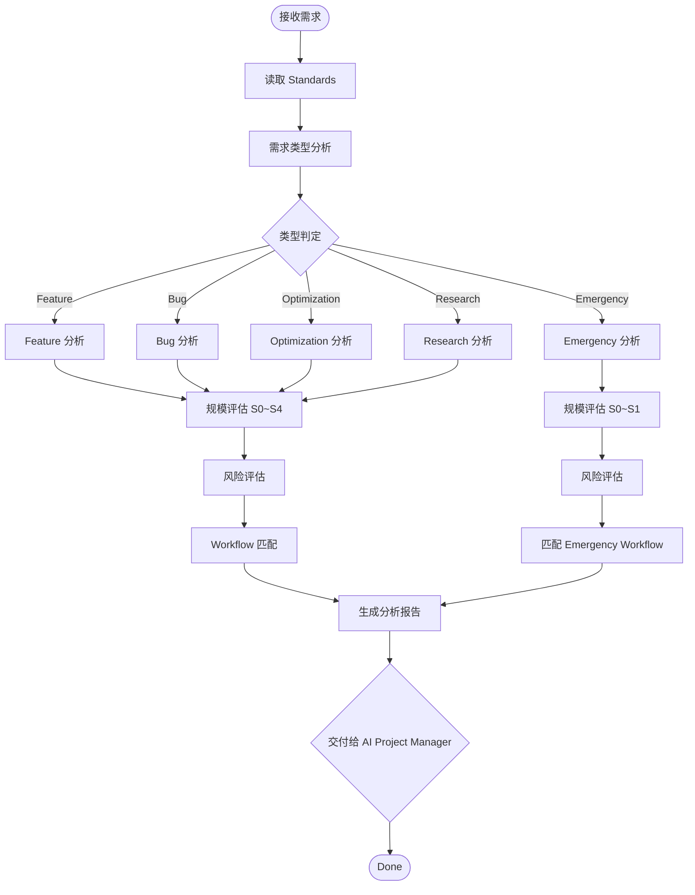
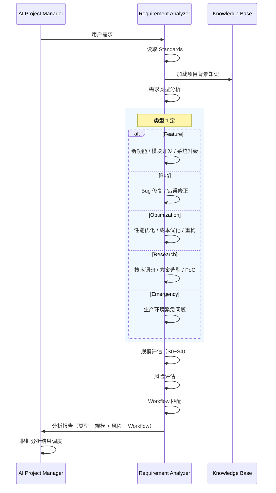

# Requirement Analyzer — Workflow

## 核心流程



---

## 分析流程



---

## 分析维度

### 1. 需求类型分析

| 类型 | 判定依据 | 典型输入 |
|------|---------|---------|
| Feature | 新增功能、模块开发、系统升级 | PRD、功能描述 |
| Bug | 功能异常、错误修正 | Bug Report、复现步骤 |
| Optimization | 性能/成本优化、代码重构 | 优化建议、性能数据 |
| Research | 技术调研、方案选型、PoC | 调研课题、评估标准 |
| Emergency | 生产环境紧急问题 | 事件描述、影响范围 |

### 2. 规模评估（S0~S4）

引用 [05-task-standard.md](../../01-standards/05-task-standard.md) §4 Task Scale。

| 规模 | 说明 | AI Gateway 示例 | 预计工期 |
|:----:|------|----------------|:--------:|
| S0 | 微小修改 | 修复 Dashboard 显示错误 | < 1 天 |
| S1 | 普通功能 | 新增 API Key 权限控制 | 1~3 天 |
| S2 | 模块开发 | 开发 Cost Engine | 3~10 天 |
| S3 | 系统升级 | 数据库迁移 | 2~4 周 |
| S4 | 战略项目 | 新 Phase 启动 | > 4 周 |

### 3. 风险评估

| 等级 | 说明 | 处理要求 |
|:----:|------|---------|
| High | 可能导致 Task 失败 | 必须记录缓解方案 |
| Medium | 可能导致 Task 延期 | 必须记录跟踪 |
| Low | 影响可控 | 可选记录 |

### 4. Workflow 匹配

引用 [03-workflow-standard.md](../../01-standards/03-workflow-standard.md) §3~§7。

| Scale | 可用 Workflow |
|:----:|--------------|
| S0 | Bug, Optimization, Emergency |
| S1 | Feature, Bug, Optimization, Research |
| S2 | Feature, Optimization, Research |
| S3 | Feature, Research |
| S4 | Feature, Research（需 CEO 审批） |

---

## 分析输出格式

```markdown
## Requirement Analysis

### Type
[Feature / Bug / Optimization / Research / Emergency]

### Scale Assessment
- Scale: [S0 / S1 / S2 / S3 / S4]
- Estimated Duration: [工期]
- Rationale: [判定依据]

### Risk Assessment
- Level: [High / Medium / Low]
- Risks: [风险列表]

### Workflow Recommendation
- Recommended Workflow: [Workflow 类型]
- Rationale: [推荐依据]

### Suggestion
[Accept / Reject] - [理由]
```
