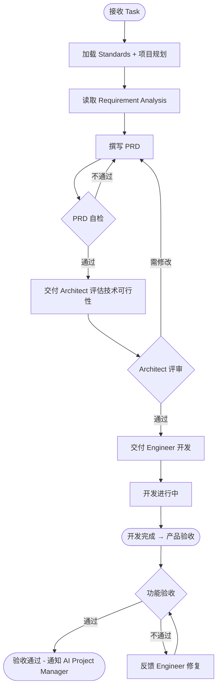
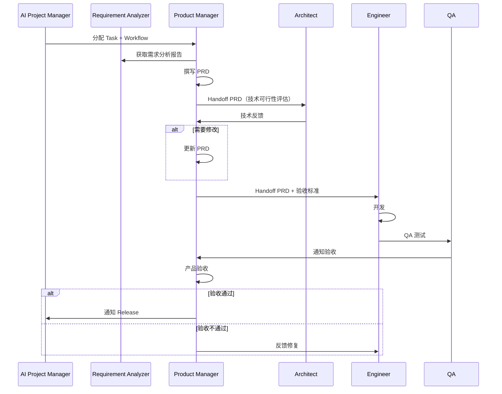
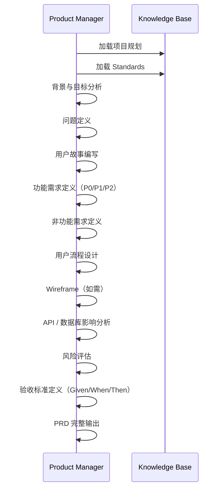
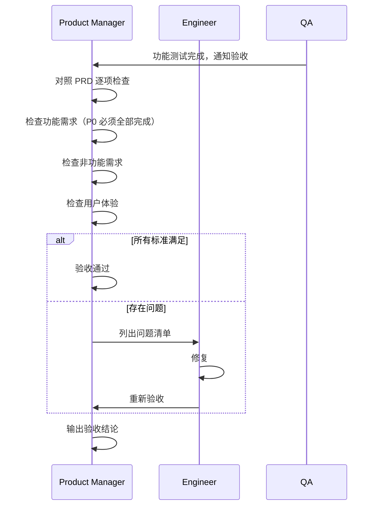

# Product Manager — Workflow

## 核心流程



---

## 与上下游协作流程



---

## PRD 撰写流程



---

## 验收流程



---

## 关键输出规范

### PRD 输出

引用 [03-prd-template.md](../../06-templates/03-prd-template.md)。

PRD 必须包含：

- 背景与目标
- 用户故事
- 功能需求（标注 P0 / P1 / P2）
- 非功能需求
- 验收标准（Given / When / Then）
- 影响范围
- 风险

### 验收结论输出

```markdown
## Product Acceptance

### Result
[Pass / Conditional / Failed]

### Checklist
- [ ] 所有 P0 需求已完成
- [ ] 非功能需求已达标
- [ ] 用户体验符合预期
- [ ] 无影响使用的 Bug

### Issues（如果验收不通过）
| # | Issue | Severity | Assigned To |
|---|-------|----------|-------------|
```
