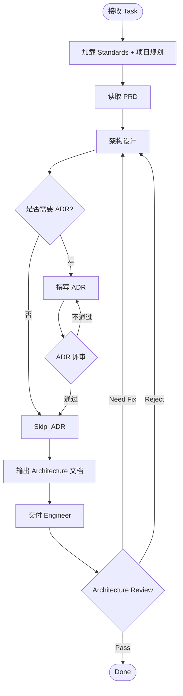
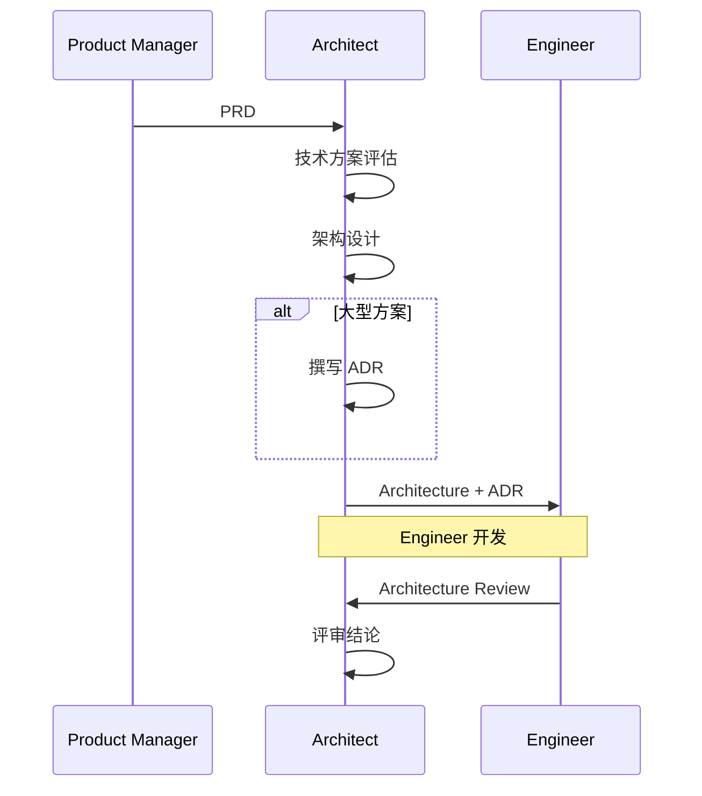
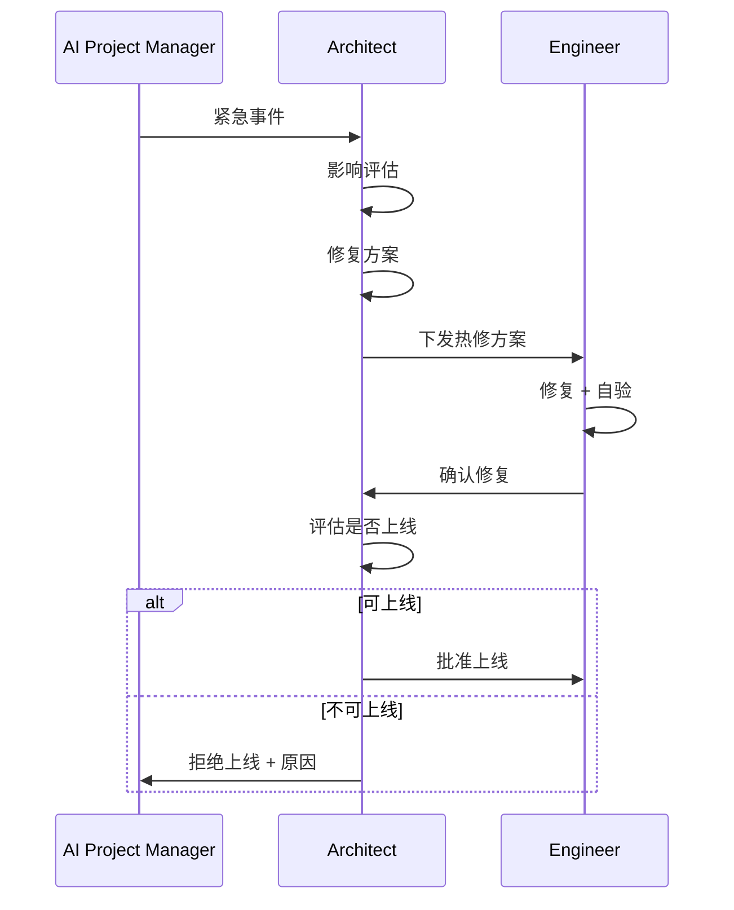
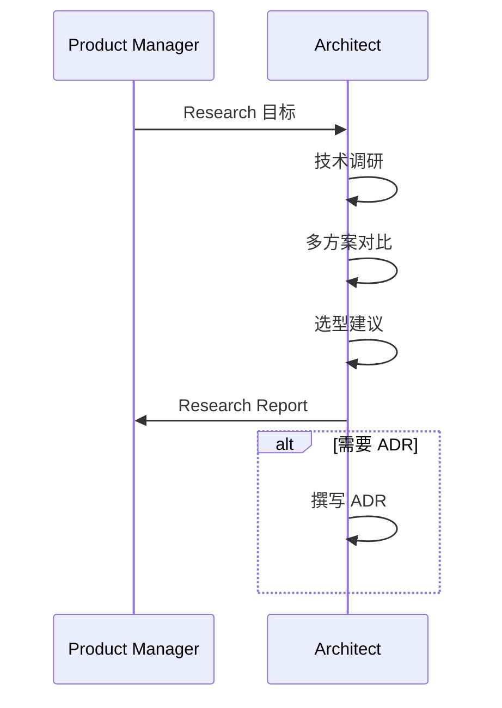

# Architect — Workflow

## 核心流程

---

## 各场景架构设计流程

### Feature Workflow（S2~S4）

### Emergency Workflow

### Research Workflow

---

## 架构设计要点

### 必须包含的设计视图

| 视图 | 说明 | Mermaid |
|:----:|------|:-------:|
| System Context | 系统与外部系统的关系 | ✅ |
| Component Diagram | 内部组件和依赖 | ✅ |
| Sequence Diagram | 核心流程交互 | ✅ |
| Layer Design | 分层架构 | — |
| Database Design | 数据模型 | ✅ |
| Deployment | 部署架构 | ✅ (如需) |

### 性能目标参考

| 指标 | 目标 |
|------|------|
| API Gateway 主链路 | < 10ms（不含模型推理） |
| Policy Engine 决策 | < 2ms |
| Router 决策 | < 2ms |
| 数据库查询 (99%) | < 10ms |
| 统计/成本/日志 | 全部异步化 |

### ADR 触发条件

| 场景 | 必须 ADR |
|------|:--------:|
| 技术方案选型 | ✅ |
| 架构设计变更 | ✅ |
| 第三方服务选择 | ✅ |
| 数据库设计 | ✅ |
| 重大重构 | ✅ |
| 技术栈变更 | ✅ |
