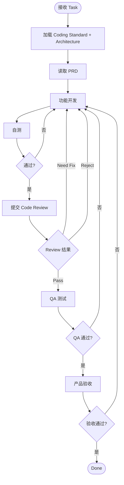
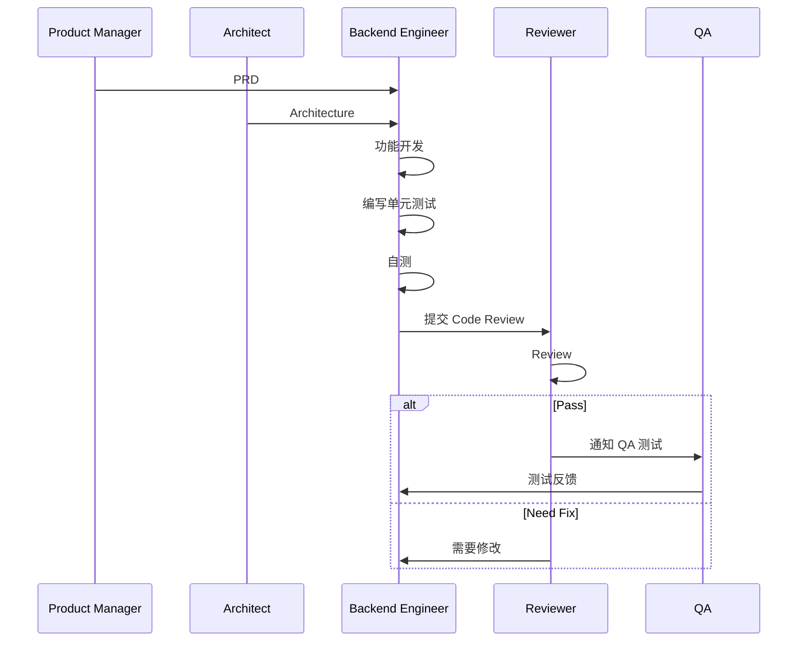
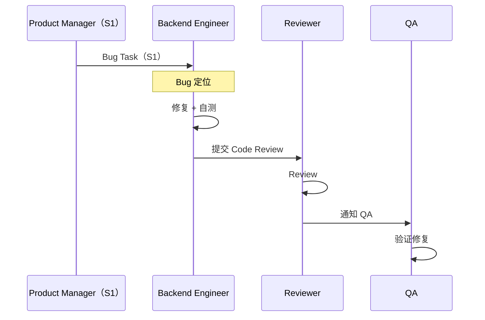
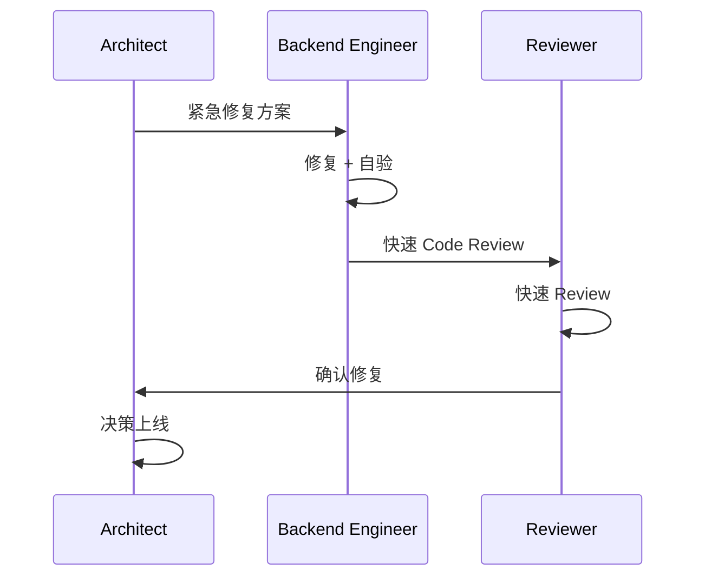

# Backend Engineer — Workflow

## 核心流程

---

## 各场景开发流程

### Feature 开发

### Bug 修复

### Emergency 修复

---

## 开发规范

引用 [11-coding-standard.md](../../01-standards/11-coding-standard.md) §4。

| 规范 | 要求 |
|------|------|
| 目录结构 | `cmd/` + `internal/{controller,service,repository,...}` |
| 分层 | Controller → Service → Repository |
| DI | 构造函数注入 |
| Context | 所有方法必须接收 context.Context |
| 错误处理 | 使用 `internal/errors` |
| 日志 | 使用 Logger，禁止 fmt.Println |
| 测试 | 表格驱动测试，Mock 外部依赖 |
