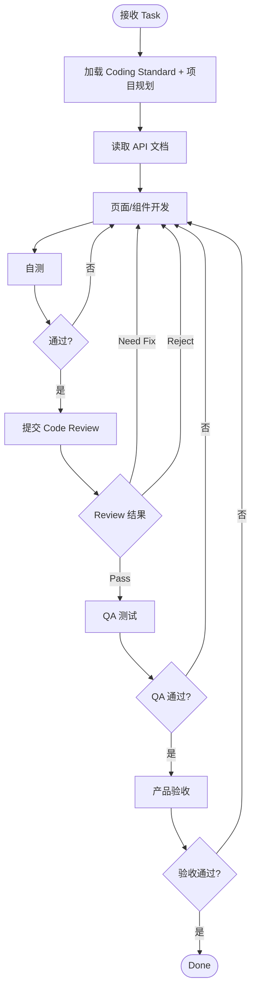
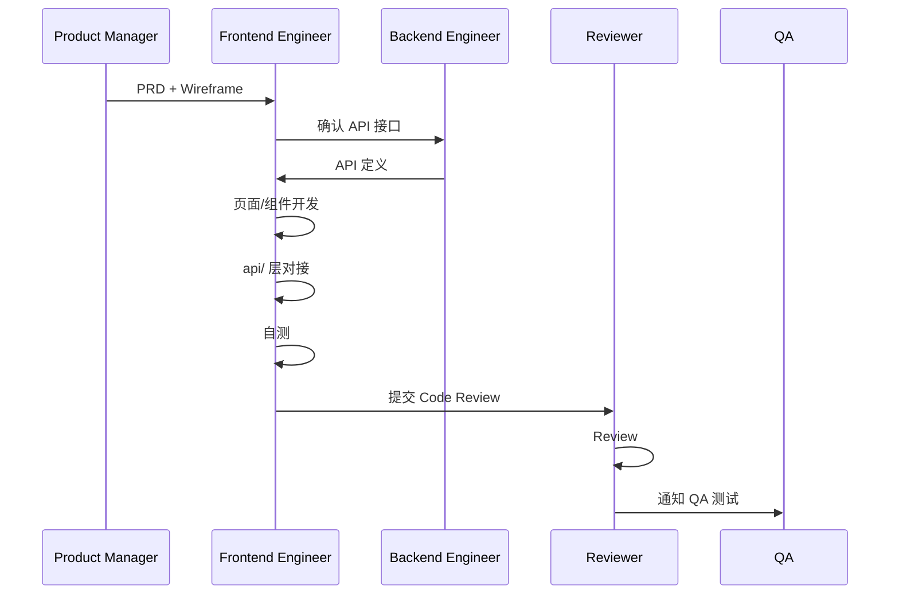
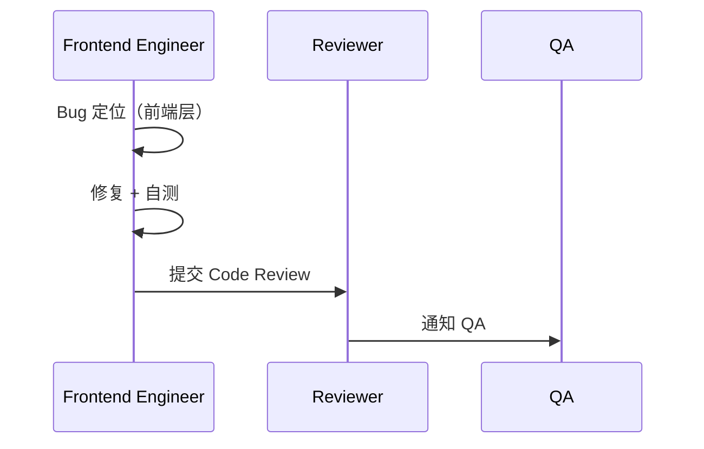

# Frontend Engineer — Workflow

## 核心流程



---

## 各场景开发流程

### 新页面 / 组件开发



### Bug 修复



---

## 组件开发规范

引用 [11-coding-standard.md](../../01-standards/11-coding-standard.md) §5。

### 目录结构

```
src/pages/          页面组件
src/components/     通用组件（common/ + business/）
src/composables/    组合式函数
src/api/            API 调用层
src/stores/         Pinia 状态
src/types/          TS 类型定义
src/hooks/          自定义 Hooks
src/utils/          工具函数
```

### 组件规则

- 每个 `.vue` 文件只包含一个组件
- 使用 `<script setup lang="ts">`
- Props 和 Emits 必须定义类型
- API 调用走 `src/api/` 层
- 全局状态走 Pinia
