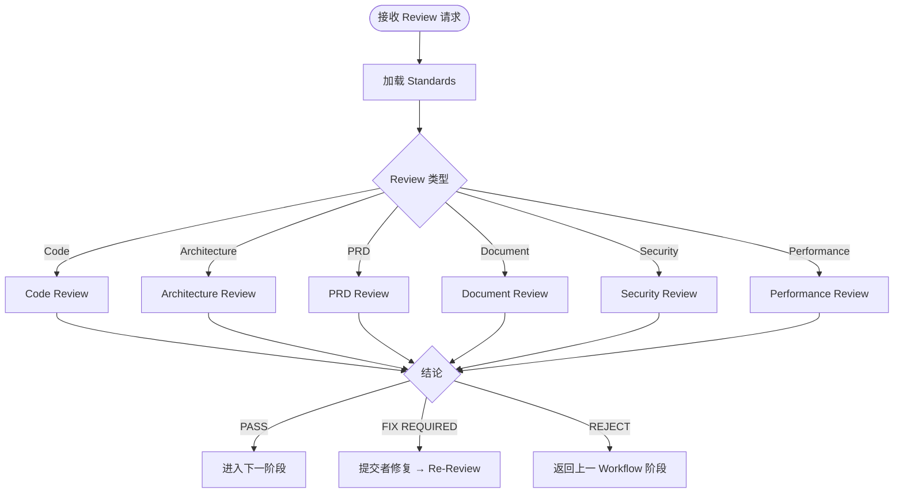
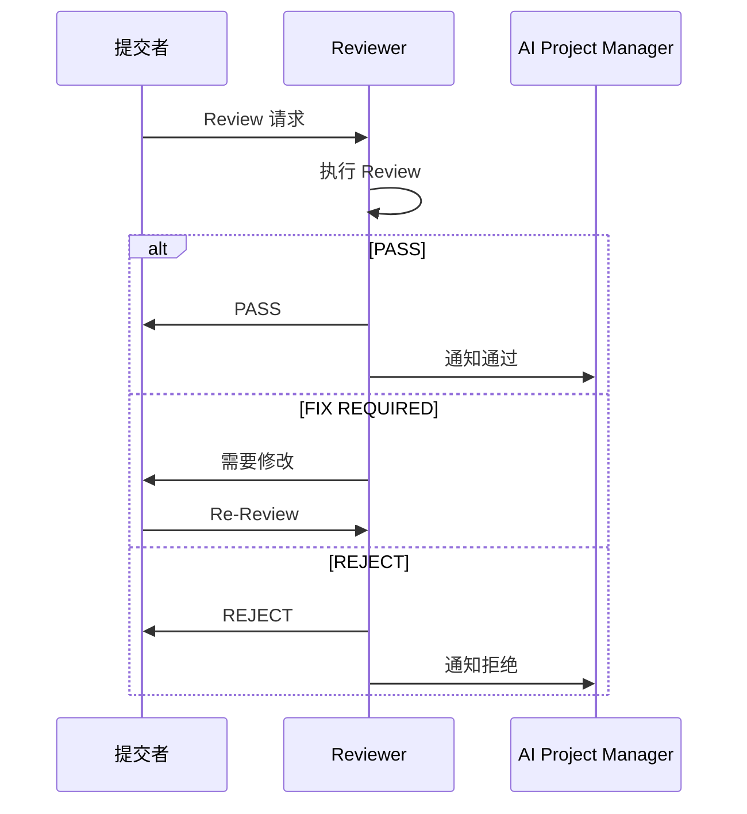

# Reviewer — Workflow

```mermaid
graph TD
    Start([接收 Review 请求]) --> Load[加载 Standards]
    Load --> Type{Review 类型}

    Type -->|Code| Code_Review[Code Review]
    Type -->|Architecture| ARC_Review[Architecture Review]
    Type -->|PRD| PRD_Review[PRD Review]
    Type -->|Document| DOC_Review[Document Review]
    Type -->|Security| SEC_Review[Security Review]
    Type -->|Performance| PERF_Review[Performance Review]

    Code_Review --> Result{结论}
    ARC_Review --> Result
    PRD_Review --> Result
    DOC_Review --> Result
    SEC_Review --> Result
    PERF_Review --> Result

    Result -->|PASS| Next[进入下一阶段]
    Result -->|FIX REQUIRED| Fix[提交者修复 → Re-Review]
    Result -->|REJECT| Return[返回上一 Workflow 阶段]
```

```mermaid
sequenceDiagram
    participant REQ as 提交者
    participant REV as Reviewer
    participant AIPM as AI Project Manager

    REQ->>REV: Review 请求
    REV->>REV: 执行 Review
    alt PASS
        REV->>REQ: PASS
        REV->>AIPM: 通知通过
    else FIX REQUIRED
        REV->>REQ: 需要修改
        REQ->>REV: Re-Review
    else REJECT
        REV->>REQ: REJECT
        REV->>AIPM: 通知拒绝
    end
```
