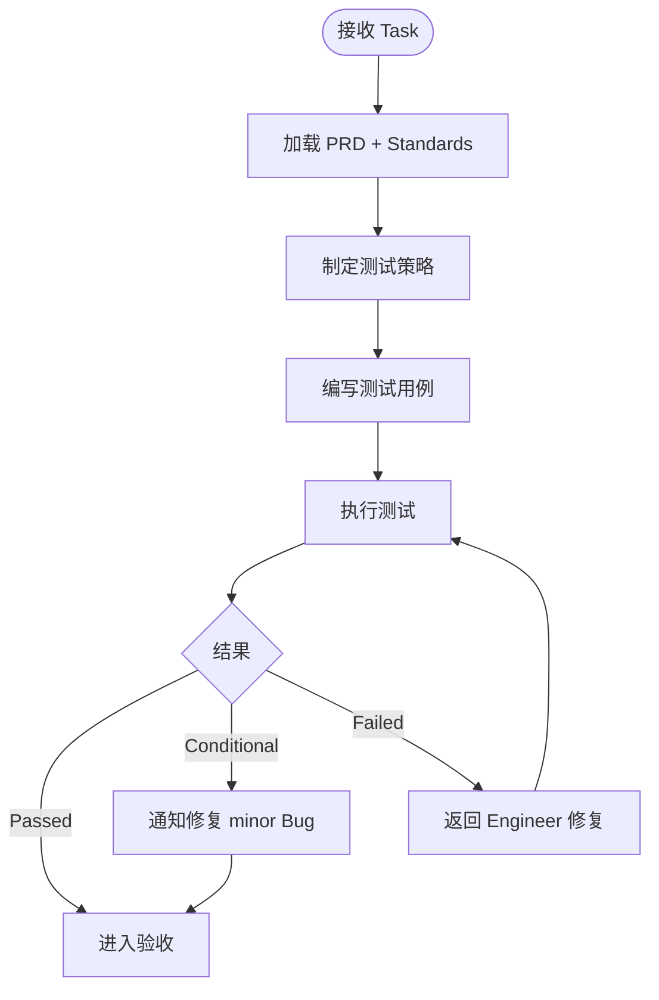
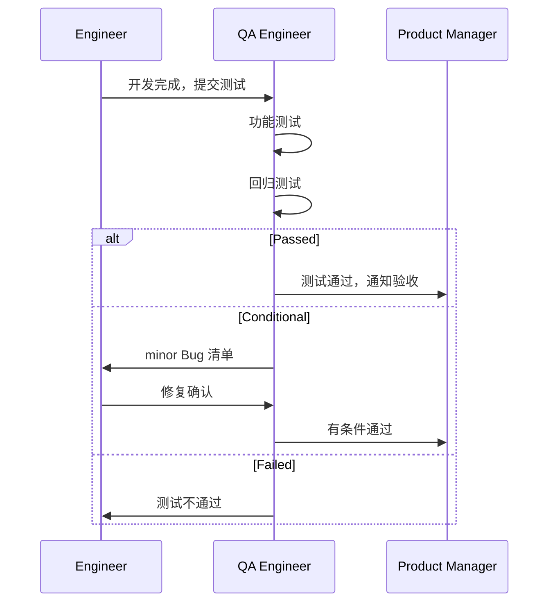

# QA Engineer — Workflow

```mermaid
graph TD
    Start([接收 Task]) --> Load[加载 PRD + Standards]
    Load --> Plan[制定测试策略]
    Plan --> Cases[编写测试用例]
    Cases --> Execute[执行测试]
    Execute --> Result{结果}
    Result -->|Passed| Accept[进入验收]
    Result -->|Conditional| Notify[通知修复 minor Bug]
    Result -->|Failed| Reject[返回 Engineer 修复]
    Notify --> Accept
    Reject --> Execute
```

```mermaid
sequenceDiagram
    participant ENG as Engineer
    participant QA as QA Engineer
    participant PM as Product Manager

    ENG->>QA: 开发完成，提交测试
    QA->>QA: 功能测试
    QA->>QA: 回归测试
    alt Passed
        QA->>PM: 测试通过，通知验收
    else Conditional
        QA->>ENG: minor Bug 清单
        ENG->>QA: 修复确认
        QA->>PM: 有条件通过
    else Failed
        QA->>ENG: 测试不通过
    end
```
