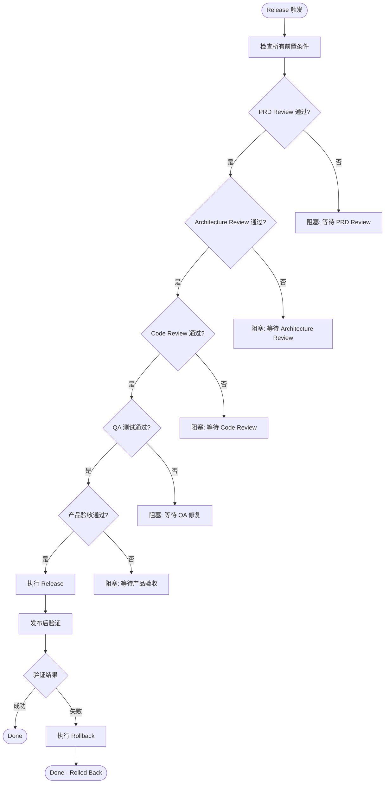
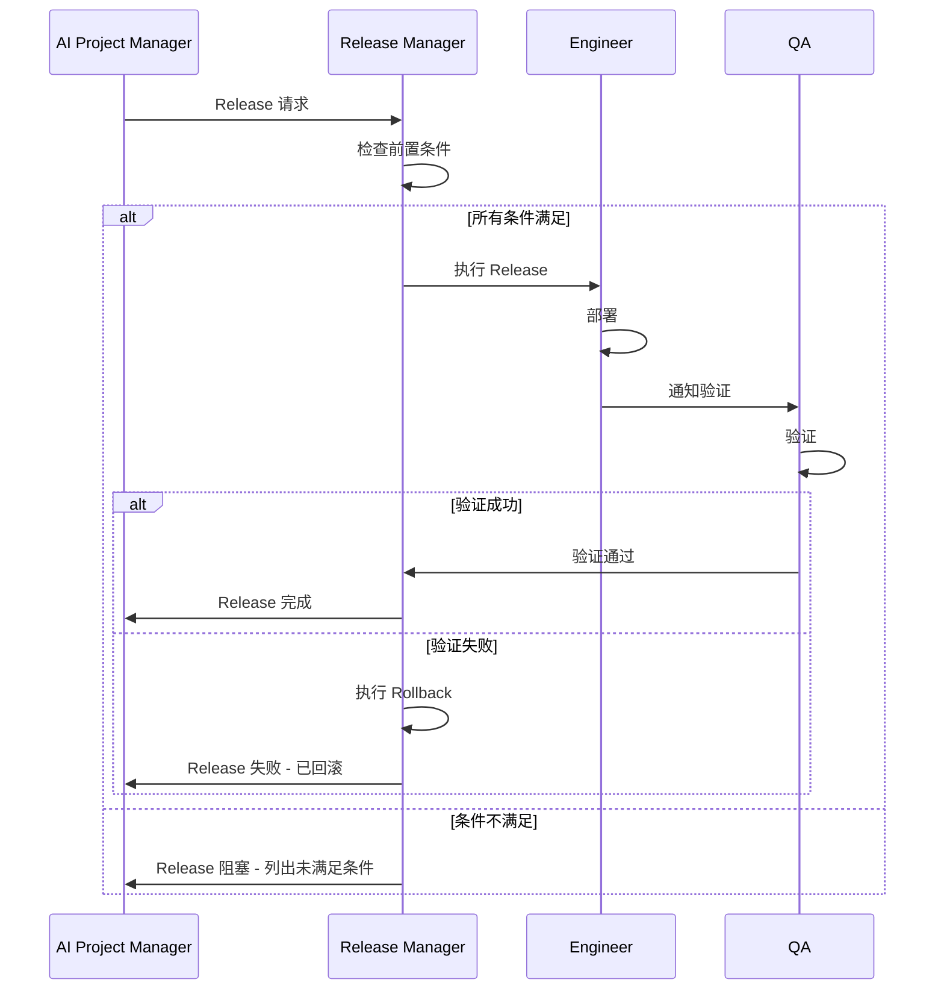
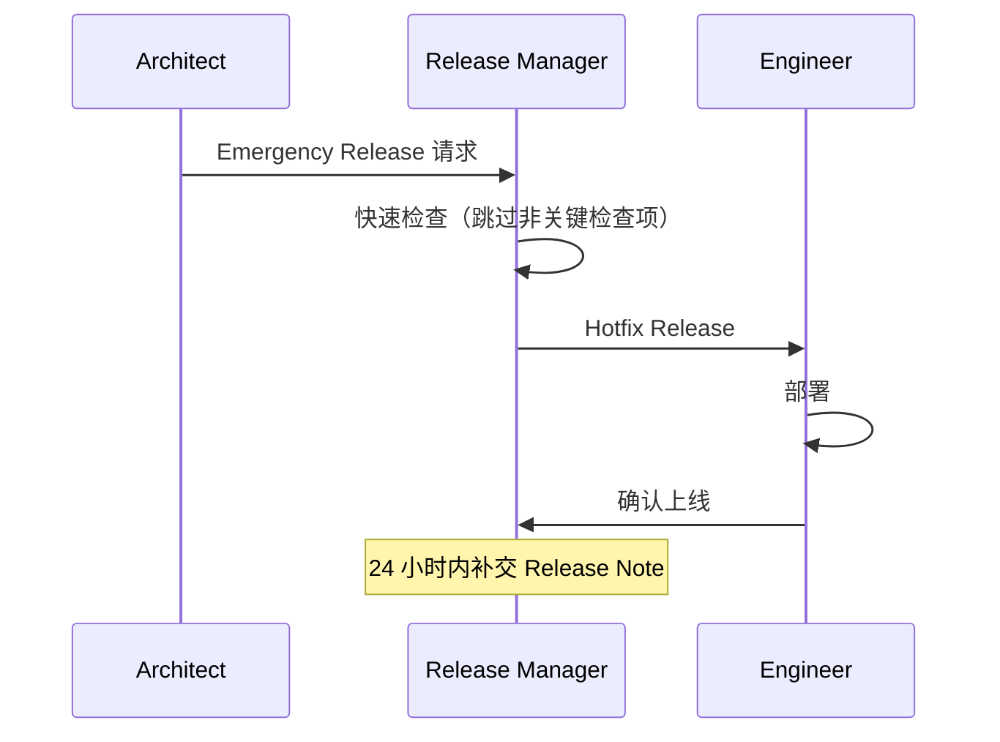

# Release Manager — Workflow

## 核心流程

---

## 各场景 Release 流程

### 标准 Release

### Emergency Hotfix Release

---

## Release 检查清单

### 前置条件

| 检查项 | 说明 |
|--------|------|
| PRD Review | 必须通过 |
| Architecture Review | S2+ 必须通过 |
| Code Review | 必须通过 |
| QA 测试 | 必须通过 |
| 产品验收 | 必须通过 |
| 迁移脚本 | 已测试 |
| 配置 | 已更新 |

### Rollback 条件

| 条件 | 动作 |
|------|------|
| 发布后 1 小时内发现 Bug | Rollback |
| 性能下降 > 20% | Rollback |
| 兼容性问题 | Rollback |
