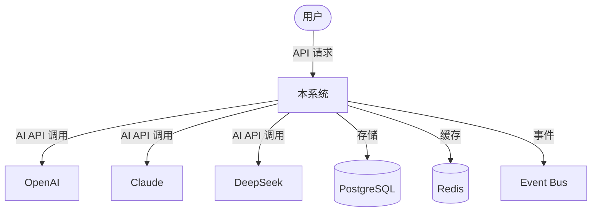
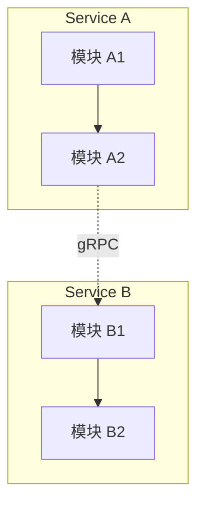
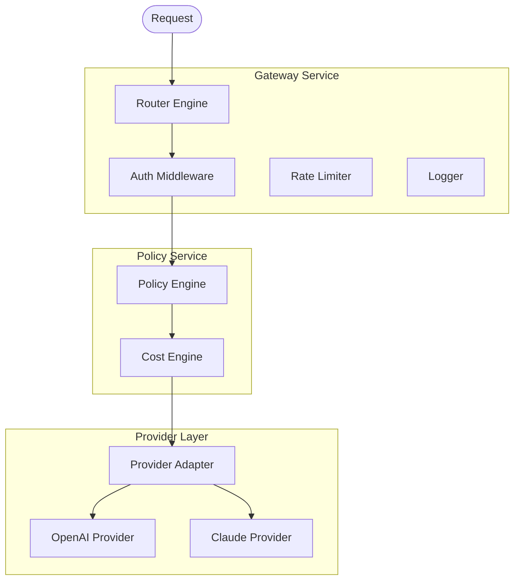
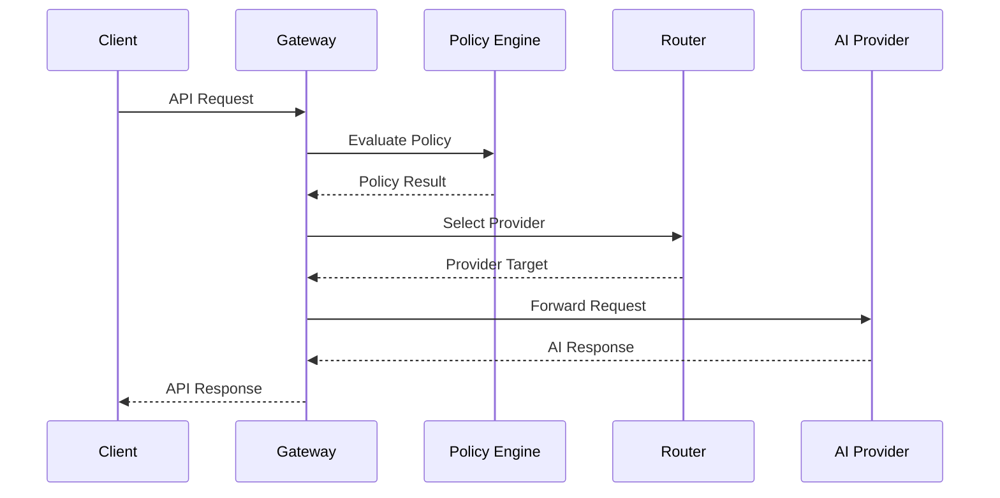
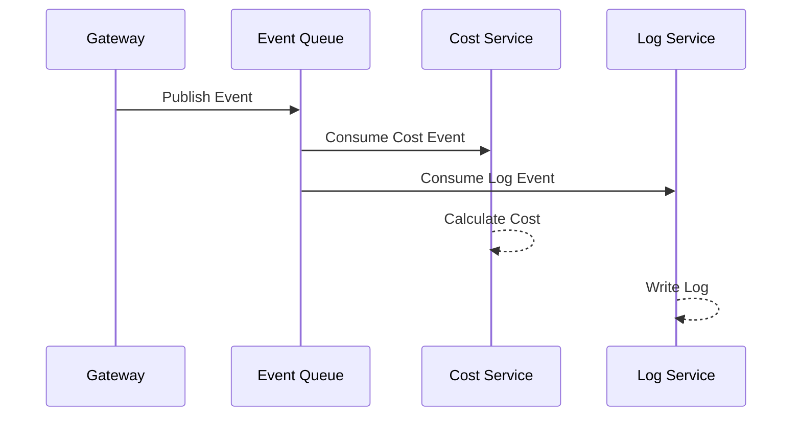
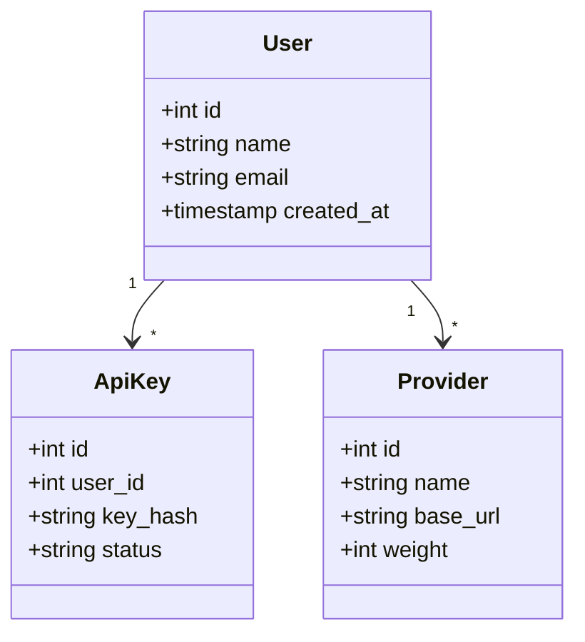
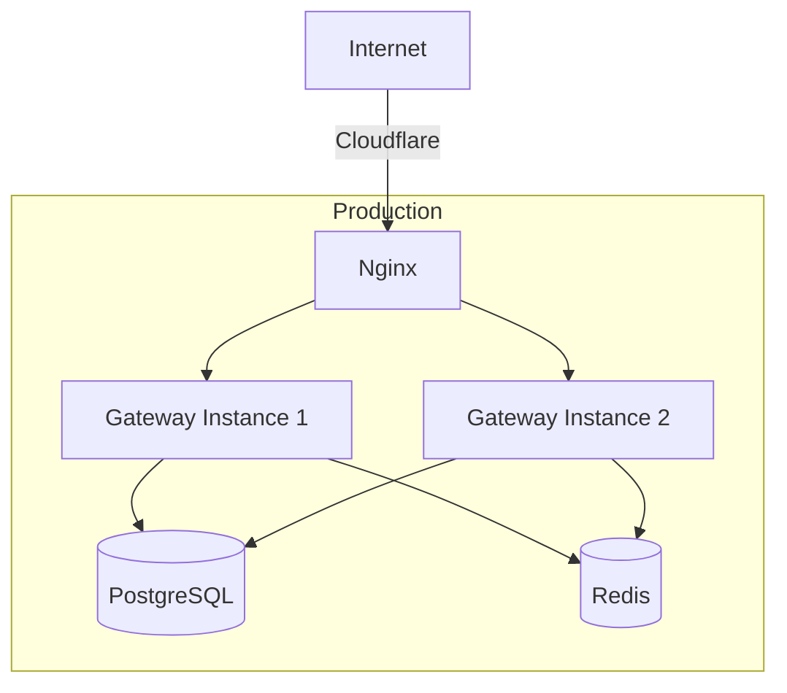

# Architecture: [模块名称]

Version: v1.0

Status: [Draft / Active / Deprecated]

Owner: Architect

Last Updated: YYYY-MM-DD

Related ADR: [ADR-XXX]

---

## 1. Metadata

| 字段 | 值 |
|------|-----|
| Architecture ID | ARCH-[YYYYMMDD]-[序号] |
| Version | v1.0 |
| Status | [Draft / Active / Deprecated] |
| Owner | Architect |
| Related ADR | [ADR-XXX] |
| Related PRD | [PRD ID] |
| Created | YYYY-MM-DD |
| Last Updated | YYYY-MM-DD |

---

## 2. Overview

[架构设计的总体说明。为什么要做这个架构设计？]

### 适用范围

- 涉及的模块：[模块列表]
- 涉及的服务：[服务列表]
- 涉及的技术栈：[技术栈]

---

## 3. Business Context

[业务背景说明。当前的业务场景和业务约束。]

```
┌──────────────────────────────────────┐
│          业务域                       │
│                                      │
│  ┌─────────┐    ┌─────────┐         │
│  │ 业务 A  │    │ 业务 B  │         │
│  └─────────┘    └─────────┘         │
│        │               │             │
│        └───────┬───────┘             │
│                ▼                     │
│        ┌──────────────┐              │
│        │  本模块/服务  │              │
│        └──────────────┘              │
└──────────────────────────────────────┘
```

---

## 4. Goals

### 架构目标

- [目标 1：可衡量的架构目标]
- [目标 2]

### 架构原则

- [原则 1：如 遵循 Clean Architecture]
- [原则 2]

### 非目标

- [本次架构设计不考虑的事情]

---

## 5. System Context

[系统上下文图：本系统与外部系统、用户、第三方服务的关系]



### 外部依赖

| 外部系统 | 依赖类型 | 说明 |
|---------|---------|------|
| [外部系统] | [API / 数据库 / 消息] | [说明] |
| [外部系统] | [API / 数据库 / 消息] | [说明] |

---

## 6. Modules

### 模块划分

| 模块 | 职责 | 依赖模块 | 所属服务 |
|------|------|---------|---------|
| [模块名称] | [模块职责] | [依赖] | [服务名称] |
| [模块名称] | [模块职责] | [依赖] | [服务名称] |

### 模块关系图



---

## 7. Layer Design

### 分层架构

```
┌──────────────────────────────────────┐
│            Controller / Handler      │  ← HTTP 层
├──────────────────────────────────────┤
│              Service / UseCase       │  ← 业务逻辑层
├──────────────────────────────────────┤
│              Repository              │  ← 数据访问层
├──────────────────────────────────────┤
│         PostgreSQL / Redis / API     │  ← 基础设施层
└──────────────────────────────────────┘
```

### 层间依赖规则

| 方向 | 规则 | 禁止事项 |
|------|------|---------|
| Controller → Service | Controller 调用 Service | Controller 不可直连 DB |
| Service → Repository | Service 调用 Repository | Service 不可处理 HTTP |
| Repository → Infrastructure | Repository 访问数据源 | Repository 不可含业务逻辑 |

---

## 8. Component Diagram

[组件图：系统内部组件及其关系]



### 组件职责

| 组件 | 职责 | 关键技术 |
|------|------|---------|
| [组件名称] | [职责描述] | [技术选型] |
| [组件名称] | [职责描述] | [技术选型] |

---

## 9. Sequence Diagram

[核心流程时序图]

### 主流程



### 异步流程



---

## 10. API Design

### 接口清单

| 接口 | Method | 说明 | 认证方式 |
|------|--------|------|---------|
| `/api/v1/[资源]` | [Method] | [说明] | [API Key / JWT] |
| `/api/v1/[资源]` | [Method] | [说明] | [API Key / JWT] |

### 内部 API

| 接口 | 协议 | 说明 |
|------|------|------|
| [服务间接口] | [gRPC / HTTP] | [说明] |
| [服务间接口] | [gRPC / HTTP] | [说明] |

---

## 11. Database Design

### 数据模型



### 核心表

| 表名 | 说明 | 主要字段 |
|------|------|---------|
| [表名] | [说明] | [字段列表] |
| [表名] | [说明] | [字段列表] |

---

## 12. Cache Design

### 缓存策略

| 缓存项 | Key 模式 | TTL | 策略 | 失效时机 |
|--------|---------|-----|------|---------|
| [缓存项] | `[key 模式]` | [时间] | [Cache-Aside / Write-Through] | [失效条件] |
| [缓存项] | `[key 模式]` | [时间] | [Cache-Aside / Write-Through] | [失效条件] |

---

## 13. Deployment

### 部署架构



### 部署配置

| 服务 | 实例数 | CPU | 内存 | 存储 |
|------|--------|-----|------|------|
| [服务名称] | [N] | [N]C | [N]G | [N]G |
| [服务名称] | [N] | [N]C | [N]G | [N]G |

---

## 14. Security

### 安全架构

| 安全层 | 措施 | 说明 |
|--------|------|------|
| 传输安全 | HTTPS / TLS 1.3 | 全链路加密 |
| 认证 | API Key / JWT | 请求身份验证 |
| 授权 | RBAC | 基于角色的权限控制 |
| 限流 | Rate Limiter | 每 Key 限流 |
| 输入校验 | Validation | 所有用户输入校验 |

---

## 15. Performance

### 性能目标

| 指标 | 目标 | 测量方式 |
|------|------|---------|
| 响应时间 | < [N]ms | [测量工具] |
| 吞吐量 | [N] QPS | [测量工具] |
| 并发连接 | [N] | [测量工具] |

### 性能优化策略

- [策略 1]
- [策略 2]

---

## 16. Scalability

### 扩展策略

| 维度 | 策略 | 触发条件 |
|------|------|---------|
| 水平扩展 | [策略说明] | [触发条件] |
| 垂直扩展 | [策略说明] | [触发条件] |

### 瓶颈分析

- [可能瓶颈 1]：[应对方案]
- [可能瓶颈 2]：[应对方案]

---

## 17. Risks

| # | 风险描述 | 等级 | 影响 | 缓解方案 |
|---|---------|------|------|---------|
| 1 | [风险] | [高/中/低] | [影响] | [方案] |
| 2 | [风险] | [高/中/低] | [影响] | [方案] |

---

## 18. Future Extension

[未来扩展考虑。当前设计如何支持未来需求。]

| 未来需求 | 预留机制 | 说明 |
|---------|---------|------|
| [需求] | [预留设计] | [说明] |
| [需求] | [预留设计] | [说明] |

---

## 19. Change Log

| 日期 | 版本 | 修改内容 | 修改人 |
|------|------|---------|--------|
| YYYY-MM-DD | v1.0 | 初始版本 | Architect |
| YYYY-MM-DD | v1.1 | [修改内容] | [修改人] |

---

# End

本模板依据 AI Company Document Standard 和 Engineering Standard 设计。

所有 Architecture 文档必须基于此模板创建。
