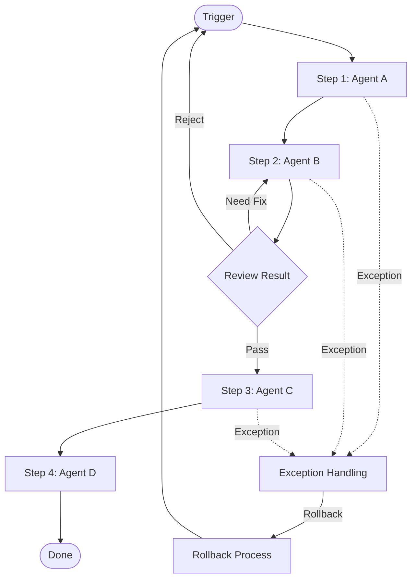

# Workflow: [Workflow 名称]

Version: v1.0

Status: [Active / Completed]

Owner: AI Project Manager

Last Updated: YYYY-MM-DD

---

## 1. Metadata

| 字段 | 值 |
|------|-----|
| Workflow ID | [workflow-type]-[s-level]-[description]-[YYYYMMDD] |
| Version | v1.0 |
| Status | [Active / Completed] |
| Owner | AI Project Manager |
| Workflow Type | [Feature / Bug / Optimization / Research / Emergency] |
| Scale | [S0 / S1 / S2 / S3 / S4] |
| Created | YYYY-MM-DD |
| Completed | YYYY-MM-DD |

---

## 2. Workflow Name

[Workflow 名称：简洁描述该 Workflow 的用途]

---

## 3. Trigger

[启动该 Workflow 的触发条件]

| 触发条件 | 说明 | 来源 |
|---------|------|------|
| [条件 1] | [说明] | [来源] |
| [条件 2] | [说明] | [来源] |

### 前置条件

- [条件 1：必须满足的前置条件]
- [条件 2]

---

## 4. Inputs

| 输入 | 来源 | 类型 | 说明 | 必填 |
|------|------|------|------|:----:|
| [输入名称] | [来源 Agent / Document] | [Document / Data / Config] | [说明] | ✅ / ❌ |
| [输入名称] | [来源 Agent / Document] | [Document / Data / Config] | [说明] | ✅ / ❌ |

### Input 就绪检查

□ 所有必填 Input 是否已到位？

□ Input 格式是否符合规范？

□ Input 版本是否最新？

---

## 5. Participants

| 角色 | Agent | 职责 | 参与阶段 |
|------|-------|------|---------|
| AI Project Manager | [Agent Name] | 调度与协调 | 全流程 |
| [Product Manager] | [Agent Name] | [职责] | [阶段] |
| [Architect] | [Agent Name] | [职责] | [阶段] |
| [Engineer] | [Agent Name] | [职责] | [阶段] |
| [Reviewer] | [Agent Name] | [职责] | [阶段] |
| [QA] | [Agent Name] | [职责] | [阶段] |

---

## 6. Workflow Steps

### Step 1: [步骤名称]

| 属性 | 值 |
|------|-----|
| Agent | [Agent 名称] |
| Action | [执行动作描述] |
| Input | [使用的输入] |
| Output | [产生的输出] |
| Duration | [预计耗时] |
| Exit Condition | [退出条件] |

### Step 2: [步骤名称]

| 属性 | 值 |
|------|-----|
| Agent | [Agent 名称] |
| Action | [执行动作描述] |
| Input | [使用的输入] |
| Output | [产生的输出] |
| Duration | [预计耗时] |
| Exit Condition | [退出条件] |

### Step N: ...

---

## 7. Outputs

### 主要输出

| 输出 | 类型 | 接收方 | 模板 |
|------|------|--------|------|
| [输出名称] | [类型] | [Agent 名称] | [模板名称] |
| [输出名称] | [类型] | [Agent 名称] | [模板名称] |

### 副产品

- [副产品 1]
- [副产品 2]

---

## 8. Exit Criteria

[Workflow 完成必须满足的退出条件]

### 必须满足

- [条件 1]
- [条件 2]

### 验收标准

- [ ] [验收标准 1]
- [ ] [验收标准 2]
- [ ] 所有阶段输出已归档
- [ ] 相关文档已更新

---

## 9. Rollback

### Rollback 触发条件

| 场景 | 触发条件 | 决策者 |
|------|---------|--------|
| [场景 1] | [条件] | [角色] |
| [场景 2] | [条件] | [角色] |

### Rollback 流程

```
Rollback Triggered
    │
    ▼
[角色]: 评估影响范围
    │
    ▼
[角色]: 执行 Rollback
    │
    ▼
[角色]: 验证 Rollback 结果
    │
    ▼
记录 Rollback 原因
    │
    ▼
创建修复 Task
```

### Rollback 规则

- Rollback 完成后 24 小时内必须创建修复 Task
- 同一模块连续 Rollback 2 次升级到 Architect
- 同一模块连续 Rollback 3 次升级到 CEO

---

## 10. Exception

### 异常类型

| 异常类型 | 说明 | 处理方式 | 升级路径 |
|---------|------|---------|---------|
| [异常类型] | [说明] | [处理方式] | [升级到] |
| [异常类型] | [说明] | [处理方式] | [升级到] |

### 异常处理原则

- **Fail Fast**: 尽早发现，尽早返回
- **No Silent Failure**: 任何失败必须记录
- **Escalation Chain**: Engineer → Reviewer → Architect → AI Project Manager → CEO

### 连续失败规则

| 连续失败次数 | 处理方式 |
|:-----------:|---------|
| 3 次 | 升级到 AI Project Manager |
| 5 次 | 升级到 CEO |

---

## 11. Mermaid Diagram



### 流程说明

| 节点 | 说明 | 负责 Agent |
|------|------|-----------|
| Trigger | [触发条件] | [Agent] |
| Step 1 | [步骤描述] | [Agent] |
| Step 2 | [步骤描述] | [Agent] |
| Decision | [决策点描述] | [Agent] |
| Step 3 | [步骤描述] | [Agent] |
| Done | Workflow 完成 | — |

---

## 12. Checklist

### 启动前检查

□ Trigger 是否已满足？

□ Input 是否已准备完整？

□ Participants 是否已分配？

□ 前置条件是否已满足？

### 执行检查

□ 当前阶段是否按 Workflow 推进？

□ 是否有阶段被跳过？

□ 每个阶段的输出是否已形成文档？

□ Handoff 是否已通过 AI Project Manager？

□ 是否有异常需要升级？

### 完成检查

□ Exit Criteria 是否已满足？

□ Output 是否已交付？

□ 所有阶段的文档是否已归档？

□ 是否有需要记录的复盘事项？

□ Workflow 是否已标记为 Completed？

---

## 13. Change Log

| 日期 | 版本 | 修改内容 | 修改人 |
|------|------|---------|--------|
| YYYY-MM-DD | v1.0 | 初始版本 | AI Project Manager |
| YYYY-MM-DD | v1.1 | [修改内容] | [修改人] |

---

# End

本模板依据 AI Company Workflow Standard 和 Document Standard 设计。

所有 Workflow 必须基于此模板创建。
