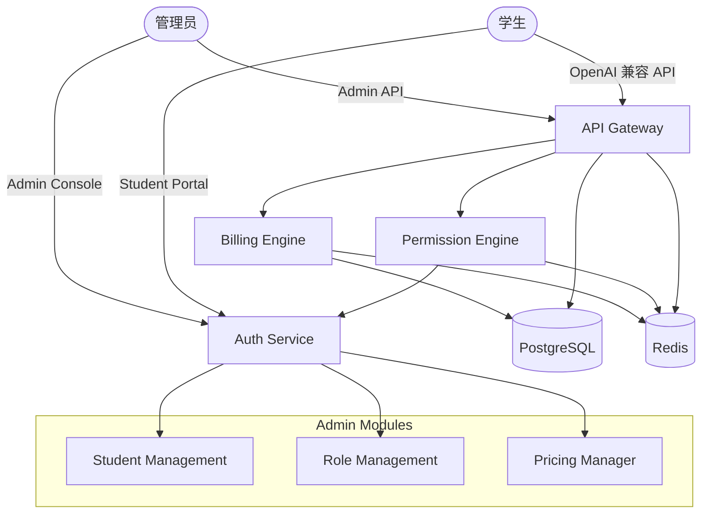
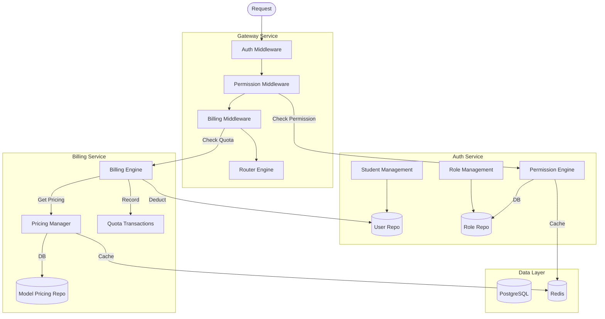
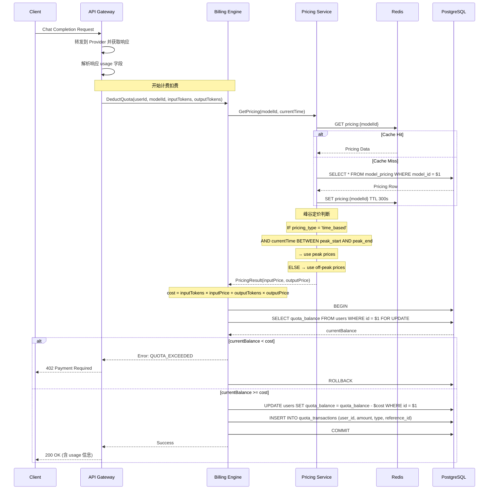
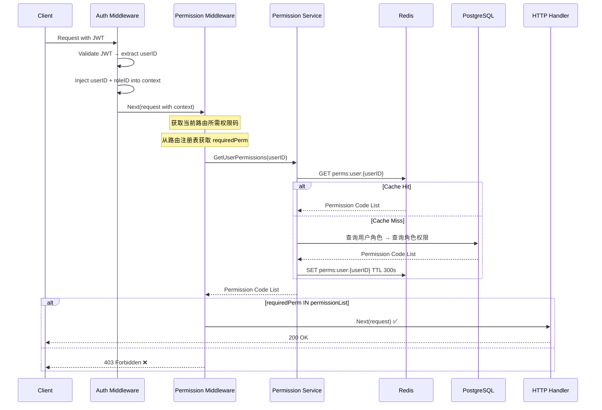
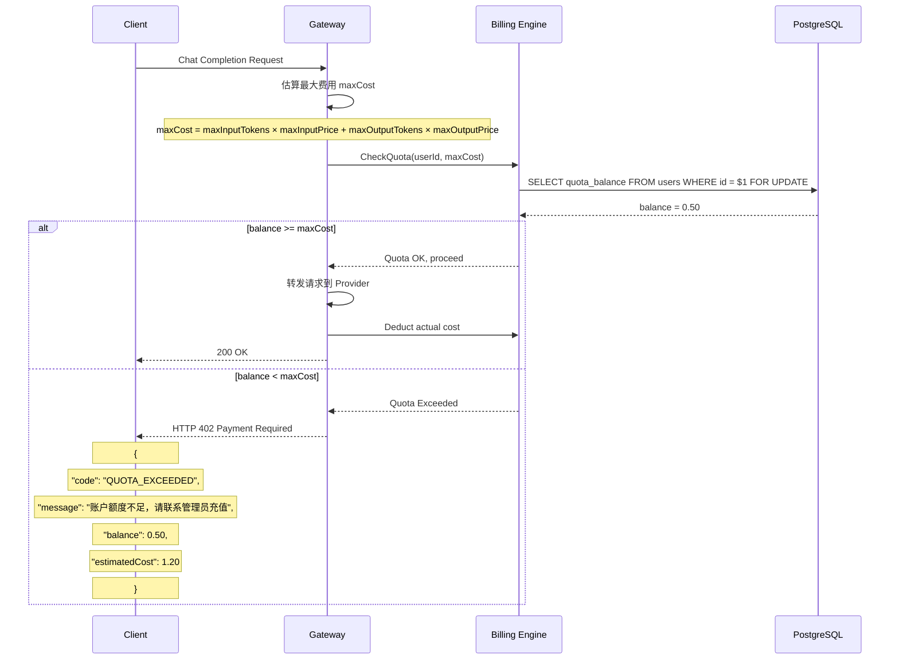
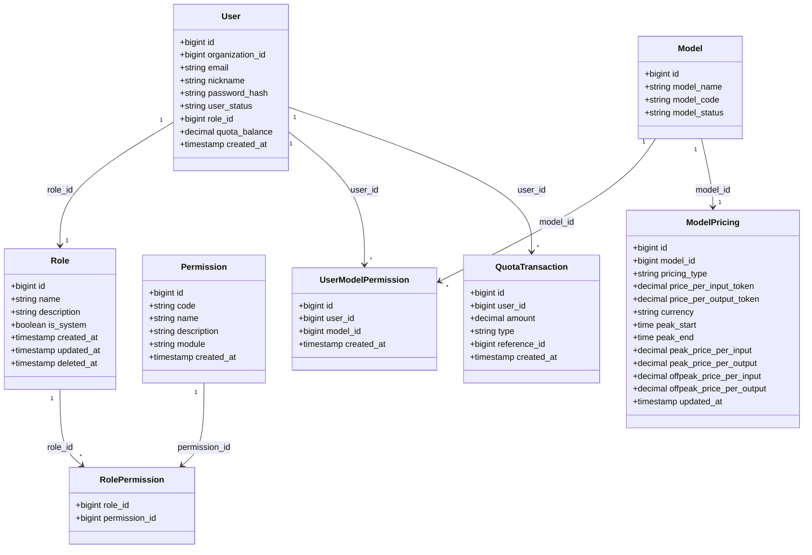

# Architecture: 学生账号体系 + 计费模块 + 权限体系

Version: v1.0

Status: Draft

Owner: Architect

Last Updated: 2026-07-25

Related ADR: ADR-007, ADR-008

---

## 1. Metadata

| 字段 | 值 |
|------|-----|
| Architecture ID | ARCH-20260725-001 |
| Version | v1.0 |
| Status | Draft |
| Owner | Architect |
| Related ADR | ADR-007-Billing-Architecture, ADR-008-rbac-design |
| Related PRD | PRD-20260725-001 (v1.3) |
| Created | 2026-07-25 |
| Last Updated | 2026-07-25 |

---

## 2. Overview

本文档定义 AI Gateway 学生账号体系、计费模块和权限体系的架构设计。PRD v1.3 要求新增学生账号管理、基于 RBAC 的权限控制、按量计费和额度管理三大核心能力，以支撑教育场景下的多用户精细化运营。

### 适用范围

- **涉及的模块**：Student Management、Billing Engine、Permission Engine、Pricing Manager
- **涉及的服务**：API Gateway、Billing Service、Auth Service
- **涉及的技术栈**：Go 1.22+、PostgreSQL 15+、Redis 7+、pgx5

---

## 3. Business Context

```
┌──────────────────────────────────────────────────────────────┐
│                        AI 教育业务域                         │
│                                                              │
│  ┌──────────────────┐   ┌──────────────────┐                │
│  │  学校/培训机构    │   │   学生           │                │
│  │  (Admin)         │   │   (Student)      │                │
│  └───────┬──────────┘   └────────┬─────────┘                │
│          │                       │                          │
│          └───────────┬───────────┘                          │
│                      ▼                                      │
│          ┌──────────────────────┐                           │
│          │   AI Gateway 平台    │                           │
│          │  ┌──────────────┐   │                           │
│          │  │ 计费 + 权限   │   │                           │
│          │  │ 学生管理      │   │                           │
│          │  └──────────────┘   │                           │
│          └──────────────────────┘                           │
│                      │                                      │
│                      ▼                                      │
│          ┌──────────────────────┐                           │
│          │  大模型供应商        │                           │
│          │  (OpenAI/DeepSeek等) │                           │
│          └──────────────────────┘                           │
└──────────────────────────────────────────────────────────────┘
```

---

## 4. Goals

### 架构目标

| # | 目标 | 衡量方式 |
|---|------|---------|
| 1 | 计费扣费 < 50ms（99%） | APM 监控 P99 延迟 |
| 2 | 权限校验 < 5ms（99%） | 中间件耗时监控 |
| 3 | 并发扣费不出现负余额 | 压力测试 + 数据校验 |
| 4 | 定价修改后即时生效 | 缓存失效后 < 1s 生效 |
| 5 | 支持 100+ 学生同时使用 | 并发压测 |

### 架构原则

- **同步优先**：计费扣费在请求链路上同步完成，保证实时一致性
- **缓存加速**：定价、权限等读多写少数据优先使用 Redis 缓存
- **行锁保障**：并发扣费使用 SELECT FOR UPDATE 行锁保证原子性
- **中间件拦截**：权限校验使用 HTTP Middleware 统一拦截，不侵入业务代码

### 非目标

- 本次不做自动充值/续费功能
- 本次不做套餐订阅模式
- 本次不做多租户隔离
- 本次不做详细财务报表

---

## 5. System Context



### 外部依赖

| 外部系统 | 依赖类型 | 说明 |
|---------|---------|------|
| PostgreSQL | 数据库 | 用户、角色、权限、定价、额度交易等权威存储 |
| Redis | 缓存 | 定价缓存、权限缓存、配额缓存 |
| AI Provider (OpenAI/DeepSeek 等) | API | 大模型调用，响应中获取 token 用量 |

---

## 6. Modules

### 模块划分

| 模块 | 职责 | 依赖模块 | 所属服务 |
|------|------|---------|---------|
| **Student Management** | Admin 创建/管理学生账号，分配额度和模型授权 | User Repository | Auth Service |
| **Billing Engine** | 实时计费扣费，额度校验，交易记录 | User Repo, Pricing Manager, Quota Transaction Repo | API Gateway / Billing Service |
| **Permission Engine** | RBAC 权限校验，角色-权限管理 | Role/Permission Repository, Redis | Auth Service |
| **Pricing Manager** | 模型定价管理，峰谷定价判断 | Model Pricing Repository, Redis | Billing Service |

### 模块关系图



### 模块职责详述

| 组件 | 职责 | 关键技术 |
|------|------|---------|
| Permission Middleware | 从 JWT 中提取用户 role，查询缓存/DB 获取权限码列表，校验当前路由所需权限 | Go HTTP Middleware + Redis |
| Billing Middleware | API 调用前校验额度是否充足，调用后扣除费用 | Go HTTP Middleware + pgx Transaction |
| Student Management | Admin 创建学生账号（role=Student）、搜索、启禁用 | Controller → Service → Repository |
| Pricing Manager | CRUD 定价、峰谷时段判断、定价缓存管理 | 支持 standard / time_based 两种定价类型 |

---

## 7. Layer Design

### 分层架构

```
┌─────────────────────────────────────────────────────┐
│              Controller / HTTP Handler               │  ← 参数解析、响应返回
├─────────────────────────────────────────────────────┤
│              Service / UseCase                        │  ← 业务逻辑、事务管理
├─────────────────────────────────────────────────────┤
│              Repository                              │  ← 数据访问
├─────────────────────────────────────────────────────┤
│         PostgreSQL / Redis / External API            │  ← 基础设施
└─────────────────────────────────────────────────────┘
```

### 各层新增内容

| 层 | 新增组件 | 说明 |
|----|---------|------|
| Controller | `UserController` | 学生管理 API（CRUD、额度、模型授权、状态） |
| Controller | `RoleController` | 角色管理 API（CRUD、权限分配） |
| Controller | `PricingController` | 定价管理 API |
| Controller | `BillingController` | 额度/用量查询 API（个人 + 管理） |
| Service | `BillingService` | 计费扣费核心逻辑、额度校验、交易记录 |
| Service | `RoleService` | 角色 CRUD、权限分配 |
| Service | `PermissionService` | 用户权限查询、缓存管理 |
| Service | `PricingService` | 定价查询、峰谷定价判断 |
| Repository | `RoleRepository` | roles / permissions / role_permissions 访问 |
| Repository | `UserModelPermissionRepository` | user_model_permissions 访问 |
| Repository | `QuotaTransactionRepository` | quota_transactions 访问 |
| Repository | `ModelPricingRepository` | model_pricing 访问 |
| Middleware | `PermissionMiddleware` | 权限校验中间件 |

### 层间依赖规则

| 方向 | 规则 | 禁止事项 |
|------|------|---------|
| Controller → Service | Controller 调用 Service | Controller 不可直连 DB |
| Service → Repository | Service 调用 Repository | Service 不可处理 HTTP |
| Repository → Infrastructure | Repository 访问数据源 | Repository 不可含业务逻辑 |
| Service → Service | BillingService 可调用 PricingService | 不允许循环依赖 |

---

## 8. Component Diagram

```mermaid
graph TD
    subgraph API Layer
        CreateStudent[POST /admin/users]
        ListStudents[GET /admin/users]
        ManageQuota[GET|PUT /admin/users/{id}/quota]
        ManageModels[GET|PUT /admin/users/{id}/models]
        ManageStatus[PUT /admin/users/{id}/status]
        RoleCRUD[GET|POST /admin/roles]
        RoleDetail[GET|PUT|DELETE /admin/roles/{id}]
        RolePerms[PUT /admin/roles/{id}/permissions]
        PricingCRUD[GET|PUT /admin/pricing/{modelId}]
        MyQuota[GET /billing/quota]
        MyUsage[GET /billing/usage]
        AdminSummary[GET /billing/admin/summary]
        AdminUsage[GET /billing/admin/usage]
    end

    subgraph Middleware Layer
        AuthMid[Auth Middleware]
        PermitMid[Permission Middleware]
    end

    subgraph Service Layer
        StudentSvc[Student Service]
        RoleSvc[Role Service]
        BillingSvc[Billing Service]
        PricingSvc[Pricing Service]
        PermitSvc[Permission Service]
    end

    subgraph Repository Layer
        UserRepo[User Repository]
        RoleRepo[Role Repository]
        PermRepo[Permission Repository]
        UPermRepo[UserModelPermission Repo]
        QTR[QuotaTransaction Repo]
        MPRepo[ModelPricing Repo]
    end

    subgraph Cache Layer
        Redis[(Redis)]
    end

    %% API Routes
    CreateStudent & ListStudents & ManageQuota & ManageModels & ManageStatus --> AuthMid
    RoleCRUD & RoleDetail & RolePerms --> AuthMid
    PricingCRUD --> AuthMid
    MyQuota & MyUsage --> AuthMid
    AdminSummary & AdminUsage --> AuthMid

    AuthMid --> PermitMid

    %% Service wiring
    CreateStudent & ListStudents & ManageQuota & ManageModels & ManageStatus --> StudentSvc
    RoleCRUD & RoleDetail & RolePerms --> RoleSvc
    PricingCRUD --> PricingSvc
    MyQuota & MyUsage & AdminSummary & AdminUsage --> BillingSvc

    StudentSvc --> UserRepo
    RoleSvc --> RoleRepo
    PricingSvc --> MPRepo
    PricingSvc --> Redis
    BillingSvc --> UserRepo
    BillingSvc --> QTR
    BillingSvc --> MPRepo
    BillingSvc --> Redis
    PermitSvc --> PermRepo
    PermitSvc --> Redis
```

---

## 9. Sequence Diagram

### 9.1 计费扣费流程（含峰谷定价判断）



### 9.2 权限校验流程（中间件拦截）



### 9.3 额度不足处理流程



---

## 10. API Design

详见 [API-Contract-Billing-RBAC.md](./API-Contract-Billing-RBAC.md)。

### 接口概览

| 接口 | Method | 说明 | 认证方式 | 权限码 |
|------|--------|------|---------|--------|
| `/api/v1/admin/users` | POST | 创建学生账号 | JWT | `admin:user:create` |
| `/api/v1/admin/users` | GET | 学生列表 | JWT | `admin:user:list` |
| `/api/v1/admin/users/{id}/quota` | GET/PUT | 查看/设置额度 | JWT | `admin:user:manage_quota` |
| `/api/v1/admin/users/{id}/models` | GET/PUT | 查看/设置模型授权 | JWT | `admin:user:manage_models` |
| `/api/v1/admin/users/{id}/status` | PUT | 启禁用学生 | JWT | `admin:user:manage` |
| `/api/v1/admin/roles` | GET/POST | 角色列表/创建 | JWT | `admin:role:manage` |
| `/api/v1/admin/roles/{id}` | GET/PUT/DELETE | 角色详情/更新/删除 | JWT | `admin:role:manage` |
| `/api/v1/admin/roles/{id}/permissions` | PUT | 更新角色权限 | JWT | `admin:role:manage` |
| `/api/v1/admin/permissions` | GET | 权限列表 | JWT | `admin:role:manage` |
| `/api/v1/admin/pricing` | GET | 定价列表 | JWT | `admin:pricing:manage` |
| `/api/v1/admin/pricing/{modelId}` | GET/PUT | 定价详情/修改 | JWT | `admin:pricing:manage` |
| `/api/v1/billing/quota` | GET | 我的额度 | JWT | `billing:view_self` |
| `/api/v1/billing/usage` | GET | 我的用量 | JWT | `billing:view_self` |
| `/api/v1/billing/admin/summary` | GET | 全平台汇总 | JWT | `admin:billing:view` |
| `/api/v1/billing/admin/usage` | GET | 全平台明细 | JWT | `admin:billing:view` |

### 认证与鉴权流程

1. **Auth Middleware**：解析 JWT，提取 userID + email 注入 Context
2. **Permission Middleware**：从 Context 获取 userID → 查询用户角色和权限 → 校验当前路由所需权限码
3. 路由注册时声明的权限码格式：`admin:user:create`、`billing:view_self` 等

---

## 11. Database Design

### 数据模型关系图



### 核心表详述

#### roles（角色表）

| 字段 | 类型 | 约束 | 说明 |
|------|------|------|------|
| id | BIGSERIAL | PRIMARY KEY | 自增主键 |
| name | VARCHAR(100) | NOT NULL, UNIQUE | 角色名称（Admin / Student） |
| description | VARCHAR(255) | | 角色描述 |
| is_system | BOOLEAN | NOT NULL DEFAULT FALSE | 系统内置角色（不可删除） |
| created_at | TIMESTAMPTZ | NOT NULL DEFAULT NOW() | 创建时间 |
| updated_at | TIMESTAMPTZ | NOT NULL DEFAULT NOW() | 更新时间 |
| deleted_at | TIMESTAMPTZ | | 软删除时间 |

#### permissions（功能权限表）

| 字段 | 类型 | 约束 | 说明 |
|------|------|------|------|
| id | BIGSERIAL | PRIMARY KEY | 自增主键 |
| code | VARCHAR(100) | NOT NULL, UNIQUE | 权限编码（如 `dashboard:view`） |
| name | VARCHAR(100) | NOT NULL | 权限名称 |
| description | VARCHAR(255) | | 权限描述 |
| module | VARCHAR(50) | NOT NULL | 所属模块（dashboard/api_key/billing/user/role/pricing/provider/model） |
| created_at | TIMESTAMPTZ | NOT NULL DEFAULT NOW() | 创建时间 |

#### role_permissions（角色-权限关联表）

| 字段 | 类型 | 约束 | 说明 |
|------|------|------|------|
| role_id | BIGINT | NOT NULL, REFERENCES roles(id) | 角色 ID |
| permission_id | BIGINT | NOT NULL, REFERENCES permissions(id) | 权限 ID |
| | | PRIMARY KEY (role_id, permission_id) | 联合主键 |

#### user_model_permissions（用户模型授权表）

| 字段 | 类型 | 约束 | 说明 |
|------|------|------|------|
| id | BIGSERIAL | PRIMARY KEY | 自增主键 |
| user_id | BIGINT | NOT NULL, REFERENCES users(id) | 用户 ID |
| model_id | BIGINT | NOT NULL, REFERENCES models(id) | 模型 ID |
| created_at | TIMESTAMPTZ | NOT NULL DEFAULT NOW() | 创建时间 |
| | | UNIQUE (user_id, model_id) | 同一用户对同一模型只有一个授权 |

#### model_pricing（模型定价表）

| 字段 | 类型 | 约束 | 说明 |
|------|------|------|------|
| id | BIGSERIAL | PRIMARY KEY | 自增主键 |
| model_id | BIGINT | NOT NULL, UNIQUE, REFERENCES models(id) | 模型 ID |
| pricing_type | VARCHAR(20) | NOT NULL DEFAULT 'standard', CHECK(standard/time_based) | 定价类型 |
| price_per_input_token | DECIMAL(16,6) | NOT NULL DEFAULT 0 | 普通定价：每输入 token 价格 |
| price_per_output_token | DECIMAL(16,6) | NOT NULL DEFAULT 0 | 普通定价：每输出 token 价格 |
| currency | VARCHAR(10) | NOT NULL DEFAULT 'USD' | 货币单位 |
| peak_start | TIME | | 峰谷定价：高峰开始时间 |
| peak_end | TIME | | 峰谷定价：高峰结束时间 |
| peak_price_per_input | DECIMAL(16,6) | | 峰谷定价：高峰输入价格 |
| peak_price_per_output | DECIMAL(16,6) | | 峰谷定价：高峰输出价格 |
| offpeak_price_per_input | DECIMAL(16,6) | | 峰谷定价：低谷输入价格 |
| offpeak_price_per_output | DECIMAL(16,6) | | 峰谷定价：低谷输出价格 |
| updated_at | TIMESTAMPTZ | NOT NULL DEFAULT NOW() | 更新时间 |

#### quota_transactions（额度交易记录表）

| 字段 | 类型 | 约束 | 说明 |
|------|------|------|------|
| id | BIGSERIAL | PRIMARY KEY | 自增主键 |
| user_id | BIGINT | NOT NULL, REFERENCES users(id) | 用户 ID |
| amount | DECIMAL(16,6) | NOT NULL | 交易金额（扣费为负值） |
| type | VARCHAR(50) | NOT NULL, CHECK(deduction/admin_allocation/refund) | 交易类型 |
| reference_id | BIGINT | | 关联 ID（如 request_logs.id） |
| created_at | TIMESTAMPTZ | NOT NULL DEFAULT NOW() | 创建时间 |

#### users 表修改

| 字段 | 类型 | 约束 | 说明 |
|------|------|------|------|
| role_id | BIGINT | REFERENCES roles(id) | 用户角色 ID |
| quota_balance | DECIMAL(16,6) | NOT NULL DEFAULT 0 | 账户额度余额（美元） |

---

## 12. Cache Design

### 缓存策略

| 缓存项 | Key 模式 | TTL | 策略 | 失效时机 |
|--------|---------|-----|------|---------|
| 模型定价 | `pricing:{modelId}` | 300s | Cache-Aside | 定价修改后 DEL 缓存 |
| 用户权限列表 | `perms:user:{userId}` | 300s | Cache-Aside | 角色权限变更后 DEL |
| 用户额度（读） | `quota:user:{userId}` | 60s | Cache-Aside | 扣费后 DEL（下次读时重新获取） |
| 角色信息 | `role:{roleId}` | 600s | Cache-Aside | 角色修改后 DEL |

### 缓存穿透防护

| 场景 | 防护措施 |
|------|---------|
| 定价不存在 | 空值缓存 TTL 30s，防止大量请求穿透到 DB |
| 用户无权限 | 空数组缓存 TTL 60s，防止频繁查 DB |
| 缓存雪崩 | 在基础 TTL 上增加随机偏移 (±30s)，避免同时过期 |

### 缓存失效策略

- **修改定价**：Admin 修改定价后，立即 `DEL pricing:{modelId}`，下次请求重新加载
- **权限变更**：Admin 修改角色权限后，遍历该角色下所有用户并 `DEL perms:user:{userId}`
- **额度变更**：Admin 分配额度或扣费后，`DEL quota:user:{userId}`

---

## 13. Performance Analysis

### 计费扣费链路延迟预估

| 步骤 | 操作 | 预估耗时 | 备注 |
|------|------|---------|------|
| 1 | 解析响应 usage 字段 | < 1ms | 内存操作 |
| 2 | 查询定价（缓存命中） | < 1ms | Redis GET |
| 3 | 峰谷时段判断 | < 0.1ms | 内存比较 |
| 4 | 费用计算 | < 0.1ms | 乘法运算 |
| 5 | 开启事务 + SELECT FOR UPDATE | 2~5ms | PG 行锁 |
| 6 | UPDATE quota_balance | 1~3ms | PG 更新 |
| 7 | INSERT quota_transactions | 1~3ms | PG 插入 |
| 8 | 提交事务 | 1~3ms | PG 提交 |
| **合计（缓存命中）** | | **~10ms** | 满足 < 50ms 目标 |
| **合计（缓存 miss）** | | **~20ms** | 含一次定价查询 |

### 权限校验延迟预估

| 步骤 | 操作 | 预估耗时 | 备注 |
|------|------|---------|------|
| 1 | JWT 解析 | < 0.5ms | 本地计算 |
| 2 | 查询权限（缓存命中） | < 1ms | Redis GET |
| 3 | 权限码比对 | < 0.1ms | 集合查找 |
| **合计** | | **~2ms** | 满足 < 5ms 目标 |

### 性能优化策略

- **缓存预热**：服务启动时加载所有定价到 Redis
- **批量失效**：权限变更时使用 Redis Pipeline 批量删除相关用户缓存
- **连接池**：pgx 连接池配置 MaxConns=10, MinConns=2
- **事务简短**：事务内不做外部网络请求，仅执行 SQL 操作
- **索引优化**：quota_transactions 表按 user_id + created_at 建立复合索引

---

## 14. Risks

| # | 风险描述 | 等级 | 影响 | 缓解方案 |
|---|---------|------|------|---------|
| 1 | 行锁死锁 | 中 | 高 | 所有事务按固定顺序访问资源（先查用户行锁，再更新，再插入） |
| 2 | 长事务阻塞 | 中 | 中 | 事务内不做网络请求，保持简短（预估 < 10ms） |
| 3 | 缓存穿透 | 低 | 中 | 空值缓存 + Bloom Filter（可选） |
| 4 | Admin 修改角色权限后用户缓存未及时失效 | 低 | 中 | 权限变更接口中统一清理缓存 |
| 5 | 计费精度丢失 | 低 | 高 | Go 代码中使用 `string` 或 `int64`（最小单位：微美元）传递金额，DB 使用 DECIMAL(16,6) |

---

## 15. Future Extension

| 未来需求 | 预留机制 | 说明 |
|---------|---------|------|
| 学生分组/班级管理 | 现有 organization_id 字段可支持分组 | 后续可建立 group 表关联 |
| 自动充值/续费 | quota_transactions 已有 admin_allocation 类型 | 增加 payment 模块 |
| 套餐订阅 | model_pricing 可扩展 subscription 定价类型 | 增加 plan 表 |
| 多租户 | users 已有 organization_id | 增加租户隔离层 |
| 详细财务报表 | quota_transactions 提供完整交易记录 | 增加报表分析模块 |

---

## 16. Change Log

| 日期 | 版本 | 修改内容 | 修改人 |
|------|------|---------|--------|
| 2026-07-25 | v1.0 | 初始版本 | Architect |

---

# End

本模板依据 AI Company Document Standard 和 Engineering Standard 设计。
