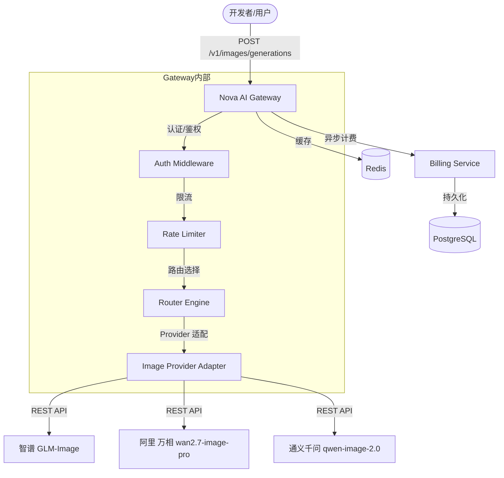
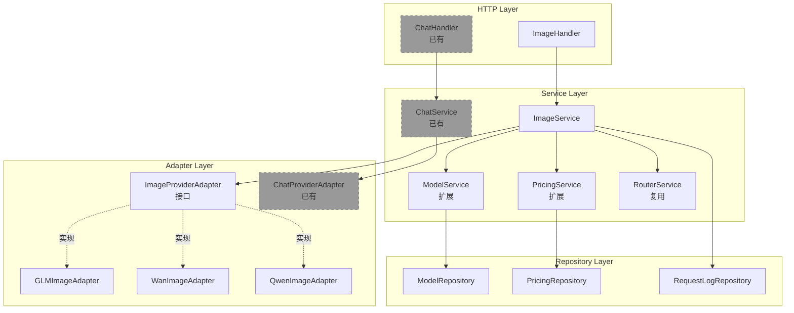
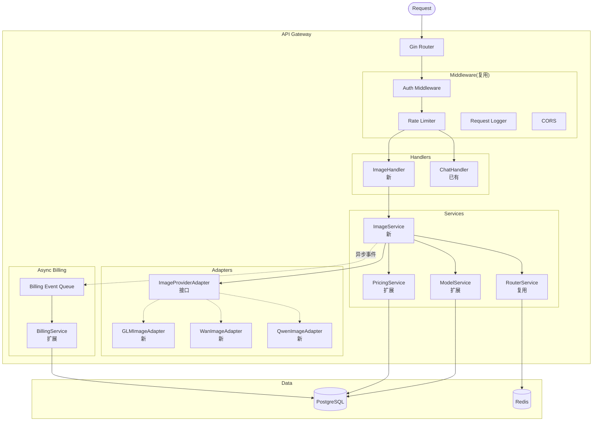
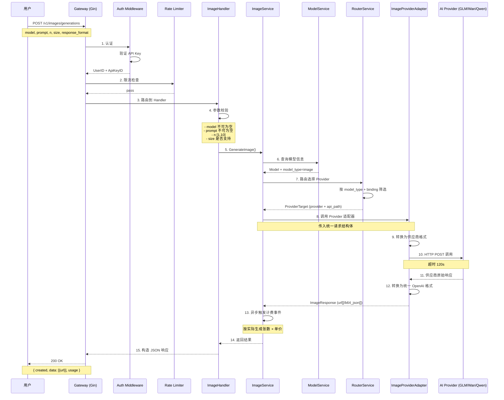
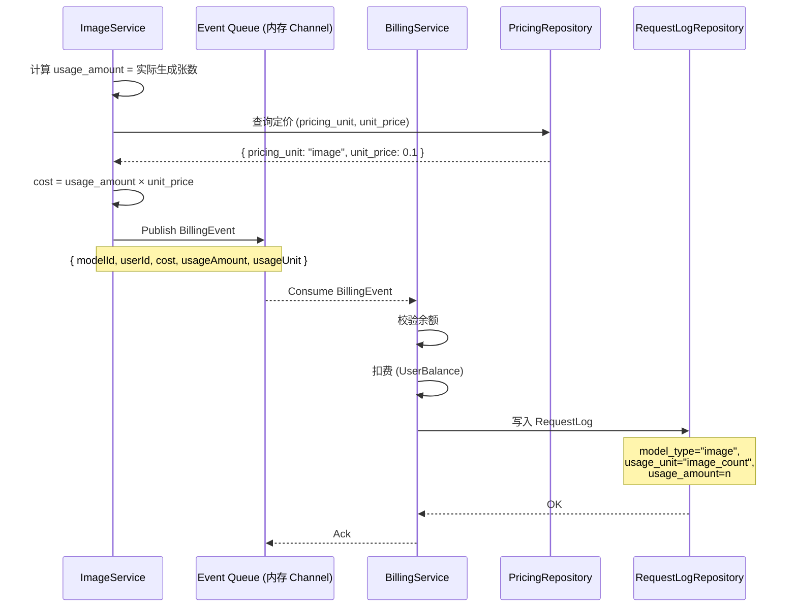
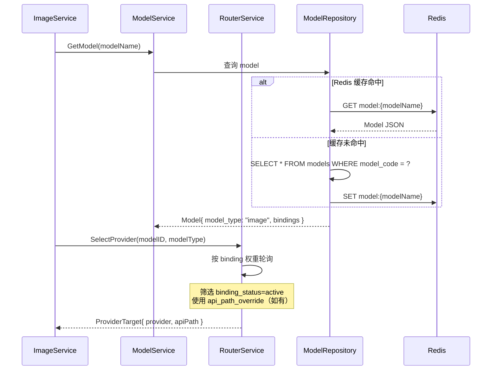
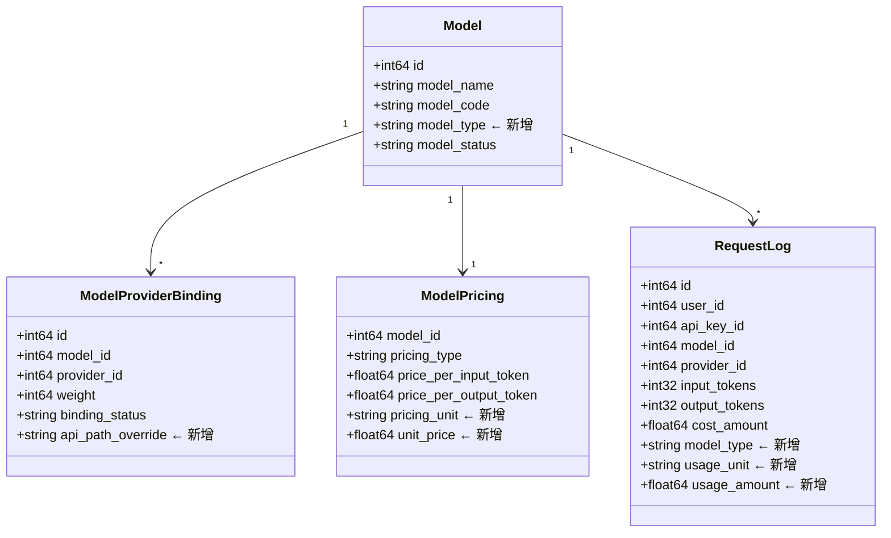

# Architecture: Image Generation 模型接入

Version: v1.0

Status: Draft

Owner: Architect

Last Updated: 2026-07-28

Related ADR: ADR-009-image-pricing

---

## 1. Metadata

| 字段 | 值 |
|------|-----|
| Architecture ID | ARCH-20260728-ImageGen |
| Version | v1.0 |
| Status | Draft |
| Owner | Architect |
| Related ADR | ADR-009-image-pricing |
| Related PRD | PRD-20260728-ImageGen |
| Created | 2026-07-28 |
| Last Updated | 2026-07-28 |

---

## 2. Overview

Nova AI Gateway 当前仅支持 Chat Completions（文本对话）模型，亟需扩展模型品类以满足用户多模态调用需求。本架构设计覆盖图片生成（Image Generation）模型的全链路接入——从 API 入口、模型路由、Provider 适配到计费扩展。

设计核心思路：**最小改动，最大复用**——充分利用现有的 Provider 管理、路由、认证、限流、计费等基础设施，仅在与"非 Token 计费"和"非 Chat 类型"相关的边界点上做扩展。

### 适用范围

- 涉及的模块：ImageHandler、ImageService、ImageProviderAdapter、ModelService（扩展）、PricingService（扩展）、BillingService（扩展）
- 涉及的服务：API Gateway（`backend/internal/`）
- 涉及的技术栈：Go 1.22+, Gin Framework, PostgreSQL 15+, Redis 7+

---

## 3. Business Context

图片生成是 2026 年增长最快的 AI 调用类型之一。主流平台（OpenAI DALL·E、Cloudflare AI Gateway、Portkey）均已提供统一图片生成 API。Nova AI Gateway 需要跟上行业标准，支持通过 OpenAI 兼容的 `/v1/images/generations` 端点调用图片生成模型。

```
┌────────────────────────────────────────────┐
│              业务域：多模态 API              │
│                                            │
│  ┌─────────────────┐  ┌─────────────────┐ │
│  │   文本对话       │  │   图片生成       │ │
│  │  (Chat)         │  │  (Image Gen)    │ │
│  │                  │  │                  │ │
│  │  GPT-4o         │  │  GLM-Image       │ │
│  │  Claude 4       │  │  wan2.7-image-pro│ │
│  │  DeepSeek V3    │  │  qwen-image-2.0  │ │
│  └────────┬────────┘  └────────┬─────────┘ │
│           │                    │            │
│           └────────┬───────────┘            │
│                    ▼                        │
│          ┌────────────────────┐              │
│          │  Nova AI Gateway  │              │
│          │  (本系统)          │              │
│          └────────────────────┘              │
└──────────────────────────────────────────────┘
```

---

## 4. Goals

### 架构目标

- **G1**: 新增图片生成 API `POST /v1/images/generations`，与 OpenAI API 格式兼容
- **G2**: 图片生成请求走完完整链路：认证 → 鉴权 → 限流 → 路由 → Provider 适配 → 计费
- **G3**: 已有 Chat 模型完全不受影响，零行为变化
- **G4**: 按张数（而非 Token）正确计费，费用记录在 RequestLog 中
- **G5**: Model 类型设计预留 future 扩展（video, audio, embedding）

### 架构原则

- **向后兼容**：新增字段均有默认值，已有 API 响应格式不变
- **OpenAI 兼容**：对外暴露符合 OpenAI images API 规范的端点
- **低成本接入**：优先复用现有中间件、路由、Provider 管理机制
- **适配器模式**：每个图片生成 Provider 实现独立的 Request/Response 转换

### 非目标

- 图片编辑（Image Edit/Inpainting）—— 后续迭代
- 图片变体（Image Variation）—— 后续迭代
- 视频生成、音频生成模型接入
- 图片存储管理（由用户自行保存）

---

## 5. System Context

图片生成请求的完整链路：用户通过统一 API 调用，Gateway 完成路由和认证后，通过 Provider Adapter 将请求转换为各供应商格式，调用对应的 AI Provider。



### 外部依赖

| 外部系统 | 依赖类型 | 说明 |
|---------|---------|------|
| 智谱 GLM-Image | REST API | 图片生成供应商，首批接入 |
| 阿里万相 wan2.7-image-pro | REST API | 图片生成供应商，首批接入 |
| 通义千问 qwen-image-2.0 | REST API | 图片生成供应商，首批接入 |
| PostgreSQL | 数据库 | 存储模型、定价、日志等数据 |
| Redis | 缓存 | 缓存模型配置、Provider 路由信息 |

---

## 6. Modules

### 模块划分

| 模块 | 职责 | 依赖模块 | 所属服务 |
|------|------|---------|---------|
| ImageHandler | 处理 `/v1/images/generations` 请求，参数校验，统一响应 | ImageService | API Gateway |
| ImageService | 图片生成业务逻辑，prompt 预处理，结果后处理 | ModelService, RouterService, PricingService | API Gateway |
| ImageProviderAdapter | Provider 请求/响应转换适配器接口 | 各 Provider 实现 | API Gateway |
| GLMImageAdapter | 智谱 GLM-Image API 适配 | ImageProviderAdapter | API Gateway |
| WanImageAdapter | 阿里万相 API 适配 | ImageProviderAdapter | API Gateway |
| QwenImageAdapter | 通义千问图片 API 适配 | ImageProviderAdapter | API Gateway |
| ModelService(扩展) | 新增 model_type 字段的读写逻辑 | ModelRepository | API Gateway |
| PricingService(扩展) | 新增 pricing_unit 分支计费逻辑 | PricingRepository | API Gateway |

### 模块关系图



### 模块职责说明

| 模块 | 输入 | 输出 | 关键方法 |
|------|------|------|---------|
| ImageHandler | HTTP Request(Gin Context) | JSON Response | `HandleGenerations()` |
| ImageService | model, prompt, n, size | images[], usage | `GenerateImage()` |
| ImageProviderAdapter | 统一请求模型 | 统一响应模型 | `Generate(request) → response` |
| ModelService(扩展) | model_type 筛选 | Model 列表 | `ListByType()`, `GetWithType()` |

---

## 7. Layer Design

### 分层架构

```
┌─────────────────────────────────────────────────────┐
│                  Controller / Handler                 │  ← HTTP 层
│  ImageHandler (新)        ChatHandler (已有)         │
│  POST /v1/images/generations                         │
├─────────────────────────────────────────────────────┤
│                   Service / UseCase                   │  ← 业务逻辑层
│  ImageService (新)                                   │
│  ModelService (扩展: model_type 支持)                │
│  PricingService (扩展: pricing_unit 分支)            │
│  RouterService (复用: 按 model_type + binding 路由)  │
├─────────────────────────────────────────────────────┤
│                    Repository                         │  ← 数据访问层
│  ModelRepository (扩展)                              │
│  PricingRepository (扩展)                            │
│  RequestLogRepository (扩展)                         │
├─────────────────────────────────────────────────────┤
│              Infrastructure / External                │  ← 基础设施层
│  PostgreSQL 15+ / Redis 7+ / Provider APIs           │
│  GLM-Image / wan2.7-image-pro / qwen-image-2.0      │
└─────────────────────────────────────────────────────┘
```

### 层间依赖规则

| 方向 | 规则 | 禁止事项 |
|------|------|---------|
| Controller → Service | Handler 调用 Service | Handler 不可直连 DB |
| Service → Repository | Service 调用 Repository | Service 不可处理 HTTP |
| Service → Adapter | Service 调用 Adapter 接口 | Service 不可直接调用第三方 API |
| Repository → Infrastructure | Repository 访问数据源 | Repository 不可含业务逻辑 |

---

## 8. Component Diagram

### 图片生成核心组件



---

## 9. Sequence Diagram

### 主流程：用户调用 `/v1/images/generations`



### 计费流程：异步计费



### API 路由选择流程



---

## 10. API Design

### 接口清单

| 接口 | Method | 说明 | 认证方式 |
|------|--------|------|---------|
| `/v1/images/generations` | POST | 图片生成（对外，OpenAI 兼容） | API Key |
| `/api/v1/models` | GET | 获取模型列表（含 modelType） | JWT |
| `/api/v1/models` | POST | 创建模型（支持 modelType） | JWT |
| `/api/v1/models/{id}` | PUT | 更新模型（支持 modelType） | JWT |
| `/api/v1/admin/pricing/{modelId}` | PUT | 设置定价（支持 pricingUnit） | JWT |
| `/api/v1/models/{id}/bind` | POST | 绑定 Provider（支持 apiPathOverride） | JWT |

> 详细的 API 字段定义见：[API-20260728-ImageGen.md](../04-Architecture/API-20260728-ImageGen.md)

### 内部接口

| 接口 | 协议 | 说明 |
|------|------|------|
| ImageProviderAdapter | Go interface | 图片生成 Provider 适配器接口 |
| BillingEvent | 内存 Channel | 异步计费事件 |

---

## 11. Database Design

### 数据模型变更



### 核心表变更说明

| 表名 | 变更 | 字段 | 类型 | 默认值 | 说明 |
|------|------|------|------|:------:|------|
| `models` | 新增字段 | `model_type` | VARCHAR(32) | `chat` | `chat` / `image` / `embedding` |
| `model_provider_bindings` | 新增字段 | `api_path_override` | VARCHAR(255) | NULL | 指定该绑定使用的 API 路径，NULL 则使用 Provider 默认路径 |
| `model_pricing` | 新增字段 | `pricing_unit` | VARCHAR(32) | `token` | `token` / `image_count` / `request` |
| `model_pricing` | 新增字段 | `unit_price` | DECIMAL(12,6) | NULL | 按 pricing_unit 的单价，如每张图片价格 |
| `request_logs` | 新增字段 | `model_type` | VARCHAR(32) | NULL | 请求的模型类型 |
| `request_logs` | 新增字段 | `usage_unit` | VARCHAR(32) | NULL | 用量单位 |
| `request_logs` | 新增字段 | `usage_amount` | DECIMAL(12,6) | NULL | 用量数值 |

### 迁移顺序

1. `models` 表加 `model_type`（已有数据设为 `chat`）
2. `model_provider_bindings` 表加 `api_path_override`（已有数据设为 NULL）
3. `model_pricing` 表加 `pricing_unit` + `unit_price`（已有数据 `pricing_unit` 设为 `token`，`unit_price` 设为 NULL）
4. `request_logs` 表加 `model_type` + `usage_unit` + `usage_amount`（已有数据均设为 NULL）

---

## 12. Cache Design

### 缓存策略

| 缓存项 | Key 模式 | TTL | 策略 | 失效时机 |
|--------|---------|:---:|------|---------|
| 模型信息 | `model:{model_code}` | 5min | Cache-Aside | 模型信息更新时 |
| Provider 绑定 | `binding:{model_id}:{provider_id}` | 5min | Cache-Aside | 绑定关系更新时 |
| 定价配置 | `pricing:{model_id}` | 10min | Cache-Aside | 定价更新时 |

---

## 13. Provider Adapter 接口设计

### Go 接口定义

```go
// ImageProviderAdapter 图片生成 Provider 适配器接口
// 所有图片生成供应商必须实现此接口
type ImageProviderAdapter interface {
    // Generate 执行图片生成
    // 接收统一请求参数，返回统一响应格式
    Generate(ctx context.Context, req *ImageGenerateRequest) (*ImageGenerateResponse, error)

    // GetSupportedSizes 返回该 Provider 支持的图片尺寸列表
    GetSupportedSizes() []string

    // GetMaxBatchSize 返回单次最大生成数量
    GetMaxBatchSize() int
}

// ImageGenerateRequest 统一图片生成请求
type ImageGenerateRequest struct {
    Prompt         string // 图片描述文本
    N              int    // 生成张数，默认 1
    Size           string // 图片尺寸，如 "1024x1024"
    ResponseFormat string // 响应格式："url" 或 "b64_json"
    User           string // 可选，用户标识
}

// ImageGenerateResponse 统一图片生成响应
type ImageGenerateResponse struct {
    Created int64         // 创建时间戳
    Data    []ImageData   // 图片数据列表
    Usage   *ImageUsage   // 使用量信息
}

// ImageData 单张图片数据
type ImageData struct {
    URL           string // 图片 URL
    B64JSON       string // Base64 编码的图片数据
    RevisedPrompt string // 如有，返回修订后的 prompt
}

// ImageUsage 用量信息
type ImageUsage struct {
    PromptTokens   int     // prompt 的 token 数（如有）
    TotalTokens    int     // 总 token 数（如有）
    ImageCount     int     // 实际生成的图片张数
}
```

---

## 14. 错误处理策略

| 场景 | HTTP Status | 响应体 | 计费处理 |
|------|:-----------:|--------|---------|
| 不支持的 model | 404 | `{"error": "Model not found"}` | 不计费 |
| 不支持的 size | 400 | `{"error": "Invalid size", "supported": ["1024x1024"]}` | 不计费 |
| prompt 为空 | 400 | `{"error": "Prompt is required"}` | 不计费 |
| Provider 超时 | 504 | `{"error": "Provider timeout"}` | 不计费 |
| Provider 错误 | 502 | `{"error": "Provider error", "detail": ...}` | 不计费 |
| 余额不足 | 402 | `{"error": "Insufficient balance"}` | 不计费 |
| 部分成功 | 200 | `data` 中只返回成功的图片，`usage.image_count` 反映实际数量 | 按实际生成张数计费 |

---

## 15. Security

### 安全架构

| 安全层 | 措施 | 说明 |
|--------|------|------|
| 传输安全 | HTTPS / TLS 1.3 | 全链路加密 |
| 认证 | API Key | `/v1/images/generations` 使用 API Key 认证 |
| 限流 | Rate Limiter | 复用现有每 Key 限流规则 |
| 输入校验 | ImageHandler 参数校验 | prompt 长度限制、size 白名单校验 |
| 超时保护 | 120s 超时 | 避免 Provider 长时间不返回导致资源占用 |

---

## 16. Performance

### 性能目标

| 指标 | 目标 | 测量方式 |
|------|------|---------|
| Gateway 路由耗时 | < 10ms | 内部计时 |
| 图片生成响应 | < 120s | 端到端计时（取决于 Provider） |
| 并发处理 | 复用已有 Worker Pool | — |

### 性能优化策略

- 图片生成本身耗时主要取决于 Provider，Gateway 层不做额外处理
- Provider 适配器转换保持轻量，避免不必要的内存拷贝
- 图片生成结果不缓存图片数据本身，只透传 URL

---

## 17. Risks

| # | 风险描述 | 等级 | 影响 | 缓解方案 |
|---|---------|:----:|------|---------|
| 1 | 各供应商 API 格式差异大，适配工作量大 | 中 | 开发周期延长 | 采用适配器模式，每个 Provider 独立适配；预留调试时间 |
| 2 | 图片生成请求超时（复杂 prompt 可能 >60s） | 中 | 用户体验差 | Gateway 设置 120s 超时；异步化处理 |
| 3 | 部分生成失败时计费处理复杂 | 低 | 计费争议 | 按实际成功张数计费，response 中准确反映 |
| 4 | model_type 枚举扩展可能涉及多处修改 | 低 | 维护成本 | 定义为常量枚举，集中管理 |

---

## 18. Future Extension

| 未来需求 | 预留机制 | 说明 |
|---------|---------|------|
| 图片编辑/变体 | ImageProviderAdapter 接口可扩展方法 | 新增 `Edit()` / `Variation()` 方法 |
| 视频生成模型 | model_type 枚举扩展 `video` | 新增 VideoProviderAdapter 接口 |
| 音频生成模型 | model_type 枚举扩展 `audio` | 新增 AudioProviderAdapter 接口 |
| Embedding 模型 | model_type 枚举扩展 `embedding` | 复用现有计费体系（按 token） |
| 图片内容审核 | ImageService 中插入审核中间步骤 | 新增审核 Adapter，回调方式集成 |
| Policy Engine 独立服务 | 现有包结构可平滑迁移 | 接口和实体设计保持独立 |

---

## 19. Change Log

| 日期 | 版本 | 修改内容 | 修改人 |
|------|------|---------|--------|
| 2026-07-28 | v1.0 | 初始版本 | Architect |

---

# End

本模板依据 AI Company Document Standard 和 Engineering Standard 设计。

所有 Architecture 文档必须基于此模板创建。
