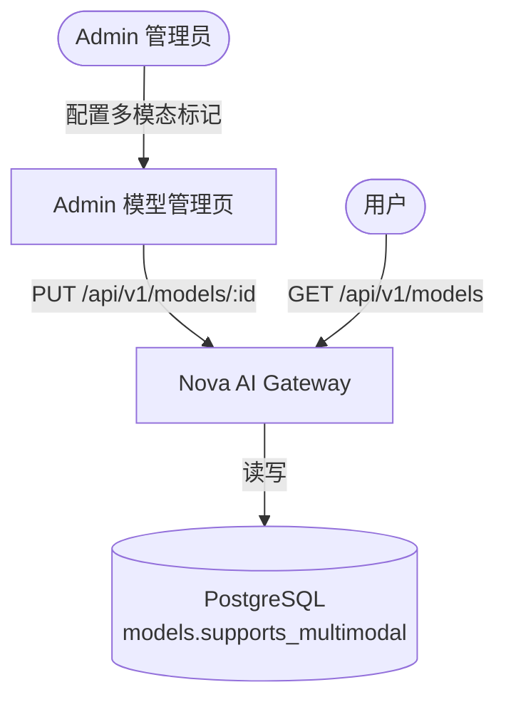
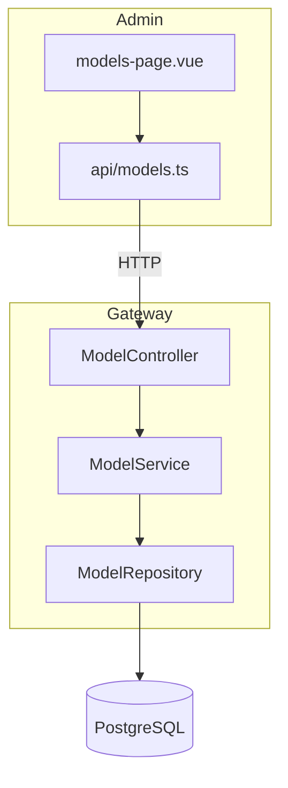
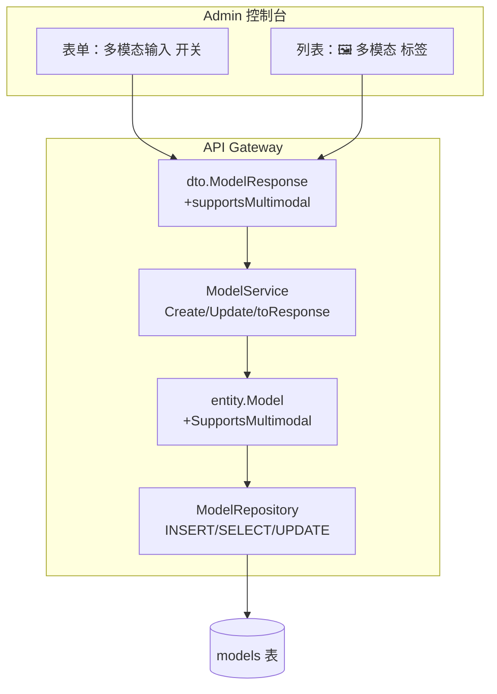
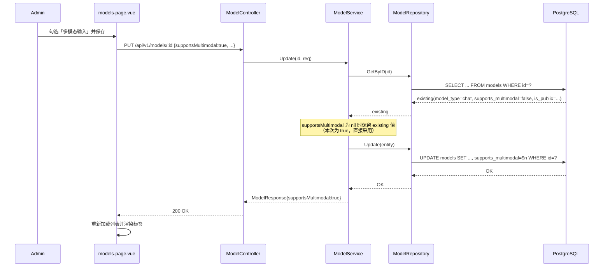
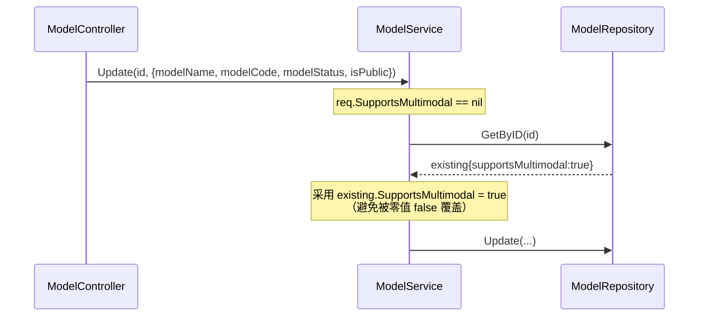
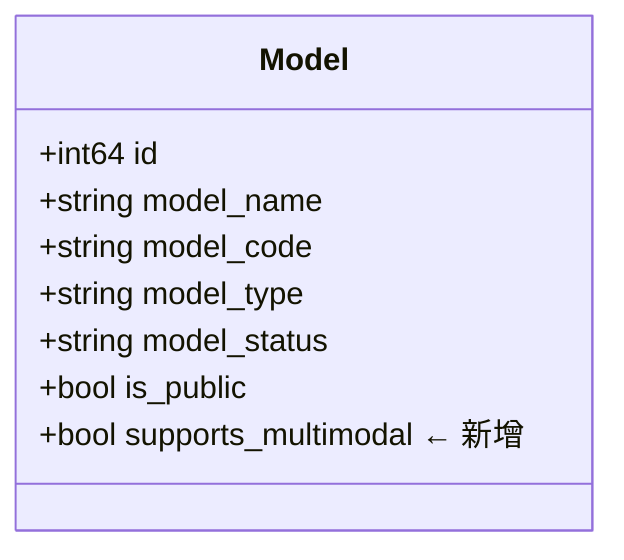

# Architecture: 模型管理「多模态输入」字段

Version: v1.0

Status: Active

Owner: Architect

Last Updated: 2026-09-14

Related ADR: N/A

---

## 1. Metadata

| 字段 | 值 |
|------|-----|
| Architecture ID | ARCH-20260914-Model-Multimodal-Input |
| Version | v1.0 |
| Status | Active |
| Owner | Architect |
| Related ADR | N/A |
| Related PRD | N/A（需求来源：模型管理新增「多模态输入」标记） |
| Created | 2026-09-14 |
| Last Updated | 2026-09-14 |
| Review | PASS（REV-20260914-ARCH-Model-Multimodal-Input） |

---

## 2. Overview

模型管理当前已支持 `model_type`（chat / image / embedding）与 `is_public` 等属性，但**缺少对模型输入能力的描述**。用户在选用某个对话模型时，无法从平台得知该模型是否接受图片等非文本输入。

本设计为 `models` 增加一个**布尔能力标记字段** `supports_multimodal`（前端展示名「多模态输入」），用于**声明**该模型使用时是否允许输入图片等信息。

设计核心思路（对齐 MVP First / 最小改动）：
- 字段为**纯声明（capability flag）**，本期**不做网关侧强制校验**，不改变任何转发逻辑；
- 完全复用现有 Model CRUD 链路（Entity → DTO → Repo → Service → Controller）与既有迁移模式；
- 存量数据默认 `false`，升级后**零行为变更**，可安全回滚。

### 适用范围

- 涉及的模块：Model 领域（Entity / DTO / Repository / Service）、Admin 模型管理页
- 涉及的服务：API Gateway（`backend/internal/`）、Admin 控制台（`admin/src/`）
- 涉及的技术栈：Go 1.22+、PostgreSQL 15+、Vue3 + TypeScript

---

## 3. Business Context

同一 `model_type=chat` 的模型，输入能力差异很大：部分模型仅支持纯文本，部分支持文本 + 图片（视觉），未来可能支持音频/视频输入。当前平台无法对外表达这一差异，导致：
1. 运营/管理员无法在管理端标注模型能力；
2. 用户缺少选择依据，误用不支持图片的模型会造成调用失败与成本浪费。

```
┌────────────────────────────────────────────┐
│           业务域：模型能力描述               │
│                                            │
│  ┌──────────────────┐  ┌─────────────────┐ │
│  │  纯文本对话模型   │  │  多模态输入模型  │ │
│  │  (text only)     │  │  (text + image) │ │
│  └────────┬─────────┘  └────────┬────────┘ │
│           │                     │           │
│           └─────────┬───────────┘           │
│                     ▼                       │
│           ┌────────────────────┐            │
│           │  models 表新增字段  │            │
│           │  supports_multimodal│           │
│           └────────────────────┘            │
└──────────────────────────────────────────────┘
```

---

## 4. Goals

### 架构目标

- **G1**：`models` 表新增布尔字段 `supports_multimodal`，默认 `false`
- **G2**：模型创建 / 编辑 / 列表 / 详情接口完整读写该字段，且**编辑时的部分更新不丢失该字段**
- **G3**：Admin 模型管理页可配置并可视化该标记
- **G4**：存量数据默认关闭，升级不改变任何现有请求行为
- **G5**：`go build` 与 `tsc --noEmit` 通过；迁移可回滚（提供 `.down.sql`）

### 架构原则

- **MVP First**：布尔开关即可满足「是否允许」，不引入多模态枚举
- **向后兼容**：新增字段带默认值，对外接口仅追加可选字段
- **最小改动**：不新增端点、不新增服务、不改网关转发链路
- **单一事实来源**：能力声明集中在 `models` 表，前端只做展示

### 非目标

- 网关侧强制校验（拦截向非多模态模型发送图片输入的请求）—— 后续迭代
- 细粒度多模态枚举（image / audio / video 分项声明）—— 后续迭代
- 修改对外 `/v1/models` 契约（OpenAI / Anthropic SDK 无此字段）
- 输出侧多模态（图片/语音生成能力），当前由 `model_type=image` 表达

---

## 5. System Context

本变更为**单服务内的字段扩展**，无新增外部依赖。



### 外部依赖

| 外部系统 | 依赖类型 | 说明 |
|---------|---------|------|
| PostgreSQL | 数据库 | 存储新增字段（唯一受影响的数据源） |

---

## 6. Modules

### 模块划分

| 模块 | 职责 | 依赖模块 | 所属服务 |
|------|------|---------|---------|
| ModelController | 解析请求、组装响应 | ModelService | API Gateway |
| ModelService（扩展） | 字段默认值、编辑时保留原值、响应映射 | ModelRepository | API Gateway |
| ModelRepository（扩展） | SQL / 内存读写新字段 | PostgreSQL / 内存 | API Gateway |
| model_request.go（扩展） | DTO 字段定义 | — | API Gateway |
| models-page.vue（扩展） | 表单开关、列表标签 | api/models.ts | Admin |

### 模块关系图



---

## 7. Layer Design

沿用现有分层（Controller → Service → Repository），**无新增层**。

```
┌───────────────────────────────────────────────┐
│  Controller   ModelController（无改动）        │  ← HTTP 层
├───────────────────────────────────────────────┤
│  Service      ModelService（默认值 / 保留原值）│  ← 业务逻辑层
├───────────────────────────────────────────────┤
│  Repository   Model Repository（PG / 内存）    │  ← 数据访问层
├───────────────────────────────────────────────┤
│  Infra        PostgreSQL                       │  ← 基础设施层
└───────────────────────────────────────────────┘
```

### 层间依赖规则

沿用项目既有规则，本次不引入例外。

---

## 8. Component Diagram



---

## 9. Sequence Diagram

### 主流程：编辑模型的多模态标记



### 边界流程：未传字段的编辑（回归关键）



---

## 10. API Design

**不新增接口**，仅在现有接口上追加可选字段。

### 接口清单

| 接口 | Method | 字段变更 | 认证方式 |
|------|--------|---------|---------|
| `/api/v1/models` | POST | 请求新增可选 `supportsMultimodal` | JWT |
| `/api/v1/models/{id}` | PUT | 请求新增可选 `supportsMultimodal` | JWT |
| `/api/v1/models` | GET | 响应新增 `supportsMultimodal` | JWT |
| `/api/v1/models/{id}` | GET | 响应新增 `supportsMultimodal` | JWT |

### 字段契约

请求（Create / Update）：

```json
{
  "supportsMultimodal": true
}
```

| 字段 | 类型 | 必填 | 默认 | 说明 |
|------|------|:----:|------|------|
| `supportsMultimodal` | boolean | 否 | `false`（Create）/ 保留原值（Update，缺省时） | 是否允许图片等非文本输入 |

响应（ModelResponse）：

| 字段 | 类型 | 说明 |
|------|------|------|
| `supportsMultimodal` | boolean | 模型能力标记 |

> 对外推理端点 `/v1/models`（`HandleListOpenAIModels`）**不暴露**该字段，避免破坏 OpenAI / Anthropic SDK 兼容。

---

## 11. Database Design

### 数据模型变更



### 核心表变更说明

| 表名 | 变更 | 字段 | 类型 | 默认值 | 说明 |
|------|------|------|------|:------:|------|
| `models` | 新增字段 | `supports_multimodal` | BOOLEAN | `FALSE` | 是否允许图片等非文本输入 |

### 迁移脚本

新增 `backend/migrations/202609140001_add_model_multimodal.up.sql`：

```sql
-- Migration: Add supports_multimodal to models
-- Marks whether a model accepts multimodal (image etc.) input.
ALTER TABLE models ADD COLUMN supports_multimodal BOOLEAN NOT NULL DEFAULT FALSE;
```

新增 `backend/migrations/202609140001_add_model_multimodal.down.sql`：

```sql
ALTER TABLE models DROP COLUMN IF EXISTS supports_multimodal;
```

> 迁移由 `internal/database/migrator.go` 按文件名前缀（`202609140001`）去重执行，天然幂等。

---

## 12. Cache Design

不适用。本次未新增缓存项；模型信息缓存（如有）沿用既有失效策略，字段随模型整体刷新。

---

## 13. Deployment

不适用。无新增服务、无新增环境变量、无基础设施变更；沿用现有 `docker compose` 部署流程，迁移在服务启动时自动执行。

---

## 14. Security

| 安全层 | 措施 | 说明 |
|--------|------|------|
| 授权 | RBAC | 沿用 `admin:model:manage` 权限控制，无新增权限点 |
| 输入校验 | 类型校验 | 布尔字段；非法类型由 JSON 解码拒绝（400 VALID001） |
| 数据暴露 | 契约收敛 | 对外 `/v1/models` 不暴露该字段 |

本次不引入新的敏感面。

---

## 15. Performance

无性能影响。字段为定长布尔列，随模型行一并读写；模型列表为低频管理端操作，主链路（推理请求）**不读取**该字段。

---

## 16. Implementation Checklist（编码阶段改动清单）

### 后端

| # | 文件 | 改动 |
|---|------|------|
| 1 | `backend/migrations/202609140001_add_model_multimodal.up.sql` / `.down.sql` | 新增迁移 |
| 2 | `backend/internal/entity/model.go` | `SupportsMultimodal bool` |
| 3 | `backend/internal/dto/model_request.go` | Create/Update 请求加 `*bool`；`ModelResponse` 加 `bool` |
| 4 | `backend/internal/repository/model_repo_pg.go` | `modelColumns`、`scanModel`、`List` 扫描、`Create` INSERT、`Update` SET |
| 5 | `backend/internal/repository/model_repository.go` | 内存实现 Create/Update；可选调整 seed 数据 |
| 6 | `backend/internal/service/model_service.go` | Create 默认 `false`；Update 为 `nil` 时继承 `existing`；`toModelResponse` 映射 |

### 前端（Admin）

| # | 文件 | 改动 |
|---|------|------|
| 7 | `admin/src/api/models.ts` | `ModelResponse` / `CreateModelRequest` / `UpdateModelRequest` 加字段 |
| 8 | `admin/src/pages/models/models-page.vue` | `form` 加 `supportsMultimodal`；`openCreate`/`openEdit` 初始化；`handleSave` 两个分支均提交；表单加开关；列表加标签 |

> `ModelController` 无需改动（`json.Decoder` 自动处理新字段）。

---

## 17. Risks

| # | 风险描述 | 等级 | 影响 | 缓解方案 |
|---|---------|:----:|------|---------|
| 1 | **Update 部分更新丢失字段**：`Update` 为「重建 entity 覆盖写」，未显式继承会导致编辑其它字段时把开关重置为 `false` | 高 | 用户配置被静默清除 | Service 层在 `req.SupportsMultimodal == nil` 时继承 `existing`（对齐 `isPublic` 现有模式）；Reviewer 重点核查；补回归用例 |
| 2 | 迁移在存量库执行失败 | 低 | 服务启动失败 | 仅 `ADD COLUMN ... DEFAULT FALSE`，无锁重写风险；提供 `.down.sql` 回滚 |
| 3 | 语义误用：`image` / `embedding` 类型模型也展示该开关 | 低 | 运营误解 | 前端在当前 `modelType` 非 `chat` 时给出辅助说明或禁用；字段本身通用不影响数据 |
| 4 | 用户期望网关拦截非多模态模型的图片输入 | 中 | 预期落差 | 本期明确为「标记展示」，未做校验；在 UI 文案与文档中说明，后续迭代补齐 |

---

## 18. Future Extension

| 未来需求 | 预留机制 | 说明 |
|---------|---------|------|
| 网关侧强制校验 | 在 `chat_controller.go` 解析 `messages` 中的 `image_url` / `image` 内容块，命中非多模态模型时返回 4xx | 需新增内容块探测逻辑，独立迭代 |
| 细粒度多模态声明 | 将布尔升级为 `input_modalities`（如 JSONB / 逗号分隔：`text,image,audio`） | 布尔与枚举可共存过渡，迁移向后兼容 |
| 输出侧能力声明 | 扩展 `model_type` 或新增输出能力字段 | 与本字段（输入侧）职责正交 |
| 对外暴露能力 | `/v1/models` 响应追加能力字段 | 需评估 SDK 兼容性后再决定 |

---

## 19. Change Log

| 日期 | 版本 | 修改内容 | 修改人 |
|------|------|---------|--------|
| 2026-09-14 | v1.0 | 初始版本 | Architect |
| 2026-09-14 | v1.0 | 评审通过（PASS），Status 更新为 Active | Reviewer |

---

# End

本模板依据 AI Company Document Standard 和 Engineering Standard 设计。

所有 Architecture 文档必须基于此模板创建。
