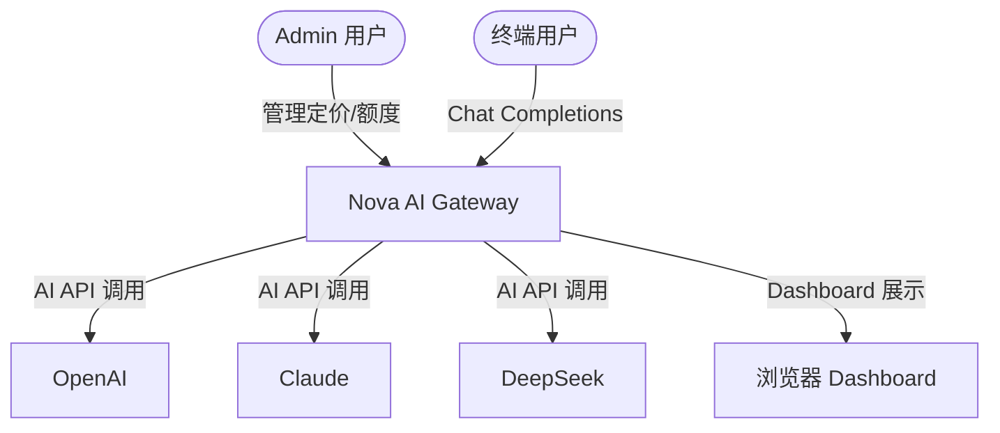
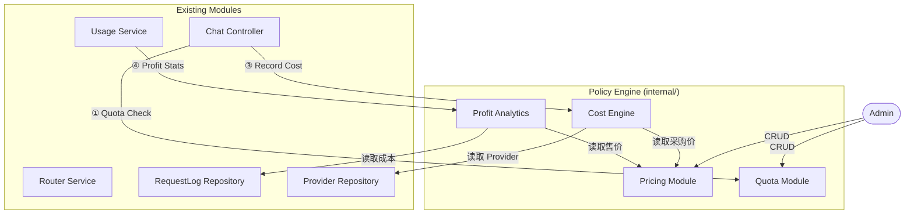
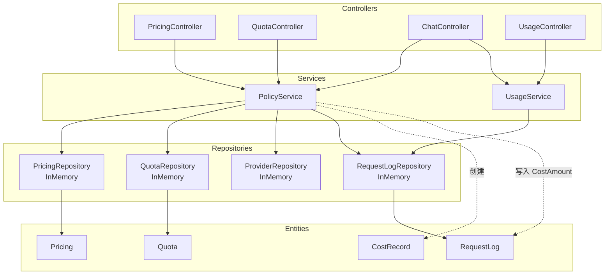
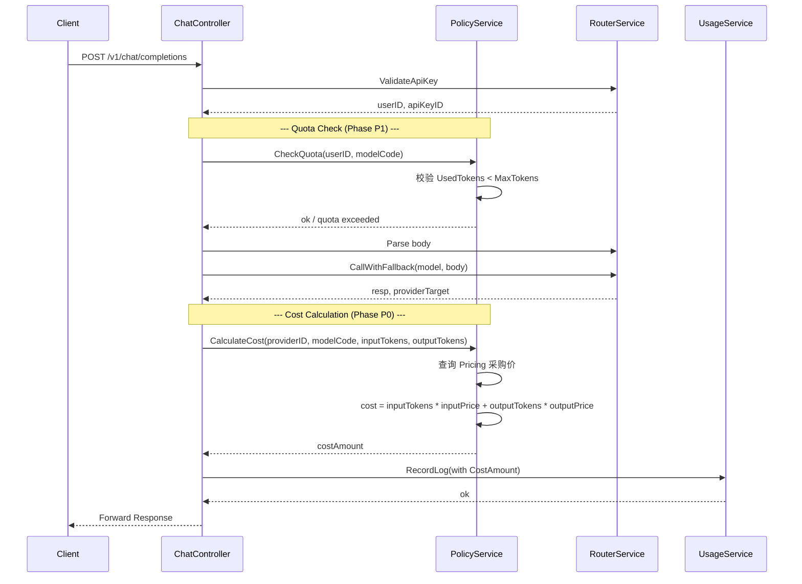
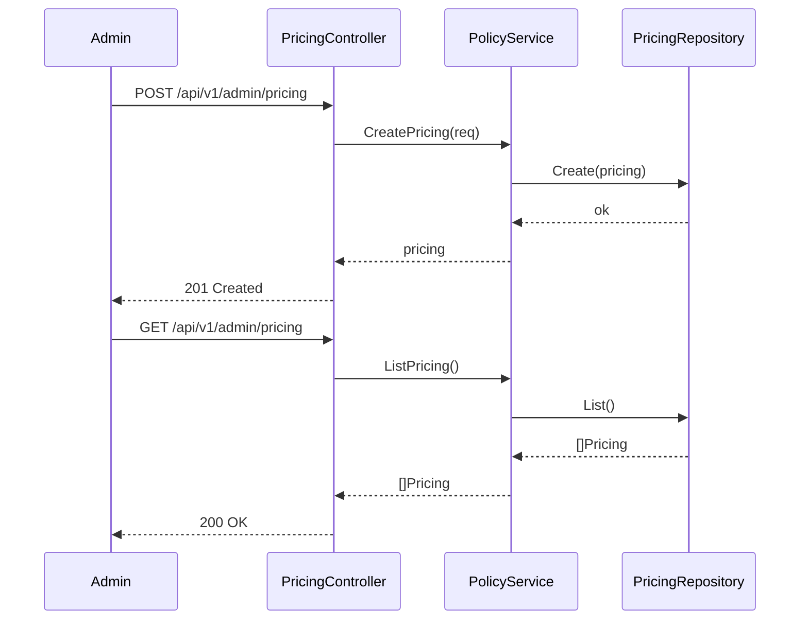
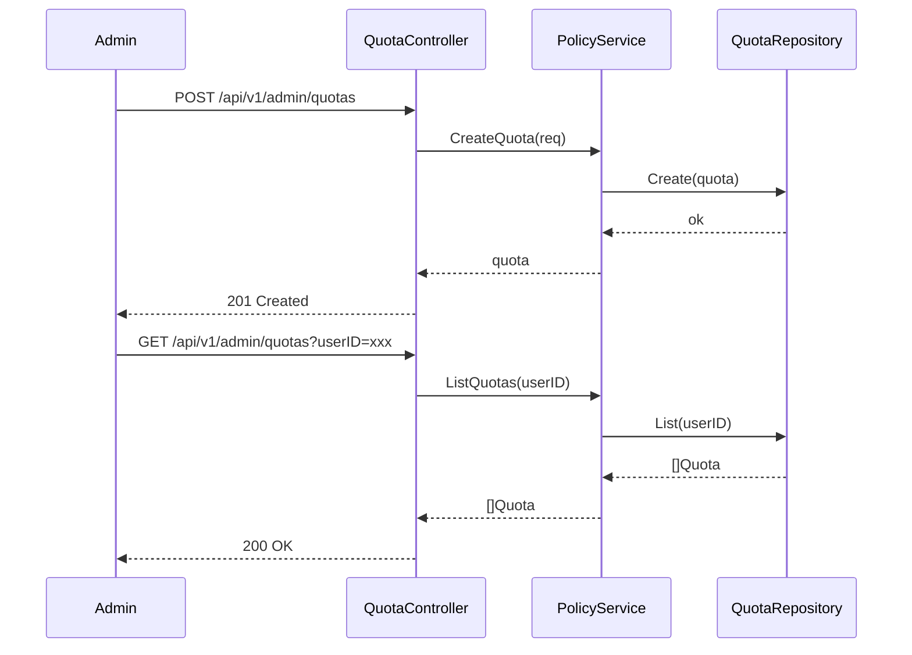
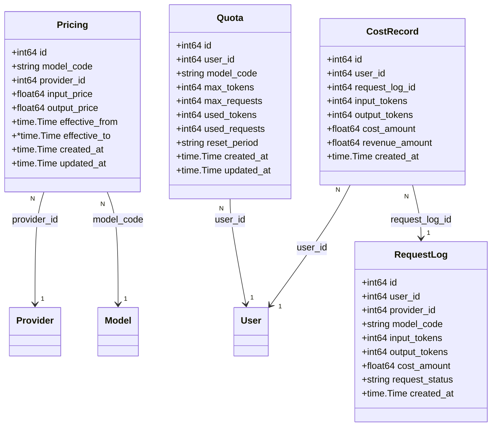

# Architecture: Policy Engine — Round 9 基础模块

Version: v1.0

Status: Draft

Owner: Architect

Last Updated: 2026-07-25

Related ADR: ADR-20260725-001

---

## 1. Metadata

| 字段 | 值 |
|------|-----|
| Architecture ID | ARCH-20260725-001 |
| Version | v1.0 |
| Status | Draft |
| Owner | Architect |
| Related ADR | ADR-20260725-001 |
| Related PRD | Round 9 Policy Engine |
| Created | 2026-07-25 |
| Last Updated | 2026-07-25 |

---

## 2. Overview

Policy Engine 是 Nova AI Gateway 的计费与额度控制核心模块。本轮实现其基础子模块：Pricing 定价配置、Cost Engine 成本计算、Profit Analytics 利润分析、Quota 额度管理。

Policy Engine MVP 阶段不拆独立服务，以包的形式集成在 Gateway 内部，遵循现有 Controller → Service → Repository 分层架构。后续 Phase P2 拆分为独立服务时，现有接口和实体设计可平滑迁移。

### 适用范围

- 涉及的模块：Pricing、Cost Engine、Quota、Profit Analytics
- 涉及的服务：API Gateway（`backend/internal/`）
- 涉及的技术栈：Go 1.22+, InMemory Repository

---

## 3. Business Context

AI Gateway 作为大模型统一接入平台，业务模型包含三个核心财务维度：

1. **采购成本**：Gateway 向各 AI Provider（OpenAI、Claude、DeepSeek 等）采购 API 服务的实际支出
2. **售卖收入**：Gateway 向终端用户收取的 API 调用费用
3. **利润**：收入 - 成本 = 毛利润

此外，需要为每个用户设置 Token/请求额度上限，防止滥用。

```
┌─────────────────────────────────────────────┐
│              业务域：计费 & 额度              │
│                                             │
│  ┌───────────┐    ┌──────────────┐         │
│  │ 采购成本   │    │ 售卖定价     │         │
│  │ (Provider) │    │ (终端用户)   │         │
│  └─────┬─────┘    └──────┬───────┘         │
│        │                  │                 │
│        └──────┬───────────┘                 │
│               ▼                             │
│       ┌───────────────┐                     │
│       │  Policy Engine │                    │
│       │  (本模块)      │                    │
│       └───────┬───────┘                     │
│               │                             │
│        ┌──────┴──────┐                      │
│        ▼             ▼                      │
│  ┌──────────┐  ┌──────────┐                 │
│  │ 额度控制  │  │ 成本/利润 │                │
│  └──────────┘  └──────────┘                 │
└─────────────────────────────────────────────┘
```

---

## 4. Goals

### 架构目标

- **P0**: 支持 Admin 对 Pricing（Model × Provider 定价）进行 CRUD 管理
- **P0**: 在每次 Chat Completion 请求完成后自动计算采购成本并记录
- **P0**: Dashboard 展示利润指标（收入 - 成本）
- **P1**: 支持 Admin 对用户 Quota 进行管理，请求到达时检查额度
- **性能目标**: Cost Calculation < 2ms（纯内存计算，无 I/O）

### 架构原则

- **遵循 Clean Architecture**: Controller → Service → Repository，依赖方向由外向内
- **遵循 MVP First**: 所有 Repository 使用 InMemory 实现，不做过度设计
- **异步化**: 成本计算在线程内同步完成（纯计算无 I/O），不影响主链路延迟
- **复用现有模式**: 实体、仓库、服务、控制器命名和结构与已有模块一致

### 非目标

- Policy Engine 独立服务化（Phase P2 再拆）
- 数据库持久化（Phase P2 再引入）
- 按时间段计费（如月度订阅）
- 复杂的折扣和阶梯定价
- 实时推送/告警

---

## 5. System Context



### 外部依赖

| 外部系统 | 依赖类型 | 说明 |
|---------|---------|------|
| AI Provider（OpenAI/Claude/DeepSeek） | HTTP API | Chat Completions 调用，返回 token 用量 |
| 浏览器 Dashboard | HTTP | 展示利润分析数据 |

---

## 6. Modules

### 模块划分

| 模块 | 职责 | 依赖模块 | 所属服务 |
|------|------|---------|---------|
| **Pricing** | Model × Provider 的 Input/Output 售价 CRUD | — | Gateway (internal) |
| **Cost Engine** | 根据 Provider 采购价计算每次请求成本 | Pricing, Provider | Gateway (internal) |
| **Quota** | 每用户的 Token/Request 限额配置与校验 | — | Gateway (internal) |
| **Profit Analytics** | 聚合收入 - 成本 = 利润 | Cost Engine, RequestLog | Gateway (internal) |

### 模块关系图



---

## 7. Layer Design

### 分层架构

```
┌───────────────────────────────────────────────┐
│         Controller (PricingController,         │  ← HTTP 层
│                     QuotaController)           │
├───────────────────────────────────────────────┤
│         Service (PolicyService)                │  ← 业务逻辑层
│           ├── CostEngine (成本计算)             │
│           ├── QuotaChecker (额度检查)           │
│           └── ProfitAggregator (利润聚合)       │
├───────────────────────────────────────────────┤
│         Repository (InMemory)                  │  ← 数据访问层
│           ├── PricingRepository                │
│           └── QuotaRepository                  │
├───────────────────────────────────────────────┤
│         Entity (Pricing, Quota, CostRecord)    │  ← 领域模型
└───────────────────────────────────────────────┘
```

### 层间依赖规则

| 方向 | 规则 | 禁止事项 |
|------|------|---------|
| Controller → Service | Controller 调用 Service | Controller 不可直接访问 Repository |
| Service → Repository | Service 调用 Repository | Service 不可处理 HTTP |
| Repository → Entity | Repository 操作 Entity | Repository 不可含业务逻辑 |
| Service → Entity | Service 使用 Entity 做业务计算 | Service 不可感知存储细节 |

### 依赖注入链

```
main.go
  ├── NewInMemoryPricingRepository()
  ├── NewInMemoryQuotaRepository()
  ├── NewPolicyService(pricingRepo, quotaRepo, providerRepo, logRepo, logger)
  ├── NewPricingController(policySvc, logger)
  ├── NewQuotaController(policySvc, logger)
  └── ChatController 集成 policySvc.QuotaCheck() + policySvc.CalculateCost()
```

---

## 8. Component Diagram



### 组件职责

| 组件 | 职责 | 关键技术 |
|------|------|---------|
| PricingController | Admin 定价 CRUD 接口 | HTTP JSON |
| QuotaController | Admin 额度管理接口 | HTTP JSON |
| PolicyService | 成本计算 + Quota 校验 + 利润聚合 | 纯内存计算 |
| PricingRepository | 定价数据存储（InMemory） | sync.RWMutex |
| QuotaRepository | 额度数据存储（InMemory） | sync.RWMutex |

---

## 9. Sequence Diagram

### 主流程：Chat Completion 集成



### Admin：定价管理



### Admin：额度管理



---

## 10. API Design

### Admin 接口清单

| 接口 | Method | 说明 | 认证方式 | Phase |
|------|--------|------|---------|:----:|
| `/api/v1/admin/pricing` | POST | 创建定价配置 | JWT | P0 |
| `/api/v1/admin/pricing` | GET | 定价配置列表 | JWT | P0 |
| `/api/v1/admin/pricing/{id}` | PUT | 更新定价配置 | JWT | P0 |
| `/api/v1/admin/quotas` | POST | 创建额度 | JWT | P1 |
| `/api/v1/admin/quotas` | GET | 额度列表（支持 ?userID= 过滤） | JWT | P1 |
| `/api/v1/admin/quotas/{id}` | PATCH | 更新额度 | JWT | P1 |
| `/api/v1/admin/profit` | GET | 利润分析聚合 | JWT | P0 |

### 新增 DTO

**CreatePricingRequest**
```go
type CreatePricingRequest struct {
    ModelCode    string  `json:"modelCode"`
    ProviderID   int64   `json:"providerId"`
    InputPrice   float64 `json:"inputPrice"`   // per token
    OutputPrice  float64 `json:"outputPrice"`  // per token
    EffectiveFrom string `json:"effectiveFrom"` // RFC3339
    EffectiveTo   string `json:"effectiveTo"`   // RFC3339, optional
}
```

**PricingResponse**
```go
type PricingResponse struct {
    ID            int64   `json:"id"`
    ModelCode     string  `json:"modelCode"`
    ProviderID    int64   `json:"providerId"`
    InputPrice    float64 `json:"inputPrice"`
    OutputPrice   float64 `json:"outputPrice"`
    EffectiveFrom string  `json:"effectiveFrom"`
    EffectiveTo   string  `json:"effectiveTo,omitempty"`
    CreatedAt     string  `json:"createdAt"`
    UpdatedAt     string  `json:"updatedAt"`
}
```

**CreateQuotaRequest**
```go
type CreateQuotaRequest struct {
    UserID       int64  `json:"userId"`
    ModelCode    string `json:"modelCode"`
    MaxTokens    int64  `json:"maxTokens"`
    MaxRequests  int64  `json:"maxRequests"`
    ResetPeriod  string `json:"resetPeriod"` // "daily" | "monthly" | "never"
}
```

**QuotaResponse**
```go
type QuotaResponse struct {
    ID           int64  `json:"id"`
    UserID       int64  `json:"userId"`
    ModelCode    string `json:"modelCode"`
    MaxTokens    int64  `json:"maxTokens"`
    MaxRequests  int64  `json:"maxRequests"`
    UsedTokens   int64  `json:"usedTokens"`
    UsedRequests int64  `json:"usedRequests"`
    ResetPeriod  string `json:"resetPeriod"`
}
```

**UpdateQuotaRequest** (用于 PATCH)
```go
type UpdateQuotaRequest struct {
    MaxTokens    *int64  `json:"maxTokens,omitempty"`
    MaxRequests  *int64  `json:"maxRequests,omitempty"`
    UsedTokens   *int64  `json:"usedTokens,omitempty"`
    UsedRequests *int64  `json:"usedRequests,omitempty"`
    ResetPeriod  *string `json:"resetPeriod,omitempty"`
}
```

**ProfitResponse**
```go
type ProfitResponse struct {
    TotalRevenue    float64 `json:"totalRevenue"`
    TotalCost      float64 `json:"totalCost"`
    TotalProfit    float64 `json:"totalProfit"`
    TodayRevenue   float64 `json:"todayRevenue"`
    TodayCost      float64 `json:"todayCost"`
    TodayProfit    float64 `json:"todayProfit"`
    ProfitMargin   float64 `json:"profitMargin"` // 利润率 %
}
```

### DashboardStatsResponse 扩展

在现有 `DashboardStatsResponse` 中新增利润字段：

```go
type DashboardStatsResponse struct {
    // ... existing fields ...
    TodayProfit  float64 `json:"todayProfit"`  // 新增
    TotalProfit  float64 `json:"totalProfit"`  // 新增
    ProfitMargin float64 `json:"profitMargin"` // 新增
}
```

---

## 11. Database Design

### 数据模型



### 核心实体

#### Pricing（定价配置）

| 字段 | 类型 | 说明 |
|------|------|------|
| ID | int64 | 主键 |
| ModelCode | string | 模型代码，如 `gpt-4` |
| ProviderID | int64 | 供应商 ID |
| InputPrice | float64 | 采购输入价格（per token） |
| OutputPrice | float64 | 采购输出价格（per token） |
| EffectiveFrom | time.Time | 生效时间 |
| EffectiveTo | *time.Time | 失效时间，nil 表示永久有效 |
| CreatedAt | time.Time | 创建时间 |
| UpdatedAt | time.Time | 更新时间 |

**唯一约束**：`(ModelCode, ProviderID, EffectiveFrom)` 唯一

#### Quota（用户额度）

| 字段 | 类型 | 说明 |
|------|------|------|
| ID | int64 | 主键 |
| UserID | int64 | 用户 ID |
| ModelCode | string | 模型代码，空表示全局 |
| MaxTokens | int64 | Token 上限，0 表示不限 |
| MaxRequests | int64 | 请求次数上限，0 表示不限 |
| UsedTokens | int64 | 已用 Token |
| UsedRequests | int64 | 已请求次数 |
| ResetPeriod | string | 重置周期：`daily` / `monthly` / `never` |
| CreatedAt | time.Time | 创建时间 |
| UpdatedAt | time.Time | 更新时间 |

**唯一约束**：`(UserID, ModelCode)` 唯一

#### CostRecord（成本记录）

| 字段 | 类型 | 说明 |
|------|------|------|
| ID | int64 | 主键 |
| UserID | int64 | 用户 ID |
| RequestLogID | int64 | 请求日志 ID |
| InputTokens | int | 输入 Token 数 |
| OutputTokens | int | 输出 Token 数 |
| CostAmount | float64 | 采购成本金额 |
| RevenueAmount | float64 | 售卖收入金额 |
| CreatedAt | time.Time | 创建时间 |

> **MVP 简化**：CostRecord 在当前 InMemory 阶段不单独建表，成本金额直接存储在 RequestLog.CostAmount 字段中。CostRecord Entity 预定义供后续持久化使用。

### Revenue（收入）计算规则

当前 MVP 阶段的收入计算规则：
- 无独立定价表（售卖价 = 采购价 × 固定倍率）
- 倍率通过环境变量 `MARKUP_RATE` 配置，默认 2.0
- 利润 = 收入 - 成本 = costAmount × (markupRate - 1)
- 后续 Phase 引入独立售价表（Sell Pricing）后替换此规则

---

## 12. Cache Design

当前使用 InMemory Repository 作为数据存储，既是存储层也是缓存层。

### 后续（独立服务化后）缓存策略

| 缓存项 | Key 模式 | TTL | 策略 | 失效时机 |
|--------|---------|-----|------|---------|
| Pricing 配置 | `policy:pricing:{modelCode}:{providerID}` | 5min | Cache-Aside | Admin 更新定价时 |
| Quota | `policy:quota:{userID}:{modelCode}` | 1min | Write-Through | 每次请求消耗后更新 |

---

## 13. Chat Completion 流程集成

### 集成前后的流程对比

**当前流程：**
```
ValidateApiKey → Parse Body → SelectProvider → CallProvider → RecordLog → Return
```

**集成后流程：**
```
ValidateApiKey → [Quota Check] → Parse Body → SelectProvider → CallProvider → [Cost Calculation] → RecordLog → Return
```

### 集成点详解

#### ① Quota Check（Phase P1）

插入位置：`ValidateApiKey` 之后，`Parse Body` 之前

```go
// 在 ChatController.HandleChatCompletions 中，ValidateApiKey 成功后
if err := policySvc.CheckQuota(ctx, userID, chatReq.Model); err != nil {
    switch {
    case errors.Is(err, service.ErrQuotaExceeded):
        writeError(w, http.StatusForbidden, "QUOTA001", "quota exceeded")
    case errors.Is(err, service.ErrQuotaNotFound):
        // No quota configured = unlimited, continue
    default:
        writeError(w, http.StatusInternalServerError, "GATEWAY001", "quota check failed")
    }
    return
}
```

#### ② Cost Calculation（Phase P0）

插入位置：`CallProvider` 成功之后，`RecordLog` 之前

```go
// 在 ChatController.HandleChatCompletions 中，解析 token 用量后
costAmount, err := policySvc.CalculateCost(ctx, target.ProviderID, chatReq.Model, inputTokens, outputTokens)
if err != nil {
    // 成本计算失败不影响主流程，记录 warn 日志，cost 设为 0
    c.logger.Warn("cost calculation failed", "error", err)
    costAmount = 0
}

// 将 costAmount 写入 RequestLog
c.usageSvc.RecordLog(r.Context(), &entity.RequestLog{
    // ... existing fields ...
    CostAmount: costAmount,
})
```

#### ③ Profit Analytics（Phase P0）

Dashboard 集成，在 `UsageService.Dashboard()` 中新增利润聚合：

```go
func (s *PolicyService) CalculateProfit(ctx context.Context, userID int64) (*ProfitResponse, error) {
    stats, _ := s.logRepo.Stats(ctx, userID)
    totalRevenue := stats.TotalCost * s.markupRate
    totalProfit := totalRevenue - stats.TotalCost
    
    todayRevenue := stats.TodayCost * s.markupRate
    todayProfit := todayRevenue - stats.TodayCost
    
    return &ProfitResponse{
        TotalRevenue: totalRevenue,
        TotalCost:   stats.TotalCost,
        TotalProfit: totalProfit,
        ...
    }, nil
}
```

---

## 14. 错误码定义

| 错误码 | HTTP Status | 说明 |
|--------|:-----------:|------|
| `PRICE001` | 404 | Pricing 配置不存在 |
| `PRICE002` | 400 | Pricing 配置重复 |
| `QUOTA001` | 403 | Quota 额度超限 |
| `QUOTA002` | 404 | Quota 配置不存在 |
| `QUOTA003` | 400 | Quota 配置重复 |
| `PROFIT001` | 500 | 利润计算异常 |

---

## 15. Performance

### 性能目标

| 指标 | 目标 | 测量方式 |
|------|------|---------|
| Cost Calculation | < 1ms | 纯内存 map 查找 + 浮点运算 |
| Quota Check | < 0.5ms | InMemory 原子加减 |
| Profit Aggregation | < 5ms | 遍历 RequestLog 累加 |

### 性能优化策略

- Cost Calculation 使用 `map[string]*Pricing` 以 `(ModelCode, ProviderID)` 为 key 查找
- Quota 使用 `map[int64]map[string]*Quota` 分层索引（UserID → ModelCode）
- 所有计算纯内存操作，无 I/O 等待

---

## 16. Risks

| # | 风险描述 | 等级 | 影响 | 缓解方案 |
|---|---------|:----:|------|---------|
| 1 | 定价配置重复（同模型同供应商同时段） | 中 | 成本计算错误 | Create 时校验唯一约束 |
| 2 | 并发请求下 Quota 的 UsedTokens 计数竞争 | 中 | 额度超限 | InMemory 使用 Lock + CompareAndSwap 模式 |
| 3 | CostRecord 与 RequestLog 数据一致性 | 低 | 财务统计偏差 | CostAmount 直接写入 RequestLog，不做分离存储 |

---

## 17. Future Extension

| 未来需求 | 预留机制 | 说明 |
|---------|---------|------|
| Policy Engine 独立服务 | 模块已按包隔离，所有依赖通过接口注入 | 后续只需抽出 package 并添加 gRPC 层 |
| 独立售价表（Sell Pricing） | 当前使用固定倍率 `MARKUP_RATE` | 后续将售价拆为独立 Entity + Repository |
| 持久化存储 | 所有 Repository 已定义 Interface | 后续实现 PostgreSQL 版本 |
| 计费异步化 | CostRecord Entity 已预定义 | 后续通过 Event Queue 异步写入 |
| 阶梯定价 / 批量折扣 | Pricing 的 EffectiveFrom/To 支持时间维度 | 后续在 Pricing 上增加阶梯字段 |
| 实时告警（额度不足） | Quota 的 UsedTokens 实时更新 | 后续在 PolicyService 中触发 Event |

---

## 18. 文件清单

### 新增文件

| # | 路径 | 说明 |
|:-:|------|------|
| 1 | `backend/internal/entity/pricing.go` | Pricing 实体 |
| 2 | `backend/internal/entity/quota.go` | Quota 实体 |
| 3 | `backend/internal/entity/cost_record.go` | CostRecord 实体（预定义，MVP 暂不单独存储） |
| 4 | `backend/internal/repository/pricing_repository.go` | PricingRepository Interface + InMemory 实现 |
| 5 | `backend/internal/repository/quota_repository.go` | QuotaRepository Interface + InMemory 实现 |
| 6 | `backend/internal/service/policy_service.go` | PolicyService（成本计算 + Quota 校验 + 利润聚合） |
| 7 | `backend/internal/controller/pricing_controller.go` | Pricing CRUD 接口 |
| 8 | `backend/internal/controller/quota_controller.go` | Quota 管理接口 |
| 9 | `backend/internal/dto/pricing_request.go` | Pricing 相关 DTO |
| 10 | `backend/internal/dto/quota_request.go` | Quota 相关 DTO |
| 11 | `backend/internal/dto/profit_response.go` | Profit 响应 DTO |
| 12 | `backend/internal/dto/dashboard_response.go` | DashboardStatsResponse 新增利润字段版本 |

### 修改文件

| # | 路径 | 修改内容 |
|:-:|------|---------|
| 1 | `backend/cmd/gateway/main.go` | 注入 PricingRepository、QuotaRepository、PolicyService；注册 Pricing/Quota/Profit 路由 |
| 2 | `backend/internal/controller/chat_controller.go` | 在 CallProvider 后、RecordLog 前插入 Cost Calculation；在 ValidateApiKey 后插入 Quota Check |
| 3 | `backend/internal/controller/usage_controller.go` | Dashboard 接口新增利润字段返回 |
| 4 | `backend/internal/service/usage_service.go` | Dashboard 方法集成 Profit 聚合 |
| 5 | `backend/internal/service/errors.go` | 新增 ErrQuotaExceeded、ErrPricingNotFound、ErrQuotaNotFound 错误 |
| 6 | `backend/internal/repository/errors.go` | 新增 ErrPricingNotFound、ErrDuplicatePricing、ErrQuotaNotFound、ErrDuplicateQuota 错误 |
| 7 | `backend/internal/dto/usage_request.go` | DashboardStatsResponse 新增利润字段 |

---

## 19. Change Log

| 日期 | 版本 | 修改内容 | 修改人 |
|------|------|---------|--------|
| 2026-07-25 | v1.0 | 初始版本 — Policy Engine Round 9 基础模块架构设计 | Architect |

---

# End
