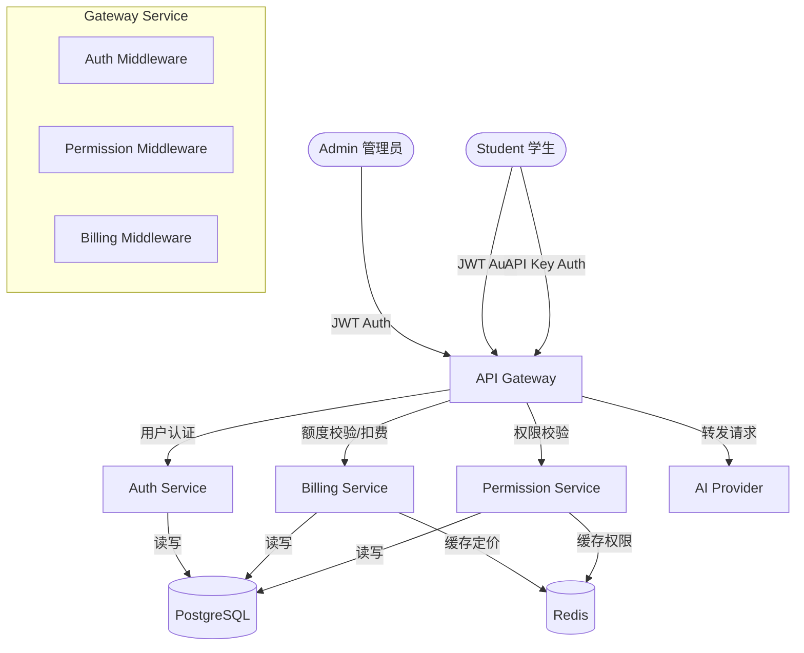
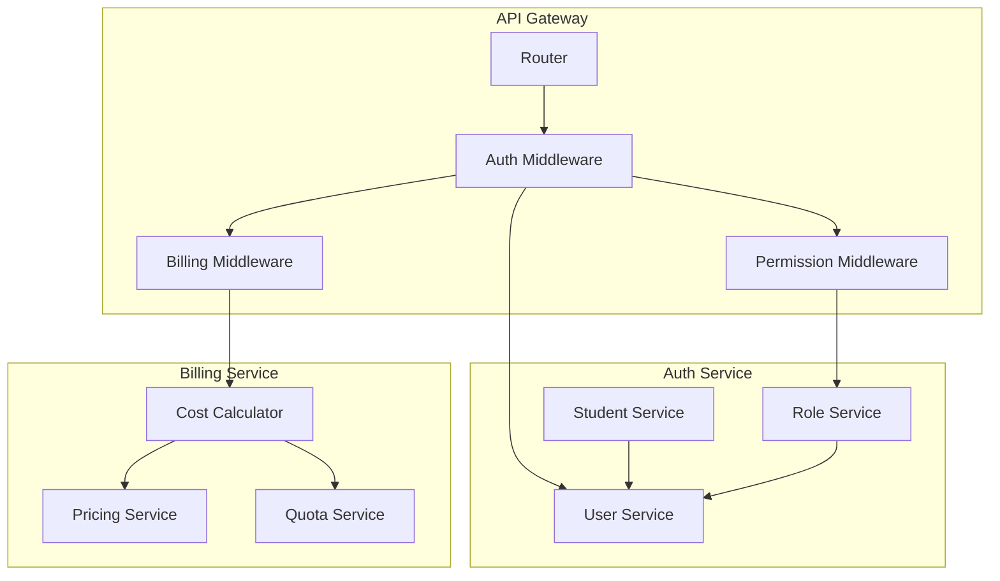
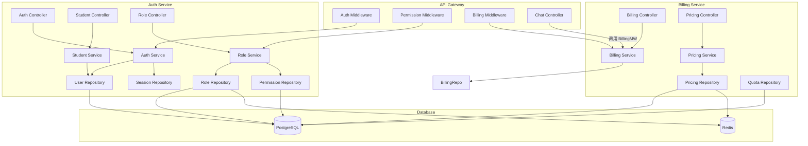
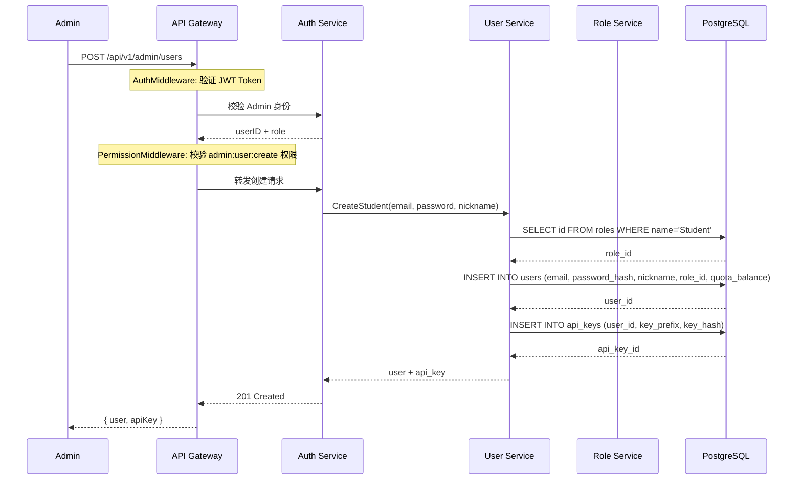
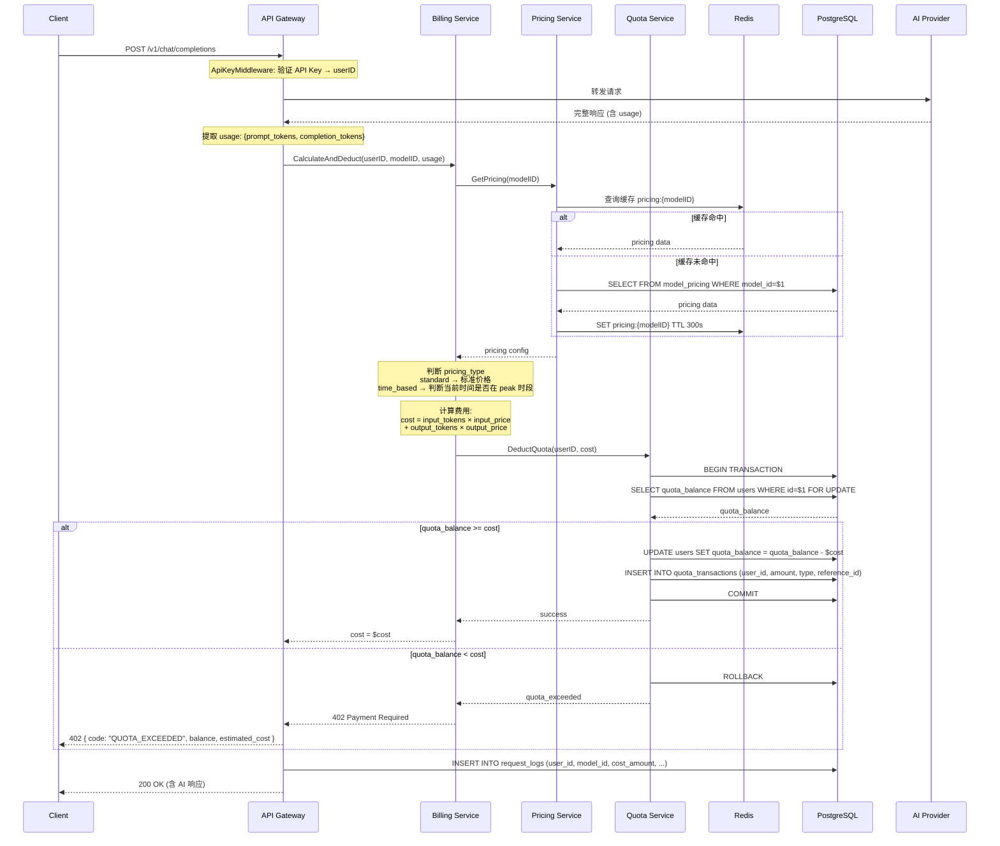
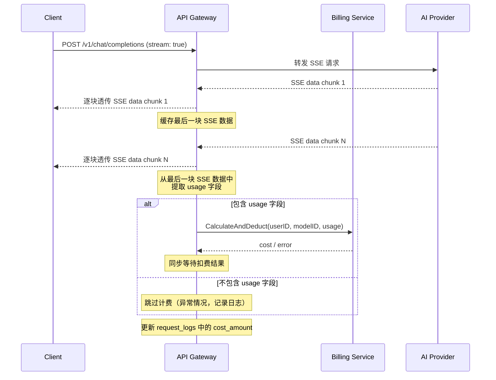
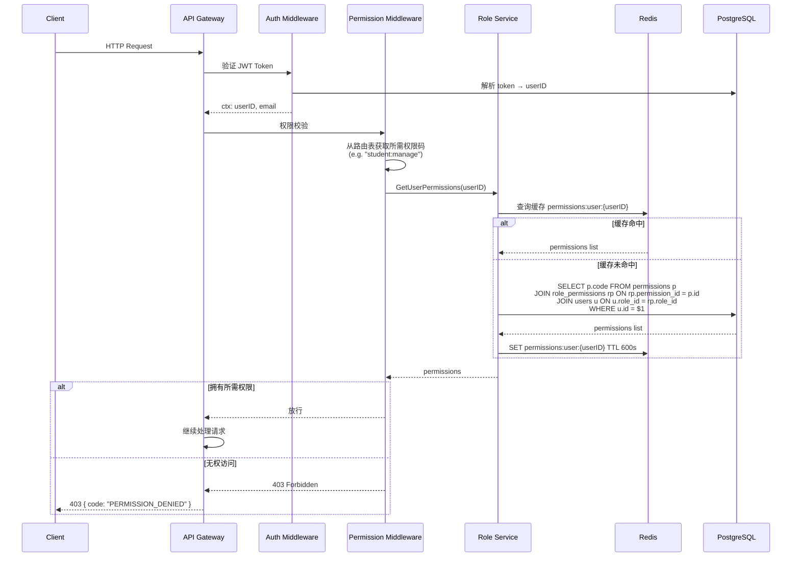
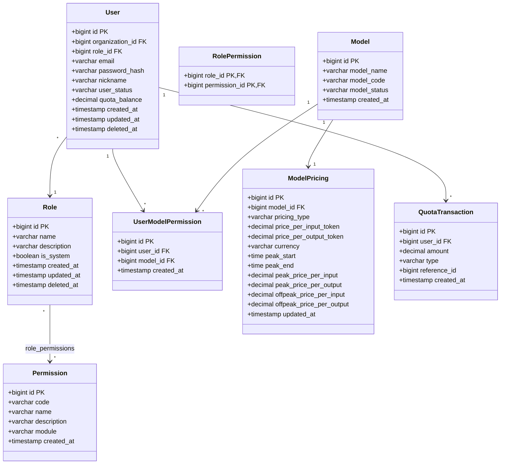

# Architecture: 学生账号体系 + 计费模块 + 权限体系

Version: v1.0

Status: Draft

Owner: Architect

Last Updated: 2026-07-25

Related ADR: ADR-007, ADR-008

---

## 1. Metadata

| 字段 | 值 |
|------|-----|
| Architecture ID | ARCH-20260725-001 |
| Version | v1.0 |
| Status | Draft |
| Owner | Architect |
| Related ADR | ADR-007, ADR-008 |
| Related PRD | PRD-20260725-001 |
| Created | 2026-07-25 |
| Last Updated | 2026-07-25 |

---

## 2. Overview

本文档定义了 Nova AI Gateway 中三个新增核心模块的架构设计：**学生账号体系**、**计费模块**和**权限体系（RBAC）**。

这三个模块共同构建了 AI Gateway 的多用户精细化运营能力，使平台能够支持教育场景下 Admin 对学生账号的创建、额度分配、计费扣减和权限管控。

### 适用范围

- 涉及的模块：Auth Service（扩展）、Billing Service（扩展）、API Gateway（扩展）
- 涉及的服务：API Gateway、Billing Service、Auth Service
- 涉及的技术栈：Go 1.22+、PostgreSQL 15+、Redis 7+

---

## 3. Business Context

AI Gateway 使用场景从单一 Admin 角色扩展为 Admin + Student 双角色。平台需要支持：

1. **学生管理**：Admin 在后台创建学生账号、分配额度、控制可用模型
2. **计费扣减**：每次 API 调用后自动按模型定价扣费，支持峰谷计价
3. **权限控制**：基于 RBAC 模型，Admin 和 Student 拥有不同功能权限

```
┌──────────────────────────────────────────────────┐
│                  业务域                           │
│                                                   │
│   ┌──────────────────┐    ┌──────────────────┐    │
│   │  学生管理域       │    │  计费域           │    │
│   │  - 账号创建       │    │  - 额度分配       │    │
│   │  - 模型授权       │    │  - 按量计费       │    │
│   │  - 状态管理       │    │  - 峰谷计价       │    │
│   └────────┬─────────┘    └────────┬──────────┘    │
│            │                       │                │
│            └───────────┬───────────┘                │
│                        ▼                            │
│            ┌──────────────────────┐                  │
│            │   权限控制域          │                  │
│            │   - RBAC 模型        │                  │
│            │   - 功能权限校验      │                  │
│            │   - 前端路由控制      │                  │
│            └──────────────────────┘                  │
└──────────────────────────────────────────────────────┘
```

---

## 4. Goals

### 架构目标

- **目标 1**：支持 Admin 管理学生账号，权限隔离清晰，Student 无法越权访问管理功能
- **目标 2**：每次 API 调用后准确实时扣减额度，并发场景下不出现负余额
- **目标 3**：基于 RBAC 的细粒度功能权限控制，所有受保护接口均有权限校验
- **目标 4**：模型定价可动态配置，支持峰谷计价策略
- **目标 5**：计费扣费主链路延迟 < 50ms

### 架构原则

- **原则 1**：遵循现有 Controller → Service → Repository 分层架构
- **原则 2**：计费操作使用行锁（SELECT FOR UPDATE）+ 事务保证一致性
- **原则 3**：权限校验通过 Middleware 实现，不侵入业务逻辑
- **原则 4**：定价缓存加速读操作，修改后即时失效

### 非目标

- 本次不做学生分组/班级管理
- 本次不做自动充值/续费
- 本次不做套餐订阅模式
- 本次不做多租户隔离
- 本次不做详细财务报表

---

## 5. System Context



### 外部依赖

| 外部系统 | 依赖类型 | 说明 |
|---------|---------|------|
| PostgreSQL 15+ | 数据库 | 用户、角色、权限、定价、额度交易等持久化存储 |
| Redis 7+ | 缓存 | 模型定价缓存、角色权限缓存 |
| AI Provider (OpenAI/DeepSeek等) | API | 模型 API 调用，用于获取 usage 信息 |

---

## 6. Modules

### 模块划分

| 模块 | 职责 | 依赖模块 | 所属服务 |
|------|------|---------|---------|
| Student Management | 学生账号 CRUD、额度分配、模型授权 | Auth Service | Auth Service |
| Billing Engine | 定价查询、费用计算、额度扣减 | Student Management | Billing Service |
| RBAC Engine | 角色管理、权限分配、权限校验 | User Management | Auth Service |
| Permission Middleware | HTTP 请求的权限校验拦截 | RBAC Engine | API Gateway |

### 模块关系图



---

## 7. Layer Design

### 分层架构

```
┌──────────────────────────────────────────────────┐
│              Controller / Handler                 │  ← HTTP 层：参数解析、响应组装
│   StudentController / BillingController /         │
│   RoleController / PricingController              │
├──────────────────────────────────────────────────┤
│               Service / UseCase                   │  ← 业务逻辑层：校验、编排、事务
│   StudentService / BillingService /               │
│   RoleService / PricingService                    │
├──────────────────────────────────────────────────┤
│               Repository                          │  ← 数据访问层：SQL、缓存
│   UserRepo / RoleRepo / PermissionRepo /          │
│   PricingRepo / QuotaRepo                         │
├──────────────────────────────────────────────────┤
│         PostgreSQL / Redis / External API         │  ← 基础设施层
└──────────────────────────────────────────────────┘
```

### 层间依赖规则

| 方向 | 规则 | 禁止事项 |
|------|------|---------|
| Controller → Service | Controller 调用 Service 处理业务 | Controller 不可直连 DB |
| Service → Repository | Service 调用 Repository 访问数据 | Service 不可处理 HTTP |
| Service → Service | 允许跨 Service 调用（同进程） | 创建循环依赖 |
| Repository → Infrastructure | Repository 执行 SQL/缓存操作 | Repository 不可含业务逻辑 |

---

## 8. Component Diagram



### 组件职责

| 组件 | 职责 | 关键技术 |
|------|------|---------|
| Student Controller | 学生账号 CRUD 的 HTTP 入口 | Go net/http |
| Billing Controller | 额度查询、用量明细的 HTTP 入口 | Go net/http |
| Role Controller | 角色/权限管理的 HTTP 入口 | Go net/http |
| Pricing Controller | 模型定价管理的 HTTP 入口 | Go net/http |
| Permission Middleware | 拦截请求、校验角色权限 | Go net/http middleware |
| Billing Middleware | 拦截 API 调用、执行计费扣减 | Go net/http middleware |
| Cost Calculator | 根据 usage 和定价计算费用，含峰谷逻辑 | Go |
| Role Service | RBAC 角色/权限的业务逻辑 | Go |
| Student Service | 学生账号管理的业务逻辑 | Go |
| Billing Service | 额度查询/交易记录的业务逻辑 | Go |
| Pricing Service | 模型定价查询/管理的业务逻辑 | Go |

---

## 9. Sequence Diagram

### 9.1 学生创建流程



### 9.2 计费扣减流程（非流式）



### 9.3 流式请求（SSE）计费流程



### 9.4 权限校验流程



---

## 10. API Design

详见独立 API 契约文档：`API-20260725-001.md`

### 接口清单概览

| 接口 | Method | 说明 | 权限 |
|------|--------|------|------|
| `/api/v1/admin/users` | GET | Admin 查看学生列表 | `admin:user:list` |
| `/api/v1/admin/users` | POST | Admin 创建学生账号 | `admin:user:create` |
| `/api/v1/admin/users/{id}/quota` | GET/PUT | Admin 查看/设置学生额度 | `admin:user:manage_quota` |
| `/api/v1/admin/users/{id}/models` | GET/PUT | Admin 查看/设置学生可用模型 | `admin:user:manage_models` |
| `/api/v1/admin/users/{id}/status` | PUT | Admin 启用/禁用学生账号 | `admin:user:manage` |
| `/api/v1/admin/roles` | GET/POST | Admin 角色列表/创建 | `admin:role:manage` |
| `/api/v1/admin/roles/{id}` | GET/PUT/DELETE | Admin 角色详情/更新/删除 | `admin:role:manage` |
| `/api/v1/admin/roles/{id}/permissions` | PUT | Admin 更新角色权限 | `admin:role:manage` |
| `/api/v1/admin/permissions` | GET | Admin 获取所有权限列表 | `admin:role:manage` |
| `/api/v1/admin/pricing` | GET | Admin 查看所有模型定价 | `admin:pricing:manage` |
| `/api/v1/admin/pricing/{modelId}` | GET/PUT | Admin 查看/修改模型定价 | `admin:pricing:manage` |
| `/api/v1/billing/quota` | GET | 当前用户查看额度余额 | 登录即可 |
| `/api/v1/billing/usage` | GET | 当前用户查看用量明细 | 登录即可 |
| `/api/v1/billing/admin/summary` | GET | Admin 全平台用量汇总 | `admin:billing:view` |
| `/api/v1/billing/admin/usage` | GET | Admin 全平台用量明细 | `admin:billing:view` |
| `/api/v1/auth/login` | POST | 登录（返回 role 字段） | 无需认证 |
| `/api/v1/auth/profile` | GET | 获取个人信息（含 role、quota） | 登录即可 |

---

## 11. Database Design

### 完整 ER 图



### 核心表

#### roles（角色表）

| 字段 | 类型 | 约束 | 说明 |
|------|------|------|------|
| id | BIGSERIAL | PK | 角色 ID |
| name | VARCHAR(100) | NOT NULL, UNIQUE | 角色名称（Admin / Student） |
| description | VARCHAR(255) | | 角色描述 |
| is_system | BOOLEAN | NOT NULL DEFAULT FALSE | 是否为系统内置角色（不可删除） |
| created_at | TIMESTAMPTZ | NOT NULL DEFAULT NOW() | 创建时间 |
| updated_at | TIMESTAMPTZ | NOT NULL DEFAULT NOW() | 更新时间 |
| deleted_at | TIMESTAMPTZ | | 软删除时间 |

#### permissions（功能权限表）

| 字段 | 类型 | 约束 | 说明 |
|------|------|------|------|
| id | BIGSERIAL | PK | 权限 ID |
| code | VARCHAR(100) | NOT NULL, UNIQUE | 权限编码（如 admin:user:create） |
| name | VARCHAR(100) | NOT NULL | 权限名称 |
| description | VARCHAR(255) | | 权限描述 |
| module | VARCHAR(50) | NOT NULL | 所属模块（user/role/billing/pricing/model/api_key） |
| created_at | TIMESTAMPTZ | NOT NULL DEFAULT NOW() | 创建时间 |

#### role_permissions（角色-权限关联表）

| 字段 | 类型 | 约束 | 说明 |
|------|------|------|------|
| role_id | BIGINT | PK, FK → roles.id | 角色 ID |
| permission_id | BIGINT | PK, FK → permissions.id | 权限 ID |

#### user_model_permissions（用户-模型授权表）

| 字段 | 类型 | 约束 | 说明 |
|------|------|------|------|
| id | BIGSERIAL | PK | ID |
| user_id | BIGINT | NOT NULL, FK → users.id | 用户 ID |
| model_id | BIGINT | NOT NULL, FK → models.id | 模型 ID |
| created_at | TIMESTAMPTZ | NOT NULL DEFAULT NOW() | 创建时间 |

UNIQUE(user_id, model_id)

#### model_pricing（模型定价表）

| 字段 | 类型 | 约束 | 说明 |
|------|------|------|------|
| id | BIGSERIAL | PK | ID |
| model_id | BIGINT | NOT NULL, UNIQUE, FK → models.id | 模型 ID |
| pricing_type | VARCHAR(20) | NOT NULL DEFAULT 'standard' | 定价类型：standard（普通）/ time_based（峰谷） |
| price_per_input_token | DECIMAL(16,6) | NOT NULL DEFAULT 0 | 普通/基础：每输入 token 价格 |
| price_per_output_token | DECIMAL(16,6) | NOT NULL DEFAULT 0 | 普通/基础：每输出 token 价格 |
| currency | VARCHAR(10) | NOT NULL DEFAULT 'USD' | 货币单位 |
| peak_start | TIME | | 高峰开始时间（如 08:00） |
| peak_end | TIME | | 高峰结束时间（如 23:00） |
| peak_price_per_input | DECIMAL(16,6) | | 高峰时段每输入 token 价格 |
| peak_price_per_output | DECIMAL(16,6) | | 高峰时段每输出 token 价格 |
| offpeak_price_per_input | DECIMAL(16,6) | | 低谷时段每输入 token 价格 |
| offpeak_price_per_output | DECIMAL(16,6) | | 低谷时段每输出 token 价格 |
| updated_at | TIMESTAMPTZ | NOT NULL DEFAULT NOW() | 最后更新时间 |

UNIQUE(model_id)

#### quota_transactions（额度交易记录表）

| 字段 | 类型 | 约束 | 说明 |
|------|------|------|------|
| id | BIGSERIAL | PK | ID |
| user_id | BIGINT | NOT NULL, FK → users.id | 用户 ID |
| amount | DECIMAL(16,6) | NOT NULL | 交易金额（正=充值，负=扣费） |
| type | VARCHAR(50) | NOT NULL | 交易类型：deduction / admin_allocation / refund |
| reference_id | BIGINT | | 关联 ID（如 request_logs.id） |
| created_at | TIMESTAMPTZ | NOT NULL DEFAULT NOW() | 创建时间 |

### users 表变更

| 新增字段 | 类型 | 约束 | 说明 |
|---------|------|------|------|
| role_id | BIGINT | FK → roles.id | 用户角色 ID |
| quota_balance | DECIMAL(16,6) | NOT NULL DEFAULT 0 | 当前额度余额（美元） |

### 索引设计

```sql
-- roles
CREATE UNIQUE INDEX idx_roles_name ON roles(name) WHERE deleted_at IS NULL;

-- permissions
CREATE UNIQUE INDEX idx_permissions_code ON permissions(code);
CREATE INDEX idx_permissions_module ON permissions(module);

-- role_permissions
CREATE INDEX idx_role_permissions_role_id ON role_permissions(role_id);
CREATE INDEX idx_role_permissions_permission_id ON role_permissions(permission_id);

-- user_model_permissions
CREATE UNIQUE INDEX idx_user_model_permissions_unique ON user_model_permissions(user_id, model_id);
CREATE INDEX idx_user_model_permissions_user_id ON user_model_permissions(user_id);
CREATE INDEX idx_user_model_permissions_model_id ON user_model_permissions(model_id);

-- model_pricing
CREATE UNIQUE INDEX idx_model_pricing_model_id ON model_pricing(model_id);

-- quota_transactions
CREATE INDEX idx_quota_transactions_user_id ON quota_transactions(user_id);
CREATE INDEX idx_quota_transactions_created_at ON quota_transactions(created_at);
CREATE INDEX idx_quota_transactions_type ON quota_transactions(type);

-- users
CREATE INDEX idx_users_role_id ON users(role_id) WHERE deleted_at IS NULL;
```

---

## 12. Cache Design

### 缓存策略

| 缓存项 | Key 模式 | TTL | 策略 | 失效时机 |
|--------|---------|-----|------|---------|
| 模型定价 | `pricing:{model_id}` | 300s | Cache-Aside | Admin 修改定价后 DEL |
| 角色权限列表 | `permissions:role:{role_id}` | 600s | Cache-Aside | 角色权限变更后 DEL |
| 用户权限列表 | `permissions:user:{user_id}` | 600s | Cache-Aside | 用户角色变更或角色权限变更后 DEL |
| 用户额度余额 | （不使用缓存，行锁保证实时性） | — | — | — |

### 缓存更新策略

- **模型定价**：Admin 通过 PUT `/api/v1/admin/pricing/{modelId}` 修改定价后，Service 层在更新数据库后立即 DEL 对应缓存
- **角色权限**：Admin 更新角色权限后，Service 层在更新 role_permissions 后立即 DEL 对应角色的缓存，同时使用 PATTERN 批量删除相应用户权限缓存
- **缓存穿透防护**：空结果也缓存（空值缓存，TTL 较短 30s）

---

## 13. Deployment

本模块不改变现有部署架构，仅扩展已有服务的功能。详见现有部署文档。

---

## 14. Security

### 安全架构

| 安全层 | 措施 | 说明 |
|--------|------|------|
| 传输安全 | HTTPS / TLS 1.3 | 全链路加密 |
| 认证 | JWT + API Key | JWT 用于管理后台，API Key 用于 API 调用 |
| 授权 | RBAC + PermissionMiddleware | 基于角色的功能权限控制 |
| 计费安全 | 行锁（SELECT FOR UPDATE）+ 事务 | 确保并发扣费不出现负余额 |
| 敏感操作 | Admin 操作记录日志 | 所有管理操作记录操作人 |
| 数据隔离 | API Key 绑定用户 → 校验模型授权 | 学生只能使用被授权的模型 |

### 权限码设计规范

权限码采用 `{module}:{action}` 格式，module 为功能模块，action 为具体操作：

| 权限码 | 说明 | 默认 Admin | 默认 Student |
|--------|------|:----------:|:------------:|
| `dashboard:view` | 查看仪表盘 | ✅ | ✅ |
| `api_key:manage` | 管理 API Key | ✅ | ✅ |
| `api_key:create` | 创建 API Key | ✅ | ✅ |
| `api_key:delete` | 删除 API Key | ✅ | ✅ |
| `billing:view_self` | 查看个人用量 | ✅ | ✅ |
| `admin:user:list` | 查看学生列表 | ✅ | ❌ |
| `admin:user:create` | 创建学生账号 | ✅ | ❌ |
| `admin:user:manage` | 管理学生账号状态 | ✅ | ❌ |
| `admin:user:manage_quota` | 管理学生额度 | ✅ | ❌ |
| `admin:user:manage_models` | 管理学生可用模型 | ✅ | ❌ |
| `admin:role:manage` | 管理角色权限 | ✅ | ❌ |
| `admin:pricing:manage` | 管理模型定价 | ✅ | ❌ |
| `admin:billing:view` | 查看全平台用量 | ✅ | ❌ |
| `admin:provider:manage` | 管理 Provider | ✅ | ❌ |
| `admin:model:manage` | 管理 Model | ✅ | ❌ |

---

## 15. Performance

### 性能目标

| 指标 | 目标 | 测量方式 |
|------|------|---------|
| 计费扣费耗时 | < 50ms | 99% 的扣费操作在 50ms 内完成 |
| 权限校验耗时 | < 10ms | 99% 的校验在 10ms 内完成（含缓存命中） |
| 定价查询耗时 | < 5ms | 缓存命中时 < 1ms |

### 性能优化策略

- 定价数据使用 Redis 缓存，减少 DB 查询
- 角色权限使用 Redis 缓存，权限校验几乎无开销
- 报价计算在内存中完成，无 IO 等待
- 行锁粒度为用户级，不同用户互不阻塞

---

## 16. Scalability

### 扩展策略

| 维度 | 策略 | 触发条件 |
|------|------|---------|
| 水平扩展 | Billing Service 无状态，可水平扩展 | QPS > 1000 |
| 读扩展 | 定价/权限读取走 Redis 缓存 | 缓存命中率 < 90% |

### 瓶颈分析

- **行锁竞争**：同一用户高频并发请求时，SELECT FOR UPDATE 会产生锁等待。缓解方案：前端控制请求频率，服务端限流
- **PostgreSQL 写入**：quota_transactions 和 request_logs 写入频率高。缓解方案：业务高峰期可考虑批量写入

---

## 17. Risks

| # | 风险描述 | 等级 | 影响 | 缓解方案 |
|---|---------|------|------|---------|
| 1 | 并发扣费导致额度计算错误 | 高 | 高（额度透支） | 使用 SELECT FOR UPDATE + 事务保证一致性 |
| 2 | 现有 Admin 用户缺少角色 | 中 | 高（无法登录） | Migration 006 迁移脚本为现有用户设置默认 Admin 角色 |
| 3 | 缓存与 DB 定价数据不一致 | 中 | 中（扣费金额偏差） | 短 TTL（300s）+ 修改后立即 DEL 缓存 |
| 4 | 峰谷计价时段切换瞬时不准确 | 低 | 低 | 每次请求实时判断当前时间，无状态依赖 |

---

## 18. Future Extension

| 未来需求 | 预留机制 | 说明 |
|---------|---------|------|
| 学生分组/班级管理 | Organization 模型已存在 | 可直接扩展 Organization 下的分组功能 |
| 套餐订阅模式 | quota_transactions 已有 type 字段 | 可扩展 subscription 类型 |
| 自动充值/续费 | quota_transactions 已有充值类型 | 可对接支付网关 |
| 详细财务报表 | quota_transactions + request_logs | 可构建财务统计报表 |
| ABAC 属性级权限 | RBAC 为前置层，可叠加 ABAC | PermissionMiddleware 可扩展为 Policy Engine |

---

## 19. Change Log

| 日期 | 版本 | 修改内容 | 修改人 |
|------|------|---------|--------|
| 2026-07-25 | v1.0 | 初始版本 | Architect |

---

# End

本模板依据 AI Company Document Standard 和 Engineering Standard 设计。
