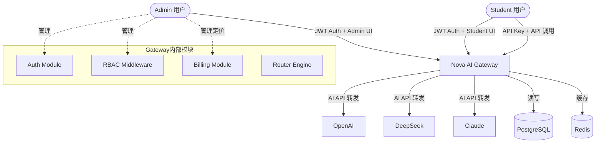
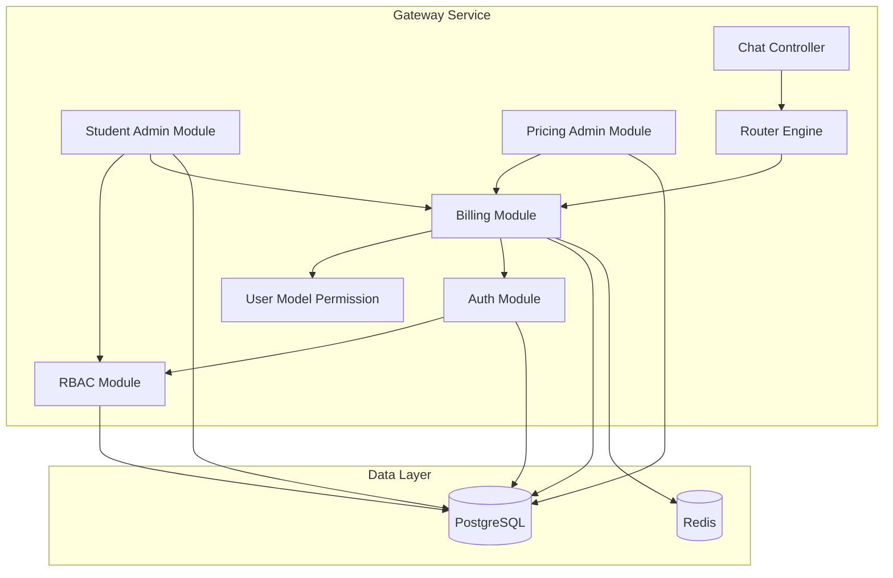
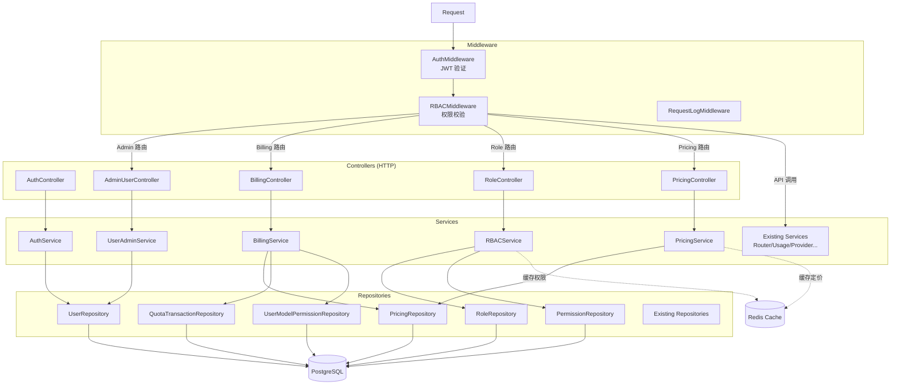
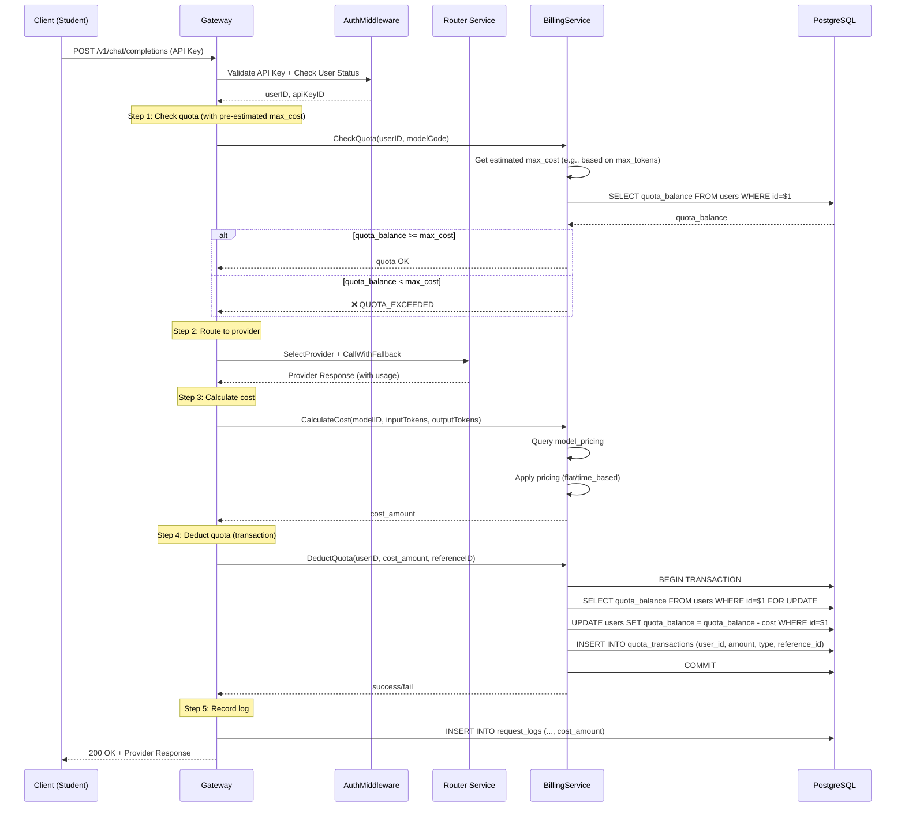
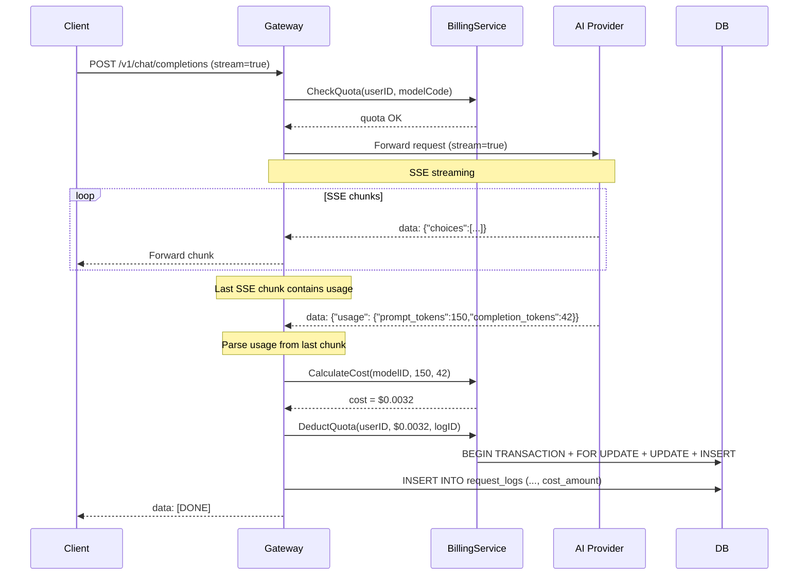
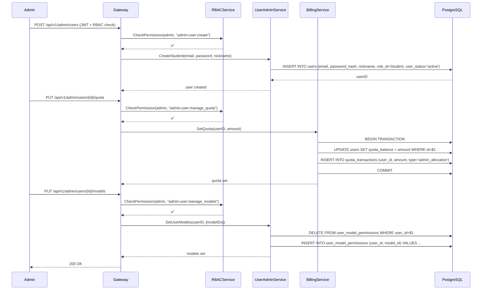
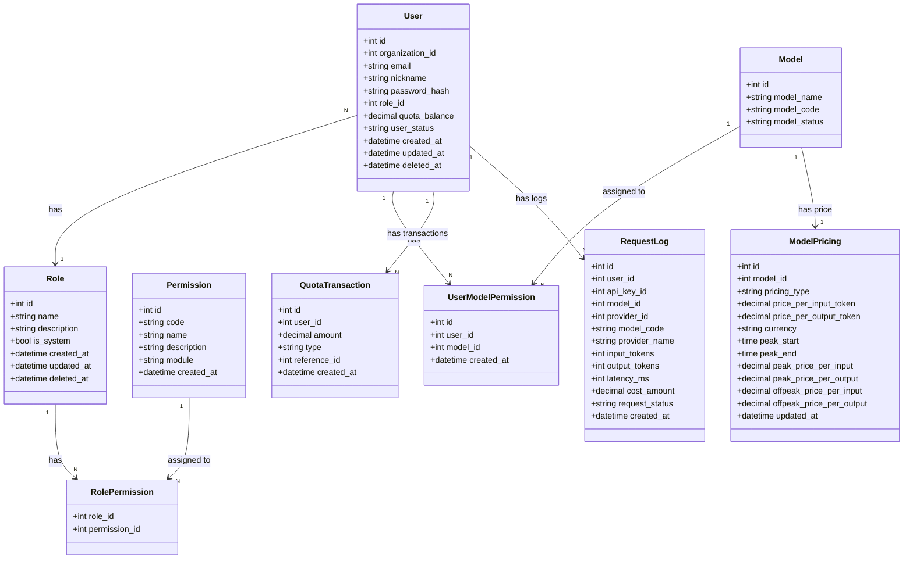
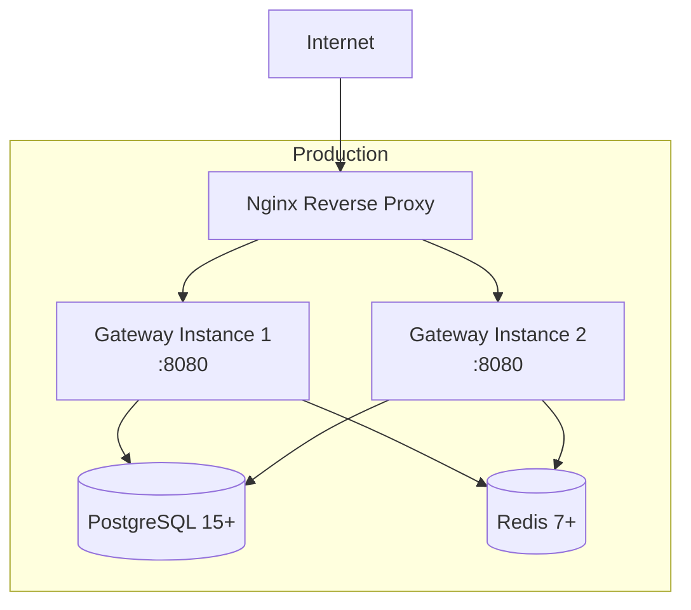

# Architecture: Student Account System + Billing Module + RBAC

Version: v1.0

Status: Draft

Owner: Architect

Last Updated: 2026-07-25

Related ADR: ADR-20260725-Billing-Design

---

## 1. Metadata

| 字段 | 值 |
|------|-----|
| Architecture ID | ARCH-20260725-Student-Billing-RBAC |
| Version | v1.0 |
| Status | Draft |
| Owner | Architect |
| Related ADR | ADR-20260725-Billing-Design |
| Related PRD | PRD-20260725-001 |
| Created | 2026-07-25 |
| Last Updated | 2026-07-25 |

---

## 2. Overview

在当前 AI Gateway MVP 基础上，新增学生账号体系、计费模块和 RBAC 权限控制，以支持教育场景的多用户、精细化管理需求。

### 适用范围

- 涉及的模块：Auth Service、Billing Service、Policy Engine（新增权限校验）
- 涉及的服务：API Gateway（单体服务，模块化扩展）
- 涉及的技术栈：Go 1.22+ / PostgreSQL 15+ / Redis 7+

---

## 3. Business Context

```
┌──────────────────────────────────────────────────┐
│                  业务域：AI API 管理平台            │
│                                                    │
│  ┌──────────────┐      ┌──────────────────┐       │
│  │  Admin 用户   │      │   Student 用户    │       │
│  │ (管理全部功能) │      │ (受限 API 调用)   │       │
│  └──────┬───────┘      └────────┬─────────┘       │
│         │                       │                   │
│         └───────┬───────────────┘                   │
│                 ▼                                   │
│        ┌────────────────────────┐                   │
│        │  Nova AI Gateway 平台   │                   │
│        │  (新增计费+权限+学生)    │                   │
│        └────────────────────────┘                   │
│                 │                                   │
│                 ▼                                   │
│        ┌────────────────────────┐                   │
│        │  AI Provider 层        │                   │
│        │  (OpenAI/DeepSeek等)   │                   │
│        └────────────────────────┘                   │
└──────────────────────────────────────────────────────┘
```

---

## 4. Goals

### 架构目标

- **目标 1**：支持 Admin 和 Student 两种角色，Student 只能访问授权功能
- **目标 2**：API 调用后自动计费，事务级扣减额度，保证财务准确性
- **目标 3**：模型定价动态可配置，支持峰谷计价策略
- **目标 4**：并发扣费场景下保证额度不被超扣（行锁 + 事务）
- **目标 5**：向后兼容现有用户和数据

### 架构原则

- **分层架构**：Controller → Service → Repository，依赖方向由外向内
- **权限第一**：所有受保护 API 必须经过身份认证和权限校验
- **事务安全**：计费操作在数据库事务内完成，使用 `SELECT FOR UPDATE` 行锁
- **可配置**：定价数据存储在数据库，Admin 后台可动态修改

### 非目标

- 本次不做学生分组/班级管理
- 本次不做自动充值/续费
- 本次不做套餐订阅模式
- 本次不做多租户隔离

---

## 5. System Context



### 外部依赖

| 外部系统 | 依赖类型 | 说明 |
|---------|---------|------|
| PostgreSQL 15+ | 数据库 | 存储用户、角色、权限、定价、额度交易等全部业务数据 |
| Redis 7+ | 缓存 | 缓存角色权限、定价信息，减少数据库查询 |
| AI Provider (OpenAI/DeepSeek 等) | API | 模型 API 调用，从中获取 token 用量 |

---

## 6. Modules

### 模块划分

| 模块 | 职责 | 依赖模块 | 所属服务 |
|------|------|---------|---------|
| **Auth Module** | 登录注册（已废弃自主注册）、JWT 签发、Token 校验 | User Repository | Gateway |
| **RBAC Module** | 角色 CRUD、权限定义、权限校验中间件 | Role/Permission Repository | Gateway |
| **Billing Module** | 定价查询、费用计算、额度扣减、交易记录 | Pricing/Quota Repository | Gateway |
| **Student Admin Module** | Admin 对学生账号的 CRUD、额度分配、模型授权 | User/Model Repository | Gateway |
| **Pricing Admin Module** | Admin 对模型定价的 CRUD 管理 | Pricing Repository | Gateway |
| **User Model Permission** | 学生可用模型校验 | UserModelPermission Repository | Gateway |

### 模块关系图



### 模块职责说明

| 模块 | 新增/修改 | 关键文件 |
|------|-----------|---------|
| Auth Module | 修改 | Login/Profile 返回体增加 role/quota 字段 |
| RBAC Module | 新增 | `middleware/rbac_middleware.go`, `controller/role_controller.go` |
| Billing Module | 新增 | `controller/billing_controller.go`, `service/billing_service.go` |
| Student Admin | 新增 | `controller/admin_user_controller.go` |
| Pricing Admin | 新增 | `controller/pricing_controller.go` |

---

## 7. Layer Design

### 分层架构

```
┌──────────────────────────────────────────────────────┐
│                Controller / Handler                   │  ← HTTP 层
│  Auth / Role / Billing / Student / Pricing            │
├──────────────────────────────────────────────────────┤
│                   Service / UseCase                   │  ← 业务逻辑层
│  AuthService / BillingService / RBACService           │
├──────────────────────────────────────────────────────┤
│                    Repository                         │  ← 数据访问层
│  UserRepo / RoleRepo / PermissionRepo / PricingRepo   │
├──────────────────────────────────────────────────────┤
│              PostgreSQL / Redis / External API        │  ← 基础设施层
└──────────────────────────────────────────────────────┘
```

### 新增/修改服务

| 服务 | 新增/修改 | 职责 |
|------|-----------|------|
| `AuthService` | 修改 | Login 返回 role 信息；Profile 返回 role + quota |
| `BillingService` | 新增 | 定价查询、费用计算、额度扣减（事务）、交易查询 |
| `RBACService` | 新增 | 角色 CRUD、权限校验、权限列表查询 |
| `UserAdminService` | 新增 | 学生 CRUD、额度/模型授权/状态管理 |

### 中间件链

```
Request → RequestLogMiddleware → CORSMiddleware
    → AuthMiddleware (JWT校验) → RBACMiddleware (权限校验)
    → Protected Handler
```

### 层间依赖规则

| 方向 | 规则 | 禁止事项 |
|------|------|---------|
| Controller → Service | Controller 调用 Service | Controller 不可直连 DB |
| Service → Repository | Service 调用 Repository | Service 不可处理 HTTP |
| Middleware → Service | Middleware 调用 AuthService/RBACService | Middleware 不可直连 DB |
| Service → Service | BillingService 可调用 AuthService 获取用户角色 | 不允许循环依赖 |

---

## 8. Component Diagram



### 组件职责

| 组件 | 职责 | 关键技术 |
|------|------|---------|
| AuthMiddleware | JWT Token 校验，解析 userID/email 到 Context | Go stdlib JWT |
| RBACMiddleware | 从 Context 获取 userID → 查询 role → 校验 permission | PostgreSQL + Redis 缓存 |
| BillingService | 定价查询 → 费用计算 → 事务扣费 | PostgreSQL FOR UPDATE |
| PricingService | 模型定价 CRUD，峰谷计价时间判断 | PostgreSQL TIME 类型 |
| UserAdminService | 学生账号 CRUD、额度分配、模型授权、状态管理 | PostgreSQL |

---

## 9. Sequence Diagram

### 9.1 核心流程：API调用 → 计费 → 扣费



### 9.2 流式请求（SSE）计费流程



### 9.3 RBAC 权限校验流程

```mermaid
sequenceDiagram
    participant C as Client
    participant G as Gateway
    participant A as AuthMiddleware
    participant R as RBACMiddleware
    participant DB as PostgreSQL
    participant RD as Redis

    C->>G: GET /api/v1/admin/users (JWT Token)
    G->>A: Validate JWT Token
    A-->>G: userID, email (in Context)

    G->>R: CheckPermission(userID, "admin:user:list")

    Note over R: Check Redis cache first

    R->>RD: GET rbac:permissions:{userID}
    alt Cache hit
        RD-->>R: [permission codes...]
    else Cache miss
        R->>DB: SELECT role_id FROM users WHERE id=$1
        DB-->>R: role_id
        R->>DB: SELECT p.code FROM permissions p
            JOIN role_permissions rp ON rp.permission_id = p.id
            WHERE rp.role_id = $1
        DB-->>R: [permission codes...]
        R->>RD: SETEX rbac:permissions:{userID} 300 [permissions...]
    end

    alt Has permission
        R-->>G: ✅ Authorized
        G->>C: 200 OK + Data
    else No permission
        R-->>G: ❌ Forbidden
        G->>C: 403 Forbidden
    end
```

### 9.4 Admin 创建学生 → 分配额度/模型



---

## 10. API Design

详见独立 API 契约文档：
- `/Users/fuxiansheng/Desktop/AI Gateway/aigateway/docs/04-architecture/API-20260725-Student-Billing-RBAC.md`

### 新增 API 总览

| 接口 | Method | 说明 | 权限 |
|------|--------|------|------|
| `/api/v1/admin/users` | GET | 查看学生列表（分页） | admin:user:list |
| `/api/v1/admin/users` | POST | Admin 创建学生账号 | admin:user:create |
| `/api/v1/admin/users/{id}` | GET | 查看学生详情 | admin:user:list |
| `/api/v1/admin/users/{id}/quota` | GET/PUT | 查看/设置学生额度 | admin:user:manage_quota |
| `/api/v1/admin/users/{id}/models` | GET/PUT | 查看/设置学生可用模型 | admin:user:manage_models |
| `/api/v1/admin/users/{id}/status` | PUT | 启用/禁用学生账号 | admin:user:manage |
| `/api/v1/admin/roles` | GET/POST | 角色列表/创建 | admin:role:manage |
| `/api/v1/admin/roles/{id}` | GET/PUT/DELETE | 角色详情/更新/删除 | admin:role:manage |
| `/api/v1/admin/roles/{id}/permissions` | PUT | 更新角色功能权限 | admin:role:manage |
| `/api/v1/admin/permissions` | GET | 获取所有功能权限 | admin:role:manage |
| `/api/v1/admin/pricing` | GET | 查看所有模型定价 | admin:pricing:manage |
| `/api/v1/admin/pricing/{modelId}` | GET/PUT | 查看/修改模型定价 | admin:pricing:manage |
| `/api/v1/billing/quota` | GET | 当前用户查看自己额度 | billing:view_self |
| `/api/v1/billing/usage` | GET | 当前用户查看用量明细 | billing:view_self |
| `/api/v1/billing/admin/summary` | GET | 查看全平台用量汇总 | admin:billing:view |
| `/api/v1/billing/admin/usage` | GET | 查看全平台用量明细 | admin:billing:view |
| `/api/v1/auth/register` | POST | 自主注册接口（已废弃） | - |

### 修改的 API

| 接口 | Method | 变更内容 |
|------|--------|---------|
| `/api/v1/auth/login` | POST | 返回体增加 `role`、`quotaBalance` |
| `/api/v1/auth/profile` | GET | 返回体增加 `role`、`quotaBalance`、`permissions` |

---

## 11. Database Design

### 数据模型关系图



### 核心表

| 表名 | 说明 | 主要字段 |
|------|------|---------|
| `roles` | 角色定义表 | id, name(unique), description, is_system |
| `permissions` | 功能权限表 | id, code(unique), name, description, module |
| `role_permissions` | 角色-权限关联表 | role_id(FK), permission_id(FK), PK(role_id,permission_id) |
| `user_model_permissions` | 用户-模型授权表 | id, user_id(FK), model_id(FK), UNIQUE(user_id,model_id) |
| `model_pricing` | 模型定价表 | id, model_id(FK,unique), pricing_type, price_per_input_token, price_per_output_token, currency, peak_start(TIME), peak_end(TIME), peak_price_per_input, peak_price_per_output, offpeak_price_per_input, offpeak_price_per_output |
| `quota_transactions` | 额度交易表 | id, user_id(FK), amount, type(deduction/admin_allocation/refund), reference_id |
| `users` | 用户表（修改） | +role_id(FK), +quota_balance |

### 用户表修改

```sql
-- 新增字段
ALTER TABLE users ADD COLUMN role_id BIGINT REFERENCES roles(id);
ALTER TABLE users ADD COLUMN quota_balance DECIMAL(16,6) NOT NULL DEFAULT 0;
CREATE INDEX idx_users_role_id ON users(role_id) WHERE deleted_at IS NULL;
```

### model_pricing 表设计

该表为核心计费表，支持两种定价模式：

| 字段 | 类型 | 说明 |
|------|------|------|
| `pricing_type` | `VARCHAR(20)` | `'flat'`=普通定价, `'time_based'`=峰谷计价 |
| `price_per_input_token` | `DECIMAL(16,6)` | 普通模式：输入 Token 价格 |
| `price_per_output_token` | `DECIMAL(16,6)` | 普通模式：输出 Token 价格 |
| `peak_start` | `TIME` | 峰谷模式：高峰开始时间（如 `08:00:00`） |
| `peak_end` | `TIME` | 峰谷模式：高峰结束时间（如 `22:00:00`） |
| `peak_price_per_input` | `DECIMAL(16,6)` | 峰谷模式：高峰时段输入价格 |
| `peak_price_per_output` | `DECIMAL(16,6)` | 峰谷模式：高峰时段输出价格 |
| `offpeak_price_per_input` | `DECIMAL(16,6)` | 峰谷模式：低谷时段输入价格 |
| `offpeak_price_per_output` | `DECIMAL(16,6)` | 峰谷模式：低谷时段输出价格 |

**峰谷计价判断逻辑**（Go 伪代码）：

```go
func getPrice(modelPricing *ModelPricing, currentTime time.Time) (inputPrice, outputPrice decimal.Decimal) {
    if modelPricing.PricingType != "time_based" {
        // 普通定价模式
        return modelPricing.PricePerInputToken, modelPricing.PricePerOutputToken
    }

    // 峰谷计价模式：判断当前时间是否在 peak_start ~ peak_end 范围内
    currentTimeOfDay := currentTime.Format("15:04:05") // HH:MM:SS
    peakStart := modelPricing.PeakStart // TIME type
    peakEnd := modelPricing.PeakEnd     // TIME type

    var isPeak bool
    if peakStart <= peakEnd {
        // 常规时间段：如 08:00 ~ 22:00
        isPeak = currentTimeOfDay >= peakStart && currentTimeOfDay < peakEnd
    } else {
        // 跨天时间段：如 22:00 ~ 08:00（夜间时段）
        isPeak = currentTimeOfDay >= peakStart || currentTimeOfDay < peakEnd
    }

    if isPeak {
        return modelPricing.PeakPricePerInput, modelPricing.PeakPricePerOutput
    }
    return modelPricing.OffpeakPricePerInput, modelPricing.OffpeakPricePerOutput
}
```

注意事项：
1. `TIME` 类型在 Go 中映射为 `string`（格式 `HH:MM:SS`），或使用 `time.Time` 只取时间部分
2. `peak_start` 和 `peak_end` 的比较应支持跨天场景（如 `22:00` ~ `08:00`）
3. 建议在 `BillingService` 中封装此逻辑，便于单元测试

### request_logs 表的 cost_amount

request_logs 表已有 `cost_amount DECIMAL(16,6) NOT NULL DEFAULT 0` 字段。计费集成后：
- API 调用完成后，BillingService 计算费用并填充 `cost_amount`
- 该字段与 quota_transactions 中的扣费记录通过 `reference_id` 关联

---

## 12. Cache Design

### 缓存策略

| 缓存项 | Key 模式 | TTL | 策略 | 失效时机 |
|--------|---------|-----|------|---------|
| 角色权限列表 | `rbac:permissions:{userID}` | 5 min | Cache-Aside | 角色权限更新时清除 |
| 模型定价 | `pricing:model:{modelID}` | 10 min | Cache-Aside | 定价修改时清除 |
| 用户角色 | `user:role:{userID}` | 5 min | Cache-Aside | 用户角色变更时清除 |
| 用户额度 | `user:quota:{userID}` | 30 sec | Cache-Aside | 每次扣费后清除（强一致性优先） |

### 缓存使用原则

1. **权限缓存**：TTL 5 分钟，权限变更后立即清除对应缓存。由于权限变更不频繁，5 分钟 TTL 即可满足
2. **定价缓存**：TTL 10 分钟，Admin 修改定价后清除缓存。定价变更频率低
3. **额度缓存**：TTL 30 秒，扣费后清除。额度对实时性要求高，短 TTL + 失效双重保障
4. **不使用缓存**：额度扣费操作直接查库（`FOR UPDATE` 行锁），不经过缓存层

---

## 13. Deployment

### 部署架构

当前 Phase P0/P1 阶段采用单体服务部署，所有模块在同一进程中运行。



### 配置变更

| 配置项 | 说明 | 默认值 |
|--------|------|--------|
| `QUOTA_CACHE_TTL` | 额度缓存 TTL | `30s` |
| `PRICING_CACHE_TTL` | 定价缓存 TTL | `10m` |
| `RBAC_CACHE_TTL` | 权限缓存 TTL | `5m` |
| `MAX_COST_PRECISION` | 费用计算精度 | `6` 位小数 |

---

## 14. Security

### 安全架构

| 安全层 | 措施 | 说明 |
|--------|------|------|
| 传输安全 | HTTPS / TLS 1.3 | 全链路加密 |
| 认证 | JWT (Admin/Student UI) + API Key (API 调用) | 双重认证机制 |
| 授权 | RBAC 中间件 | 所有受保护接口校验权限 |
| 额度安全 | SELECT FOR UPDATE 行锁 | 防止并发扣费超支 |
| 输入校验 | Validation | 所有用户输入校验 |
| 状态校验 | UserStatus + KeyStatus + ModelStatus | 禁用账号/Key/Model 即时拦截 |

### 权限矩阵

| 功能 | Admin | Student |
|------|-------|---------|
| 查看仪表盘 | ✅ | ✅ |
| 管理 API Key | ✅ | ✅ |
| 调用模型 API | ✅ | ✅（受模型授权限制） |
| 查看个人用量 | ✅ | ✅ |
| 管理 Provider | ✅ | ❌ |
| 管理 Model | ✅ | ❌ |
| 管理学生账号 | ✅ | ❌ |
| 管理角色权限 | ✅ | ❌ |
| 管理模型定价 | ✅ | ❌ |
| 查看全平台用量 | ✅ | ❌ |

---

## 15. Performance

### 性能目标

| 指标 | 目标 | 测量方式 |
|------|------|---------|
| 权限校验延迟 | < 5ms（缓存命中）/ < 20ms（缓存未命中） | 中间件耗时统计 |
| 单次扣费操作 | < 50ms（含事务） | 事务耗时统计 |
| 定价查询 | < 5ms（缓存命中） | Service 层统计 |
| 并发扣费 | 正确性优先，不出现超扣 | 压力测试验证 |

### 性能优化策略

- 权限缓存：RBAC 权限缓存 5 分钟，减少数据库查询
- 定价缓存：模型定价缓存 10 分钟
- 额度缓存：短 TTL（30s）+ 扣费后即时清除
- 索引优化：为所有外键和查询条件建立索引

---

## 16. Scalability

### 扩展策略

| 维度 | 策略 | 触发条件 |
|------|------|---------|
| 水平扩展 | 增加 Gateway 实例 | CPU > 70% |
| 垂直扩展 | 提升 PostgreSQL 实例规格 | 事务竞争加剧 |
| 读写分离 | 将查询类操作路由到 Read Replica | 读 QPS > 5000 |

### 瓶颈分析

- **数据库事务竞争**：并发扣费时 `SELECT FOR UPDATE` 行锁可能导致锁等待。缓解方案：保持事务简短，仅在扣费时加锁
- **缓存一致性**：多实例场景下，内存缓存不再适用。方案：使用 Redis 集中缓存

---

## 17. Risks

| # | 风险描述 | 等级 | 影响 | 缓解方案 |
|---|---------|------|------|---------|
| 1 | 并发扣费导致额度超扣 | 高 | 财务损失 | SELECT FOR UPDATE 行锁 + 事务 + 扣费后校验余额 |
| 2 | Redis 缓存与数据库不一致 | 中 | 权限/定价延迟生效 | 短 TTL + 写操作主动清除缓存 |
| 3 | 现有 Admin 用户缺少角色 | 高 | 无法登录 | 迁移脚本为所有无角色用户设置 Admin 角色 |
| 4 | 模型定价缺失导致计费异常 | 中 | 无法计费 | 创建模型时自动创建默认定价（价格为 0） |
| 5 | 流式计费丢数据 | 中 | 少计费 | 从最后 SSE chunk 解析 usage，结合超时兜底机制 |

---

## 18. Future Extension

| 未来需求 | 预留机制 | 说明 |
|---------|---------|------|
| 学生分组/班级 | roles 表已有基础，可扩展 team/group 表 | 在 roles 基础上增加组概念 |
| 自动充值/续费 | quota_transactions type 已预留 refund/recharge | 新增 type 值即可 |
| 套餐订阅模式 | 可新增 subscription 表，与 model_pricing 关联 | 定价体系可扩展 |
| 详细财务报表 | quota_transactions + request_logs 已提供基础数据 | 增加财务打款字段 |
| 多租户隔离 | 已有 organization_id 字段 | 在角色基础上增加租户维度 |

---

## 19. Change Log

| 日期 | 版本 | 修改内容 | 修改人 |
|------|------|---------|--------|
| 2026-07-26 | v1.1 | 1. 统一 Admin 汇总路径为 /billing/admin/*<br/>2. 记录 /auth/register 接口废弃<br/>3. 统一费用精度为 DECIMAL(16,6)<br/>4. 核心流程补充 max_cost 预扣费概念 | Architect |
| 2026-07-25 | v1.0 | 初始版本 | Architect |

---

# End

本文档依据 AI Company Document Standard 和 Architecture Template 设计。
