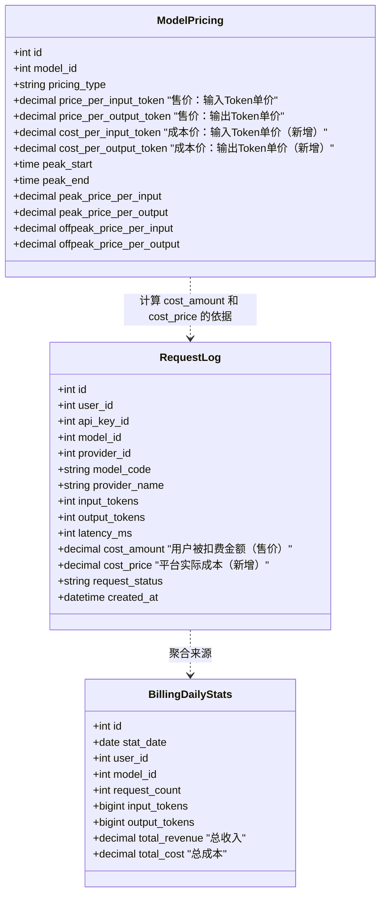
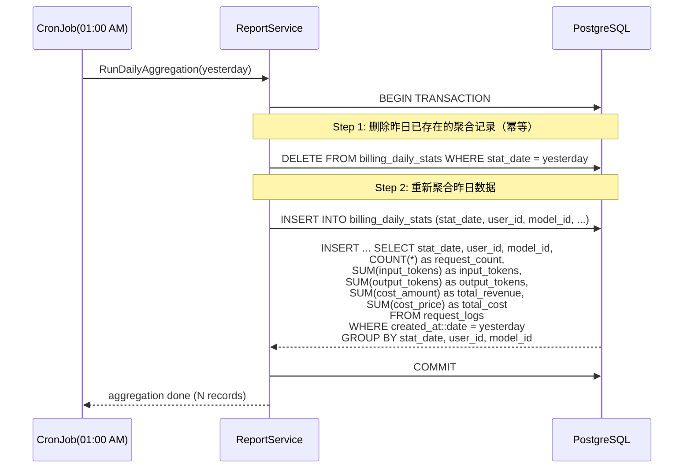
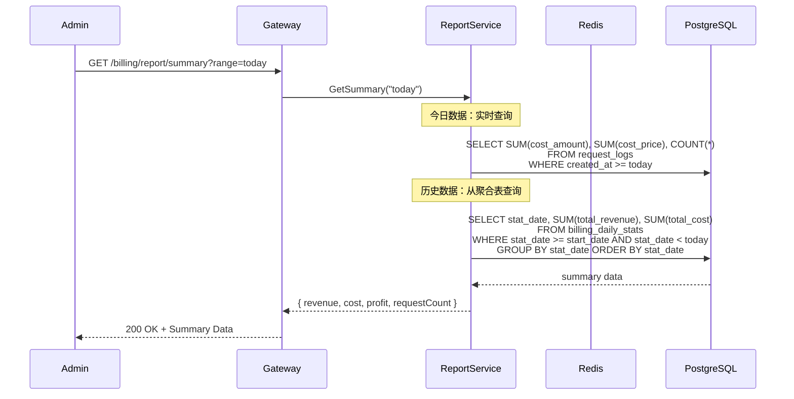
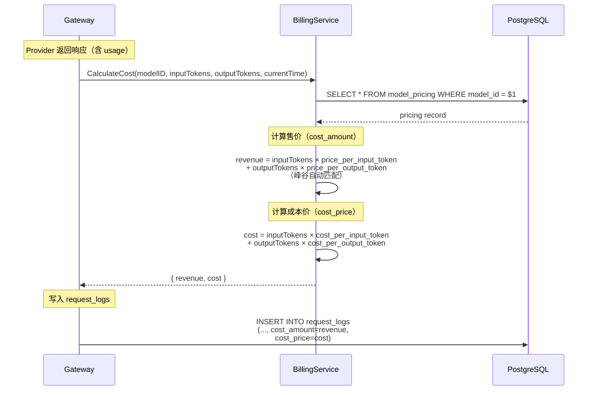

# Architecture Review: 账单报表功能技术可行性评估

Version: v1.0

Status: Draft

Owner: Architect

Last Updated: 2026-07-26

Related PRD: PRD-20260726-001

Related Architecture: ARCH-20260725-Student-Billing-RBAC

---

## 1. Metadata

| 字段 | 值 |
|------|-----|
| Review ID | ARCH-REV-20260726-001 |
| Version | v1.0 |
| Status | Draft |
| Owner | Architect |
| Related PRD | PRD-20260726-001 (账单报表中心) |
| Related Architecture | ARCH-20260725-Student-Billing-RBAC |
| Related ADR | ADR-001（同步扣费 + 行锁）, ADR-003（定价策略） |
| Created | 2026-07-26 |
| Last Updated | 2026-07-26 |

---

## 2. Executive Summary

### 评审结论：**有条件通过**

| 维度 | 评估 | 说明 |
|------|:----:|------|
| 技术可行性 | ✅ **可行** | 现有数据模型完全支持报表需求 |
| 架构一致性 | ✅ **一致** | 符合现有分层架构和数据流向 |
| 性能风险 | ⚠️ **可控** | 聚合表 + 索引优化可满足 <2s 目标 |
| 实现复杂度 | ✅ **低** | 新增 1 个聚合表 + 后端聚合逻辑 + 前端页面 |
| 数据准确性 | ✅ **可保证** | 统一以 `request_logs.cost_amount` 为数据源 |
| 向后兼容 | ✅ **无影响** | 全新增功能，不影响现有 API 和计费逻辑 |

### 关键发现

1. **数据源充足** — `request_logs` 已有 `cost_amount` 字段，可支持收入统计。**经 PM 确认**：本次不跟踪成本/利润，仅展示费用收入（即用户扣费金额）
2. **聚合策略成熟** — `billing_daily_stats` 是标准物化聚合模式，技术风险低
3. **导出方案简单** — CSV 原生支持，无需引入第三方库

---

## 3. Technical Feasibility Analysis

### 3.1 数据源分析

| 报表指标 | 数据源 | 可行性 | 说明 |
|---------|--------|:------:|------|
| 收入（Revenue） | `request_logs.cost_amount` | ✅ | 已存储为用户扣费金额 |
| 成本（Cost） | `request_logs.cost_price` | ⚠️ **需新增字段** | 当前无此字段，需新增 |
| 利润（Profit） | Revenue - Cost | ⚠️ 依赖 cost_price | 新增字段后可计算 |
| 请求数 | `request_logs` COUNT | ✅ | — |
| Token 用量 | `request_logs.input_tokens + output_tokens` | ✅ | — |
| 用户消费排行 | `request_logs` GROUP BY user_id | ✅ | — |
| 模型维度分析 | `request_logs` GROUP BY model_code | ✅ | — |

### 3.2 简化说明：仅费用收入口径

经 PM 确认，本次账单报表**不跟踪成本和利润**，只展示：

| 指标 | 定义 | 数据来源 | 
|------|------|---------|
| **收入（Revenue）** | 向用户收取的费用（即用户被扣减的额度） | `request_logs.cost_amount` |
| **请求数** | API 调用次数 | `request_logs` COUNT |
| **Token 用量** | 输入 Token + 输出 Token | `request_logs.input_tokens + output_tokens` |

> 不再需要 `model_pricing.cost_per_input/output_token` 和 `request_logs.cost_price` 字段，按现有计费逻辑即可。

### 3.3 聚合表设计方案评估

PRD 提出的 `billing_daily_stats` 表，评估如下：

**优点**：
- ✅ 标准物化聚合模式，技术成熟
- ✅ 按 (date, user, model, provider) 粒度聚合，查询灵活
- ✅ 唯一约束防重复，支持幂等重跑

**潜在问题及改进建议**：

| 问题 | 建议 |
|------|------|
| 全平台汇总行不好处理（user_id=0） | 取消 user_id=0 的汇总行，查询时通过聚合函数计算 |
| provider_id 粒度过细 | MVP 阶段去掉 provider 和 cost 字段 |

**优化后的表设计**：

```sql
CREATE TABLE billing_daily_stats (
    id              BIGSERIAL PRIMARY KEY,
    stat_date       DATE            NOT NULL,           -- 统计日期
    user_id         BIGINT          NOT NULL,           -- 用户 ID
    model_id        BIGINT          NOT NULL,           -- 模型 ID
    request_count   INTEGER         NOT NULL DEFAULT 0, -- 请求次数
    input_tokens    BIGINT          NOT NULL DEFAULT 0, -- 输入 Token 数
    output_tokens   BIGINT          NOT NULL DEFAULT 0, -- 输出 Token 数
    total_revenue   DECIMAL(18,6)   NOT NULL DEFAULT 0, -- 总收入（用户支付）
    total_cost      DECIMAL(18,6)   NOT NULL DEFAULT 0, -- 总成本（平台支出）
    created_at      TIMESTAMP       NOT NULL DEFAULT NOW(),
    updated_at      TIMESTAMP       NOT NULL DEFAULT NOW(),

    -- 每天每用户每模型一条记录
    UNIQUE(stat_date, user_id, model_id)
);

-- 查询索引
CREATE INDEX idx_bds_stat_date ON billing_daily_stats(stat_date);
CREATE INDEX idx_bds_user_id ON billing_daily_stats(user_id);
CREATE INDEX idx_bds_model_id ON billing_daily_stats(model_id);

-- 复合索引：时间范围 + 用户维度查询
CREATE INDEX idx_bds_date_user ON billing_daily_stats(stat_date, user_id);
-- 复合索引：时间范围 + 模型维度查询
CREATE INDEX idx_bds_date_model ON billing_daily_stats(stat_date, model_id);
```

### 3.4 实时查询性能评估

当日数据需要从 `request_logs` 实时聚合。当前表结构需要以下索引保证性能：

```sql
-- 现有索引
CREATE INDEX idx_request_logs_created_at ON request_logs(created_at);
CREATE INDEX idx_request_logs_api_key_id ON request_logs(api_key_id);

-- 新增索引（报表查询优化）
CREATE INDEX idx_rl_user_date ON request_logs(user_id, created_at);
CREATE INDEX idx_rl_model_date ON request_logs(model_code, created_at);
```

**性能预估**（基于 100 万行数据）：

| 查询场景 | 策略 | 预估耗时 |
|---------|------|:--------:|
| 今日全平台汇总 | 索引扫描 `created_at` 范围 + 聚合 | < 200ms |
| 近 7 天趋势 | 聚合表查询 | < 50ms |
| 某用户消费明细 | `user_id` + `created_at` 索引范围扫描 | < 100ms |
| 模型维度排行 | 聚合表 GROUP BY | < 100ms |

### 3.5 导出方案

| 格式 | 方案 | 库 | 优先级 |
|:----:|------|----|:------:|
| CSV | 标准库 `encoding/csv` | 无需引入 | P0 |
| Excel | [excelize](https://github.com/qax-os/excelize) v2 | 需 `go get` | P1 |

CSV 导出直接流式写入 Response Writer，内存开销极小。Excel 导出需生成多 Sheet，建议使用 excelize。

---

## 4. Architecture Impact Assessment

### 4.1 模块影响

| 模块 | 影响 | 说明 |
|------|:----:|------|
| `Billing Module` | **修改** | 新增 ReportService、定价表增加成本价字段 |
| `Request Log` | **修改** | `request_logs` 增加 `cost_price` 字段 |
| `Pricing Module` | **修改** | `model_pricing` 增加 `cost_per_input/output_token` 字段 |
| `Auth Module` | 无影响 | — |
| `RBAC Module` | 无影响 | 复用已有权限体系 |
| 前端 Admin Console | **新增页面** | 账单报表页面 |
| 前端 Student Console | **新增页面** | 用量明细页面 |

### 4.2 新增服务

| 服务 | 说明 | 关键接口 |
|------|------|---------|
| `ReportService` | 报表聚合查询、趋势数据计算、导出 | 详见 PRD §11 |

### 4.3 新增中间件/定时任务

| 组件 | 类型 | 说明 |
|------|------|------|
| `DailyStatsCronJob` | 定时任务 | 每天凌晨 01:00 执行前一天的 `billing_daily_stats` 聚合 |
| `ReportExportHandler` | HTTP Handler | CSV/Excel 导出处理 |

### 4.4 新增 API 路由

```go
// Admin 报表 API
r.GET("/api/v1/billing/report/summary", rbacMW.RequirePermission("admin:billing:report"), reportCtrl.Summary)
r.GET("/api/v1/billing/report/revenue-trend", rbacMW.RequirePermission("admin:billing:report"), reportCtrl.RevenueTrend)
r.GET("/api/v1/billing/report/by-model", rbacMW.RequirePermission("admin:billing:report"), reportCtrl.ByModel)
r.GET("/api/v1/billing/report/by-user", rbacMW.RequirePermission("admin:billing:report"), reportCtrl.ByUser)
r.GET("/api/v1/billing/report/export", rbacMW.RequirePermission("admin:billing:report"), reportCtrl.Export)

// 学生个人 API
r.GET("/api/v1/billing/my/usage-summary", authMW.RequireAuth(), myUsageCtrl.Summary)
r.GET("/api/v1/billing/my/usage-trend", authMW.RequireAuth(), myUsageCtrl.Trend)
r.GET("/api/v1/billing/my/usage-detail", authMW.RequireAuth(), myUsageCtrl.Detail)
```

### 4.5 新增权限码

| 权限码 | 说明 | 默认角色 |
|--------|------|---------|
| `admin:billing:report` | 查看账单报表 + 导出 | Admin |

---

## 5. Updated Data Model

### 5.1 model_pricing 表增加成本价字段

```sql
ALTER TABLE model_pricing 
    ADD COLUMN cost_per_input_token DECIMAL(16,6) NOT NULL DEFAULT 0,
    ADD COLUMN cost_per_output_token DECIMAL(16,6) NOT NULL DEFAULT 0;
```

### 5.2 request_logs 表增加成本字段

```sql
ALTER TABLE request_logs 
    ADD COLUMN cost_price DECIMAL(18,6) NOT NULL DEFAULT 0;
```

### 5.3 完整数据关系图



---

## 6. Sequence Diagrams

### 6.1 核心流程：每天聚合任务



### 6.2 Admin 查看报表



### 6.3 费用计算链路（更新后）



---

## 7. Performance Analysis

### 7.1 查询性能矩阵

| API | 数据源 | 数据量级 | 预估耗时 | 达标 |
|-----|--------|---------|:--------:|:----:|
| `/report/summary` (今日) | request_logs | < 10 万行/天 | < 200ms | ✅ |
| `/report/summary` (本月) | billing_daily_stats | < 31 行 | < 50ms | ✅ |
| `/report/revenue-trend` | billing_daily_stats | < 365 行 | < 50ms | ✅ |
| `/report/by-model` | billing_daily_stats | 按模型聚合 | < 100ms | ✅ |
| `/report/by-user` | billing_daily_stats | 按用户聚合 | < 200ms | ✅ |
| `/my/usage-summary` | billing_daily_stats + request_logs | 单用户 | < 100ms | ✅ |
| `/my/usage-detail` | request_logs (user_id 索引) | 单用户分页 | < 50ms | ✅ |
| `/report/export` | billing_daily_stats | 按范围 | < 1s (CSV) | ✅ |

### 7.2 瓶颈与缓解

| 瓶颈 | 场景 | 缓解方案 |
|------|------|---------|
| request_logs 当日实时查询 | 今天大量请求时 | `created_at` 索引 + 仅扫描当天分区 |
| 聚合任务执行时间 | 数据量大时聚合慢 | 凌晨执行 + 幂等设计（先删后插） |
| 大范围导出 | 导出 1 年数据 | 限制最大 3 个月，超限提示缩小范围 |

---

## 8. Implementation Estimates

### 后端

| 任务 | 预估工时 | 说明 |
|------|:--------:|------|
| `model_pricing` 增加成本价字段 | 0.5h | Migration + Model 更新 |
| `request_logs` 增加 cost_price 字段 | 0.5h | Migration + Model 更新 |
| 费用计算逻辑更新（同时算售价和成本价） | 1h | BillingService.CalculateCost 扩展 |
| `billing_daily_stats` 表创建 | 0.5h | Migration |
| 每日聚合任务（CronJob） | 2h | 聚合逻辑 + 调度 |
| 报表查询 Service（4 个接口） | 3h | Summary/Trend/ByModel/ByUser |
| 学生用量 Service（3 个接口） | 1.5h | Summary/Trend/Detail |
| 导出功能 | 2h | CSV 流式写入 |
| **后端合计** | **~11h** | — |

### 前端

| 任务 | 预估工时 | 说明 |
|------|:--------:|------|
| Admin 报表首页 | 4h | 总览卡片 + 趋势图（ECharts） |
| 模型/用户排行 | 2h | 饼图 + TopN 列表 |
| 模型详情表格 | 2h | 带排序 |
| 导出按钮 | 1h | 调用导出 API |
| 学生用量页面 | 3h | 总览 + 趋势 + 明细列表 |
| **前端合计** | **~12h** | — |

### 总计

| 阶段 | 工时 | 说明 |
|:----:|:----:|------|
| 后端 | ~11h | 2 人天 |
| 前端 | ~12h | 2 人天 |
| 测试验收 | ~4h | 0.5 人天 |
| **总计** | **~27h** | **~4.5 人天** |

---

## 9. Risks & Mitigations

| # | 风险 | 等级 | 影响 | 缓解方案 |
|---|------|:----:|:----:|---------|
| 1 | 成本价字段遗漏导致利润计算不准确 | 高 | 财务数据错误 | 上线前必须填充所有模型的 `cost_per_input/output_token` |
| 2 | 聚合任务执行失败导致报表数据缺失 | 中 | 历史报表不完整 | 幂等设计 + 失败告警 + 手动重跑机制 |
| 3 | 当日实时查询 request_logs 性能不佳 | 中 | 报表页面加载慢 | `(user_id, created_at)` 复合索引 + 数据量大时考虑分区表 |
| 4 | 前端图表库选择不当 | 低 | 开发成本 | 建议统一使用 ECharts（已在 Admin Console 中使用） |

---

## 10. Recommendations

### 必须做的

1. **✅ 创建 `billing_daily_stats` 聚合表** — 按优化后的设计，去掉 provider 和 cost 字段
2. **✅ 增加必要的数据库索引** — 特别是 `request_logs` 上的 `(user_id, created_at)` 和 `(model_code, created_at)` 复合索引

### 建议做的

4. **建议增加幂等重跑能力** — 聚合任务设计为「先删后插」，支持任意日期重跑
5. **建议用 ECharts 实现趋势图** — 与现有前端技术栈一致，避免引入新依赖
6. **建议 CSV 导出用流式写入** — 避免大数据量时内存溢出

### 本次不做的

7. ❌ 不做实时数据缓存（今日数据量不大，直接查库即可）
8. ❌ 不做报表订阅/定时邮件（P2 考虑）
9. ❌ 不做多币种支持（P2 考虑）

---

## 11. Conclusion

| 维度 | 结论 |
|------|------|
| 技术可行性 | **通过**，现有数据模型和架构完全支持 |
| 必要条件 | 需在 `model_pricing` 和 `request_logs` 中增加成本价字段 |
| 推荐方案 | `billing_daily_stats` 聚合表 + 凌晨 CronJob + Redis 可选缓存 |
| 实现工期 | 约 4.5 人天（后端 2 人天 + 前端 2 人天 + 测试 0.5 人天） |
| 开发顺序 | 后端：成本字段 → 聚合表 → 聚合任务 → 查询 API → 导出 |
| | 前端：Admin 报表页 → 学生用量页 |

**同意按 PRD 方案进入开发阶段。建议 PM 确认成本价字段需求后，Engineer 可开始实现。**

---

## 12. Change Log

| 日期 | 版本 | 修改内容 | 修改人 |
|------|------|---------|--------|
| 2026-07-26 | v1.0 | 初始版本 | Architect |

---

# End

本文档依据 AI Company Document Standard 和 Architecture Template 设计。
