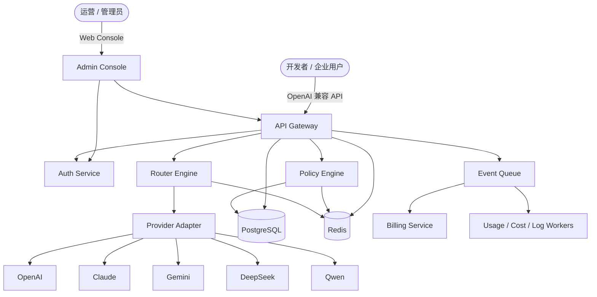
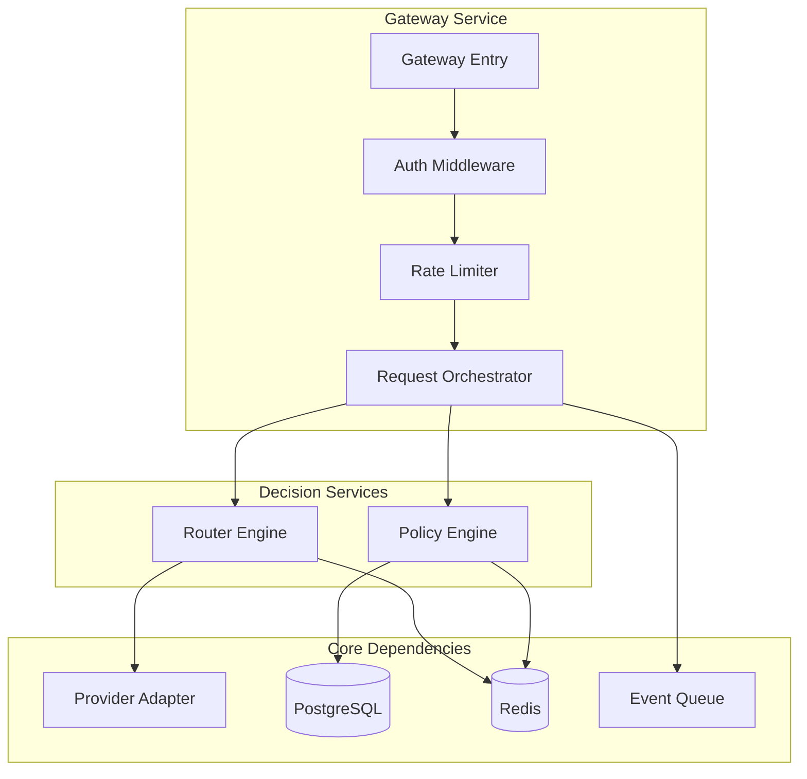
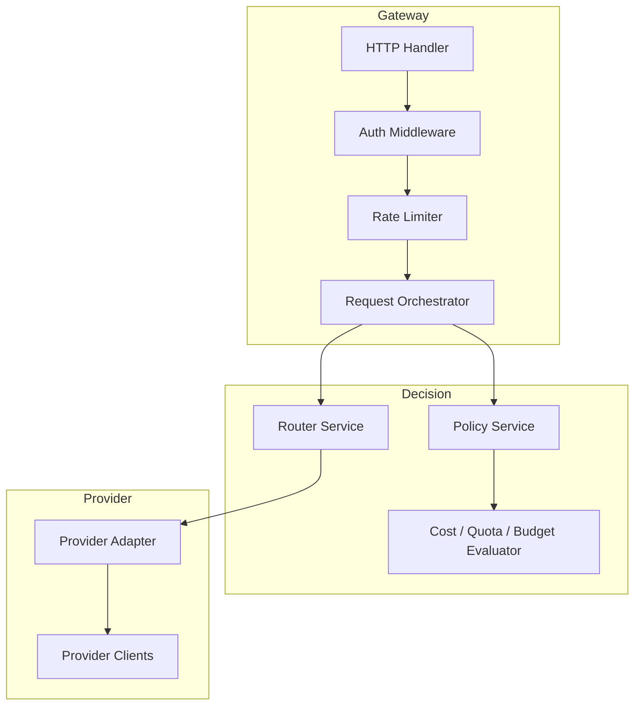
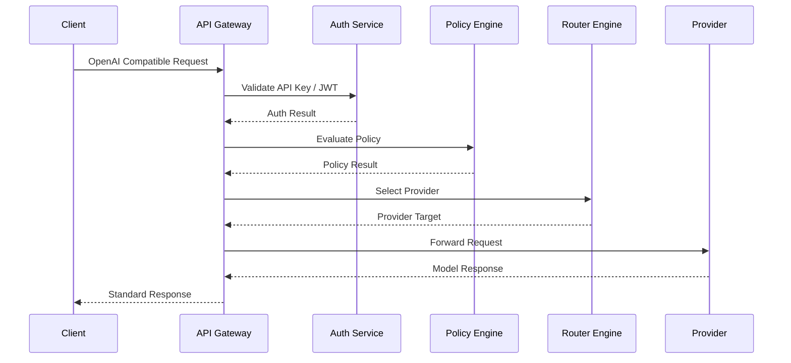
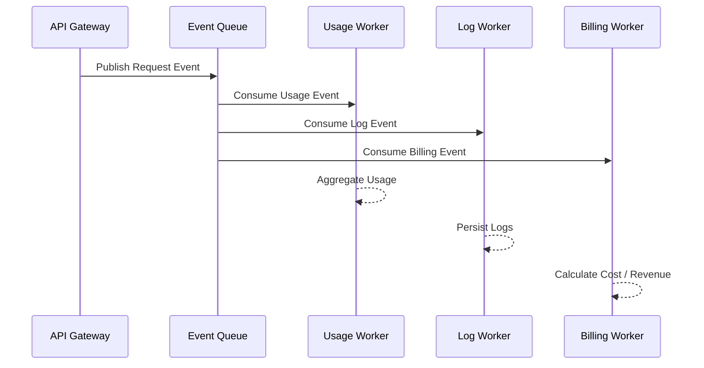
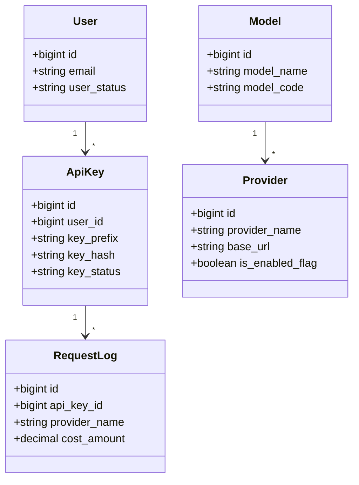
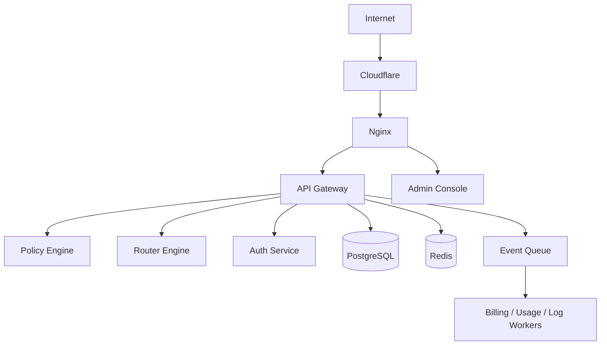

# Architecture: Nova AI Gateway 系统架构总览

Version: v1.0

Status: Active

Owner: Architect

Last Updated: 2026-07-20

Related ADR: ADR-001, ADR-002

---

## 1. Metadata

| 字段 | 值 |
|------|-----|
| Architecture ID | ARCH-20260720-001 |
| Version | v1.0 |
| Status | Active |
| Owner | Architect |
| Related ADR | ADR-001, ADR-002 |
| Related PRD | N/A |
| Created | 2026-07-20 |
| Last Updated | 2026-07-20 |

---

## 2. Overview

本文档定义 Nova AI Gateway 在 P0 到 P2 阶段的整体系统架构，用于指导基础设施搭建、后端工程骨架、数据库设计和 API 设计。

### 适用范围

- 涉及的模块：Gateway、Policy、Router、Auth、Billing、Provider Adapter、Usage、Log、Cost
- 涉及的服务：API Gateway、Policy Engine、Router Engine、Auth Service、Billing Service
- 涉及的技术栈：Go、Vue3、PostgreSQL、Redis、Docker Compose

---

## 3. Business Context

Nova AI Gateway 面向企业和 AI 开发者，解决多模型接入、智能路由、成本优化、权限管理和日志追踪等问题。

```text
┌──────────────────────────────────────────────────────────────┐
│                        AI 基础设施业务域                     │
│                                                              │
│  ┌──────────────┐   ┌──────────────┐   ┌──────────────────┐  │
│  │ 开发者调用 API │   │ 企业后台运营  │   │ 成本 / 用量 / 日志 │  │
│  └──────────────┘   └──────────────┘   └──────────────────┘  │
│         │                    │                    │           │
│         └────────────┬───────┴────────────┬──────┘           │
│                      ▼                    ▼                  │
│                ┌──────────────┐   ┌──────────────┐           │
│                │ API Gateway  │   │ Admin Portal │           │
│                └──────────────┘   └──────────────┘           │
└──────────────────────────────────────────────────────────────┘
```

---

## 4. Goals

### 架构目标

- 支撑 P1 阶段 AI Gateway MVP 快速落地
- 保证 Gateway 主链路不引入明显额外延迟，目标 < 10ms
- 保证 Policy / Router 决策链路足够轻，目标 < 2ms
- 为 P2 的成本、用量、预算、预警能力预留扩展点

### 架构原则

- 遵循 Clean Architecture 和分层依赖规则
- 主链路与统计链路分离，统计全部异步化
- 优先简单方案，第一阶段仅使用 Docker Compose
- API First，文档先行

### 非目标

- 当前不设计 Skill Marketplace、Workflow Platform、Agent Runtime 的运行时细节
- 当前不引入 Kubernetes、服务网格、复杂消息队列中间件

---

## 5. System Context



### 外部依赖

| 外部系统 | 依赖类型 | 说明 |
|---------|---------|------|
| OpenAI / Claude / Gemini / DeepSeek / Qwen | API | 大模型供应商 |
| PostgreSQL | 数据库 | 关系型权威存储 |
| Redis | 缓存 | 低延迟缓存、配额、限流、会话 |
| Cloudflare | 网络 | 域名、流量防护、入口层 |

---

## 6. Modules

### 模块划分

| 模块 | 职责 | 依赖模块 | 所属服务 |
|------|------|---------|---------|
| Request Gateway | 接收请求、鉴权、限流、路由协调 | Auth、Policy、Router | API Gateway |
| Policy Engine | 成本、预算、配额、策略判断 | Redis、PostgreSQL | Policy Engine |
| Router Engine | 根据策略和健康状态选择 Provider | Redis、Provider Adapter | Router Engine |
| Auth Module | JWT、API Key、RBAC | PostgreSQL、Redis | Auth Service |
| Billing / Usage / Log | 异步处理计费、用量、日志 | Event Queue、PostgreSQL | Billing Service / Workers |
| Provider Adapter | 屏蔽多 Provider API 差异 | 外部 Provider | API Gateway / Router |

### 模块关系图



---

## 7. Layer Design

### 分层架构

```text
┌──────────────────────────────────────┐
│ Controller / HTTP Handler            │
├──────────────────────────────────────┤
│ Service / UseCase                    │
├──────────────────────────────────────┤
│ Repository                           │
├──────────────────────────────────────┤
│ PostgreSQL / Redis / External APIs   │
└──────────────────────────────────────┘
```

### 层间依赖规则

| 方向 | 规则 | 禁止事项 |
|------|------|---------|
| Controller → Service | 只做参数解析、响应返回 | 不可直接访问 DB |
| Service → Repository | 实现业务逻辑和事务 | 不可处理 HTTP 细节 |
| Repository → Infrastructure | 访问 PostgreSQL / Redis / 外部 API | 不可写业务逻辑 |

---

## 8. Component Diagram



### 组件职责

| 组件 | 职责 | 关键技术 |
|------|------|---------|
| Auth Middleware | API Key / JWT 校验 | Go Middleware + Redis/PostgreSQL |
| Rate Limiter | 每 Key / 每用户限流 | Redis |
| Policy Service | 成本、预算、配额、策略决策 | Go + Redis + PostgreSQL |
| Router Service | Provider 选择和失败切换 | Go + Redis |
| Provider Adapter | 多厂商协议适配 | Go HTTP Client |

---

## 9. Sequence Diagram

### 主流程



### 异步流程



---

## 10. API Design

### 接口清单

| 接口 | Method | 说明 | 认证方式 |
|------|--------|------|---------|
| `/api/v1/chat/completions` | POST | OpenAI 兼容对话接口 | API Key |
| `/api/v1/models` | GET | 查询可用模型列表 | API Key / JWT |
| `/api/v1/providers` | GET/POST/PATCH | Provider 管理 | JWT |
| `/api/v1/api-keys` | GET/POST/PATCH | API Key 管理 | JWT |
| `/api/v1/usage` | GET | 用量查询 | JWT |

### 内部 API

| 接口 | 协议 | 说明 |
|------|------|------|
| Gateway → Policy | HTTP | 策略判断 |
| Gateway → Router | HTTP | Provider 选择 |
| Gateway → Auth | HTTP | 认证校验 |

---

## 11. Database Design

### 数据模型



### 核心表

| 表名 | 说明 | 主要字段 |
|------|------|---------|
| `users` | 用户主表 | `email`, `user_status`, `created_at` |
| `organizations` | 组织主表 | `name`, `plan_type`, `budget_amount` |
| `api_keys` | API Key 表 | `user_id`, `key_prefix`, `key_hash`, `key_status` |
| `providers` | Provider 配置表 | `provider_name`, `base_url`, `priority`, `weight` |
| `models` | 逻辑模型表 | `model_name`, `model_code`, `model_status` |
| `model_provider_bindings` | 模型与 Provider 绑定关系 | `model_id`, `provider_id`, `weight` |
| `request_logs` | 请求日志表 | `api_key_id`, `model_id`, `provider_id`, `latency_ms`, `cost_amount` |

---

## 12. Cache Design

### 缓存策略

| 缓存项 | Key 模式 | TTL | 策略 | 失效时机 |
|--------|---------|-----|------|---------|
| API Key 鉴权结果 | `gateway:apikey:{prefix}` | 5 分钟 | Cache-Aside | Key 状态变更 |
| Provider 健康状态 | `router:provider:{id}:health` | 30 秒 | Cache-Aside | 健康检测更新 |
| 策略结果 | `policy:user:{id}:model:{model}` | 1 分钟 | Cache-Aside | 策略配置修改 |
| 配额剩余额度 | `policy:quota:user:{id}` | 1 分钟 | Cache-Aside | 请求消费后异步更新 |

---

## 13. Deployment

### 部署架构



### 部署配置

| 服务 | 实例数 | CPU | 内存 | 存储 |
|------|--------|-----|------|------|
| API Gateway | 1~2 | 1C | 1G | - |
| Policy Engine | 1 | 1C | 512M | - |
| Router Engine | 1 | 1C | 512M | - |
| Auth Service | 1 | 1C | 512M | - |
| PostgreSQL | 1 | 2C | 2G | 20G+ |
| Redis | 1 | 1C | 512M | 5G+ |

---

## 14. Security

### 安全架构

| 安全层 | 措施 | 说明 |
|--------|------|------|
| 传输安全 | HTTPS / TLS | 入口统一走 Cloudflare + Nginx |
| 认证 | API Key / JWT | 开发者与后台两套认证体系 |
| 授权 | RBAC | Admin / User / Read-only |
| 限流 | Redis Rate Limiter | 每 API Key 1000 req/min |
| 输入校验 | Validation | 所有入参都必须校验 |

---

## 15. Performance

### 性能目标

| 指标 | 目标 | 测量方式 |
|------|------|---------|
| Gateway 主链路 | < 10ms | HTTP Benchmark / APM |
| Policy 决策 | < 2ms | Service Profiling |
| Router 决策 | < 2ms | Service Profiling |
| 数据库查询（99%） | < 10ms | Query Analysis |

### 性能优化策略

- 认证、策略、路由结果尽可能使用 Redis 缓存
- 日志、成本、用量全部异步化
- Provider 健康状态不走实时数据库查询
- 主链路只保留必须的同步步骤

---

## 16. Scalability

### 扩展策略

| 维度 | 策略 | 触发条件 |
|------|------|---------|
| 水平扩展 | Gateway 无状态实例横向扩容 | QPS 持续增长 |
| 垂直扩展 | PostgreSQL / Redis 提升规格 | 存储和缓存压力增长 |

### 瓶颈分析

- Provider 响应时间：通过智能路由和失败切换缓解
- PostgreSQL 写入日志压力：通过异步写入和聚合统计缓解
- Redis 热点键：通过合理 key 设计和 TTL 控制缓解

---

## 17. Risks

| # | 风险描述 | 等级 | 影响 | 缓解方案 |
|---|---------|------|------|---------|
| 1 | 初期无独立消息队列实现事件总线 | 中 | 异步能力受限 | 先用轻量异步模式，后续演进 |
| 2 | Provider 差异导致适配复杂度上升 | 中 | 增加开发和测试成本 | 统一 Provider Adapter 接口 |
| 3 | 日志增长过快影响数据库 | 中 | 存储成本上升 | 做冷热分层与归档策略 |

---

## 18. Future Extension

| 未来需求 | 预留机制 | 说明 |
|---------|---------|------|
| Skill Marketplace | 通过独立模块和 API 扩展 | 当前不侵入核心网关 |
| Agent Runtime | 预留 MCP Gateway / Workflow 扩展位 | 放在后续阶段单独建设 |
| 企业私有化 | 当前架构已支持 Docker Compose 私有部署 | 后续可升级为 K8S |

---

## 19. Change Log

| 日期 | 版本 | 修改内容 | 修改人 |
|------|------|---------|--------|
| 2026-07-20 | v1.0 | 初始版本 | Architect |

---

# End

本架构文档定义 Nova AI Gateway 在 P0 到 P2 阶段的系统级设计基线。

后续模块级架构文档必须在本总览基础上展开。
