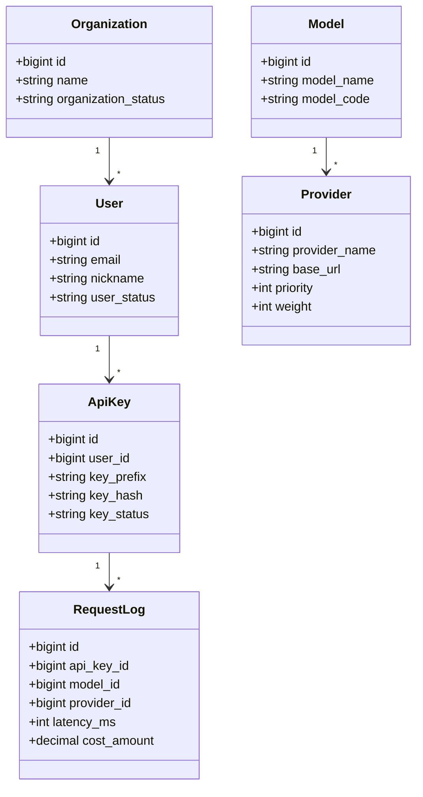

# 数据库总览

Version: v1.0

Status: Active

Owner: Architect

Last Updated: 2026-07-20

Related Architecture: ARCH-20260720-001

---

## 1. 目标

本文档定义 Nova AI Gateway 在 P0 到 P2 阶段的数据库总体设计，覆盖核心实体、表关系、索引原则、迁移规则与分层边界。

---

## 2. 设计原则

- 数据库使用 **PostgreSQL 15+**
- 所有表必须具备 `id`、`created_at`、`updated_at`
- 业务删除优先使用 `deleted_at` 软删除
- 表名使用复数 `snake_case`
- 核心写路径保持简单，统计和聚合优先异步化

---

## 3. 业务域划分

| 业务域 | 核心职责 | 核心表 |
|--------|----------|--------|
| 身份与权限域 | 用户、组织、成员、登录、角色 | `users`, `organizations`, `organization_memberships` |
| 访问控制域 | API Key、套餐、配额、权限 | `api_keys`, `plans`, `quotas` |
| 模型与供应商域 | Provider、Model、绑定关系 | `providers`, `models`, `model_provider_bindings` |
| 请求追踪域 | 请求日志、错误、统计聚合 | `request_logs`, `usage_daily_stats` |
| 成本与策略域 | 成本、定价、预算、策略 | `pricing_rules`, `budget_rules`, `policy_rules` |

---

## 4. 核心实体关系

---

## 5. 核心表清单

### 5.1 身份与权限

| 表名 | 说明 | 关键字段 |
|------|------|---------|
| `users` | 用户主表 | `email`, `nickname`, `user_status`, `organization_id` |
| `organizations` | 组织主表 | `name`, `organization_status`, `budget_amount` |
| `organization_memberships` | 用户与组织关系 | `organization_id`, `user_id`, `role_code` |

### 5.2 API 访问控制

| 表名 | 说明 | 关键字段 |
|------|------|---------|
| `api_keys` | 开发者 API Key | `user_id`, `key_prefix`, `key_hash`, `permission_scope`, `key_status` |
| `plans` | 套餐定义 | `plan_name`, `request_limit`, `token_limit` |
| `quotas` | 用户或组织配额 | `owner_type`, `owner_id`, `quota_type`, `quota_limit` |

### 5.3 模型与 Provider

| 表名 | 说明 | 关键字段 |
|------|------|---------|
| `providers` | 供应商配置 | `provider_name`, `base_url`, `api_key_ref`, `priority`, `weight`, `is_enabled_flag` |
| `models` | 逻辑模型定义 | `model_name`, `model_code`, `model_status` |
| `model_provider_bindings` | 逻辑模型与 Provider 的绑定 | `model_id`, `provider_id`, `weight`, `binding_status` |

### 5.4 请求日志与统计

| 表名 | 说明 | 关键字段 |
|------|------|---------|
| `request_logs` | 原始请求日志 | `api_key_id`, `user_id`, `model_id`, `provider_id`, `latency_ms`, `cost_amount`, `request_status` |
| `usage_daily_stats` | 按日聚合的用量统计 | `stat_date`, `owner_type`, `owner_id`, `request_count`, `input_tokens`, `output_tokens` |

### 5.5 成本与策略

| 表名 | 说明 | 关键字段 |
|------|------|---------|
| `pricing_rules` | 定价规则 | `model_id`, `provider_id`, `input_price`, `output_price`, `pricing_mode` |
| `budget_rules` | 预算规则 | `owner_type`, `owner_id`, `budget_amount`, `alert_threshold` |
| `policy_rules` | 策略规则 | `rule_name`, `rule_type`, `rule_expression`, `rule_status` |

---

## 6. 关键字段规范

| 类型 | 规范 | 示例 |
|------|------|------|
| 主键 | `id BIGSERIAL PRIMARY KEY` | `id` |
| 外键 | `_id` 结尾 | `user_id`, `provider_id` |
| 状态 | `_status` 结尾 | `user_status`, `request_status` |
| 布尔 | `is_*_flag` | `is_enabled_flag` |
| 时间 | `_at` 结尾 | `created_at`, `updated_at`, `deleted_at` |
| 金额 | `DECIMAL(18,6)` | `cost_amount`, `revenue_amount` |

---

## 7. 索引策略

### 7.1 必备索引

| 表名 | 索引 | 目的 |
|------|------|------|
| `users` | `idx_users_email` | 邮箱登录和唯一查询 |
| `api_keys` | `idx_api_keys_prefix` | Key 前缀快速匹配 |
| `api_keys` | `idx_api_keys_user_id` | 用户维度查询 |
| `providers` | `idx_providers_name` | Provider 配置查询 |
| `models` | `idx_models_code` | 逻辑模型唯一编码查询 |
| `request_logs` | `idx_request_logs_created_at` | 时间范围检索 |
| `request_logs` | `idx_request_logs_api_key_id` | API Key 维度日志分析 |
| `usage_daily_stats` | `idx_usage_daily_stats_owner_date` | 按用户/组织日期聚合查询 |

### 7.2 设计原则

- 高频过滤字段必须建立索引
- 联合索引优先围绕查询条件顺序设计
- 日志表避免过度索引，优先保证写入性能

---

## 8. 写入与查询策略

### 主链路同步写入

主链路只允许最少同步写入：
- API Key 基础校验可能读取缓存，必要时回源数据库
- 策略配置、Provider 配置优先缓存
- 请求原始日志建议通过异步事件落库

### 异步聚合

以下能力优先异步处理：
- 用量统计
- 成本统计
- 日志聚合
- 报表生成

---

## 9. 迁移规则

| 规则 | 要求 |
|------|------|
| 工具 | 使用 `golang-migrate` 或 `goose` |
| 命名 | `YYYYMMDDHHMMSS_description.up.sql` |
| 粒度 | 每个迁移只做一件事 |
| 修改 | 禁止修改已合并迁移，只能追加新迁移 |

建议的首批迁移顺序：

1. `users`
2. `organizations`
3. `organization_memberships`
4. `api_keys`
5. `providers`
6. `models`
7. `model_provider_bindings`
8. `request_logs`
9. `usage_daily_stats`
10. `pricing_rules`
11. `budget_rules`
12. `policy_rules`

---

## 10. 缓存与数据库边界

| 数据类型 | 权威存储 | 缓存策略 |
|----------|----------|---------|
| 用户与权限 | PostgreSQL | 热点用户短期缓存 |
| API Key 校验结果 | PostgreSQL | Redis 5 分钟缓存 |
| Provider 配置 | PostgreSQL | Redis 1 分钟缓存 |
| 策略规则 | PostgreSQL | Redis 1 分钟缓存 |
| 配额剩余量 | PostgreSQL + Redis | Redis 为实时读取入口 |

---

## 11. 风险与限制

| # | 风险 | 等级 | 说明 | 缓解方案 |
|---|------|------|------|---------|
| 1 | `request_logs` 增长过快 | 中 | 日志表写入量可能迅速膨胀 | 做冷热分层与归档策略 |
| 2 | 策略规则复杂导致查询变慢 | 中 | P2 阶段策略维度增多 | 热点规则缓存到 Redis |
| 3 | 多维统计查询拖慢主库 | 中 | 报表查询压力大 | 聚合表 + 异步计算 |

---

## 12. 下一步

数据库总览完成后，建议继续推进：

1. 建立 `backend/migrations/` 目录
2. 编写首批建表迁移文件
3. 在 `docs/API/00-API设计规范.md` 中对齐实体字段命名
4. 在模块级 Architecture 文档中补充表级细节

---

## Change Log

| 日期 | 版本 | 修改内容 | 修改人 |
|------|------|---------|--------|
| 2026-07-20 | v1.0 | 初始版本 | Architect |

---

# End

本文档是 Nova AI Gateway 在 P0 到 P2 阶段的数据库权威总览。

所有表设计与迁移必须以本文档为基础展开。
